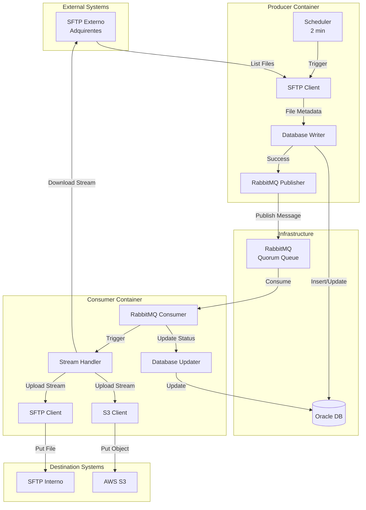
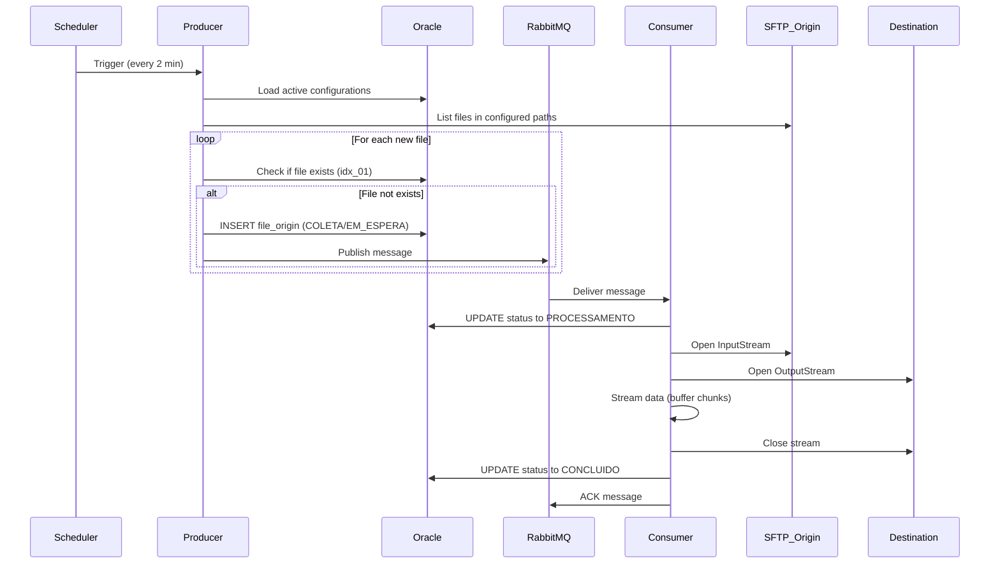

# Design Document: Controle de Arquivos EDI

## Overview

O sistema "Controle de Arquivos EDI" é uma solução de transferência automatizada de arquivos EDI para conciliação de cartão de crédito. O sistema implementa uma arquitetura baseada em mensageria assíncrona com dois componentes principais:

- **Producer**: Detecta novos arquivos em servidores SFTP externos, registra metadados no banco de dados Oracle e publica mensagens para processamento assíncrono
- **Consumer**: Consome mensagens, realiza transferência streaming de arquivos do SFTP origem para destinos configurados (S3 ou SFTP interno) e atualiza rastreabilidade

A arquitetura prioriza:
- **Eficiência de memória**: Streaming de arquivos sem carregar conteúdo completo em memória
- **Rastreabilidade**: Registro completo de estados e transições de cada arquivo
- **Escalabilidade**: Processamento assíncrono via RabbitMQ com filas Quorum
- **Resiliência**: Retry automático com limites configuráveis e tratamento de erros

## Architecture

### High-Level Architecture



### Component Interaction Flow



### Technology Stack

- **Runtime**: Java 21
- **Framework**: Spring Boot 3.4
- **Build Tool**: Maven (mono repository)
- **Database**: Oracle Database
- **Message Broker**: RabbitMQ 3.12+ (Quorum Queues)
- **Cloud Storage**: AWS S3 (via AWS SDK)
- **File Transfer**: Spring Integration SFTP (uses Apache SSHD internally)
- **Containerization**: Docker / Docker Compose
- **Local Development**: LocalStack (S3), Oracle XE, SFTP Server

## Components and Interfaces

### Mono Repository Structure

```
controle-arquivos-edi/
├── pom.xml                          # Parent POM
├── commons/
│   ├── pom.xml
│   └── src/main/java/
│       └── com/concil/edi/commons/
│           ├── model/               # Shared entities
│           │   ├── Server.java
│           │   ├── ServerPath.java
│           │   ├── ServerPathInOut.java
│           │   └── FileOrigin.java
│           ├── dto/                 # Data Transfer Objects
│           │   └── FileTransferMessage.java
│           ├── enums/               # Shared enumerations
│           │   ├── ServerType.java
│           │   ├── ServerOrigin.java
│           │   ├── PathType.java
│           │   ├── LinkType.java
│           │   ├── Step.java
│           │   ├── Status.java
│           │   ├── FileType.java
│           │   └── TransactionType.java
│           └── config/              # Shared configurations
│               └── RabbitMQConfig.java
├── producer/
│   ├── pom.xml
│   ├── Dockerfile
│   └── src/main/java/
│       └── com/concil/edi/producer/
│           ├── ProducerApplication.java
│           ├── scheduler/
│           │   └── FileCollectionScheduler.java
│           ├── service/
│           │   ├── ConfigurationService.java
│           │   ├── SftpService.java
│           │   ├── FileRegistrationService.java
│           │   └── MessagePublisherService.java
│           ├── repository/
│           │   ├── ServerRepository.java
│           │   ├── ServerPathRepository.java
│           │   ├── ServerPathInOutRepository.java
│           │   └── FileOriginRepository.java
│           └── config/
│               ├── SchedulerConfig.java
│               └── VaultConfig.java
└── consumer/
    ├── pom.xml
    ├── Dockerfile
    └── src/main/java/
        └── com/concil/edi/consumer/
            ├── ConsumerApplication.java
            ├── listener/
            │   └── FileTransferListener.java
            ├── service/
            │   ├── FileDownloadService.java
            │   ├── FileUploadService.java
            │   ├── StreamingService.java
            │   └── StatusUpdateService.java
            └── config/
                ├── SftpConfig.java
                └── VaultConfig.java
```

### Core Services

Todos os serviços são implementados como classes concretas (sem interfaces), seguindo o padrão estabelecido no Producer.

#### Producer Services

```java
// ConfigurationService.java
@Service
@RequiredArgsConstructor
@Slf4j
public class ConfigurationService {
    
    private final ServerPathRepository serverPathRepository;
    private final ServerPathInOutRepository serverPathInOutRepository;
    
    @Transactional(readOnly = true)
    public List<ServerConfigurationDTO> loadActiveConfigurations() {
        // Implementation
    }
}

// SftpService.java
@Service
@RequiredArgsConstructor
@Slf4j
public class SftpService {
    
    private final SftpConfig sftpConfig;
    private final VaultConfig vaultConfig;
    
    public List<FileMetadataDTO> listFiles(ServerConfigurationDTO config) {
        // Implementation
    }
    
    public CredentialsDTO getCredentials(String codVault, String vaultSecret) {
        // Implementation
    }
}

// FileRegistrationService.java
public interface FileRegistrationService {
    boolean fileExists(String filename, Long acquirerId, Timestamp fileTimestamp);
    
    @Retryable(
        value = {DataAccessException.class},
        maxAttempts = 5,
        backoff = @Backoff(delay = 1000, multiplier = 2)
    )
    FileOrigin registerFile(FileMetadata metadata, Long serverPathInOutId);
}

// MessagePublisherService.java
public interface MessagePublisherService {
    @Retryable(
        value = {AmqpException.class},
        maxAttempts = 5,
        backoff = @Backoff(delay = 1000, multiplier = 2)
    )
    void publishFileTransferMessage(FileTransferMessage message);
    
    @Recover
    void recoverFromPublishFailure(AmqpException e, FileTransferMessage message);
}

// MessagePublisherServiceImpl.java
@Service
public class MessagePublisherServiceImpl implements MessagePublisherService {
    
    @Override
    public void publishFileTransferMessage(FileTransferMessage message) {
        rabbitTemplate.convertAndSend(exchange, routingKey, message);
    }
    
    @Override
    public void recoverFromPublishFailure(AmqpException e, FileTransferMessage message) {
        // After 5 retry attempts failed, update file_origin with error status
        FileOrigin fileOrigin = fileOriginRepository.findById(message.getIdtFileOrigin())
            .orElseThrow();
        
        fileOrigin.setDesStatus(Status.ERRO);
        fileOrigin.setDesMessageError("Failed to publish RabbitMQ message after 5 attempts: " + e.getMessage());
        fileOrigin.setNumRetry(1); // Set to 1 to allow scheduler retry
        fileOrigin.setDatUpdate(new Date());
        
        fileOriginRepository.save(fileOrigin);
        
        log.error("RabbitMQ publish failed after 5 attempts for file_origin: {}, marked as ERRO for scheduler retry", 
            message.getIdtFileOrigin(), e);
    }
}
```

#### Consumer Services

```java
// FileDownloadService.java
@Service
@RequiredArgsConstructor
@Slf4j
public class FileDownloadService {
    private final ServerPathRepository serverPathRepository;
    private final SftpConfig sftpConfig;
    
    public InputStream openInputStream(Long serverPathOriginId, String filename) {
        // Implementation
    }
}

// FileUploadService.java
@Service
@RequiredArgsConstructor
@Slf4j
public class FileUploadService {
    private final S3Client s3Client;
    private final SftpConfig sftpConfig;
    private final ServerPathRepository serverPathRepository;
    
    public void uploadToS3(InputStream inputStream, String bucketName, String key) {
        // Implementation
    }
    
    public void uploadToSftp(InputStream inputStream, ServerConfigurationDTO config, String remotePath) {
        // Implementation
    }
}

// StreamingService.java
@Service
@Slf4j
public class StreamingService {
    private static final int BUFFER_SIZE = 8192;
    
    public void transferFile(InputStream source, OutputStream destination) throws IOException {
        // Implementation
    }
}

// StatusUpdateService.java
@Service
@RequiredArgsConstructor
@Slf4j
public class StatusUpdateService {
    private final FileOriginRepository fileOriginRepository;
    
    public void updateStatus(Long fileOriginId, Status status) {
        // Implementation
    }
    
    public void updateStatusWithError(Long fileOriginId, Status status, String errorMessage) {
        // Implementation
    }
    
    public void incrementRetry(Long fileOriginId) {
        // Implementation
    }
}
```

### Key Classes

#### Commons Module

```java
// FileTransferMessage.java
@Data
@NoArgsConstructor
@AllArgsConstructor
public class FileTransferMessage implements Serializable {
    private Long idtFileOrigin;
    private String filename;
    private Long idtServerPathOrigin;
    private Long idtServerPathDestination;
}

// FileOrigin.java (JPA Entity)
@Entity
@Table(name = "file_origin")
public class FileOrigin {
    @Id
    @GeneratedValue(strategy = GenerationType.SEQUENCE, generator = "file_origin_seq")
    private Long idtFileOrigin;
    
    private Long idtAcquirer;
    private Long idtLayout;
    private String desFileName;
    private Long numFileSize;
    private String desFileMimeType;
    
    @Enumerated(EnumType.STRING)
    private FileType desFileType;
    
    @Enumerated(EnumType.STRING)
    private Step desStep;
    
    @Enumerated(EnumType.STRING)
    private Status desStatus;
    
    private String desMessageError;
    private String desMessageAlert;
    
    @Enumerated(EnumType.STRING)
    private TransactionType desTransactionType;
    
    private Timestamp datTimestampFile;
    private Long idtServerPathsInOut;
    private Date datCreation;
    private Date datUpdate;
    private String namChangeAgent;
    private Integer flgActive;
    private Integer numRetry;
    private Integer maxRetry;
}
```

#### Producer Module

```java
// FileCollectionScheduler.java
@Component
@EnableRetry
public class FileCollectionScheduler {
    
    @Scheduled(fixedDelay = 120000) // 2 minutes
    public void collectFiles() {
        // Step 1: Retry failed message publications
        retryFailedPublications();
        
        // Step 2: Process new files
        List<ServerConfiguration> configs = configurationService.loadActiveConfigurations();
        
        for (ServerConfiguration config : configs) {
            try {
                List<FileMetadata> files = sftpService.listFiles(config);
                
                for (FileMetadata file : files) {
                    if (!isValidFileType(file.getFileType())) {
                        continue;
                    }
                    
                    if (fileRegistrationService.fileExists(
                        file.getFilename(), 
                        config.getAcquirerId(), 
                        file.getTimestamp())) {
                        continue;
                    }
                    
                    // registerFile has @Retryable with exponential backoff (1s, 2s, 4s, 8s, 16s)
                    FileOrigin registered = fileRegistrationService.registerFile(
                        file, 
                        config.getServerPathInOutId()
                    );
                    
                    FileTransferMessage message = new FileTransferMessage(
                        registered.getIdtFileOrigin(),
                        file.getFilename(),
                        config.getServerPathOriginId(),
                        config.getServerPathDestinationId()
                    );
                    
                    // publishFileTransferMessage has @Retryable with exponential backoff (1s, 2s, 4s, 8s, 16s)
                    // If all retries fail, @Recover method updates file_origin with ERRO status and num_retry=1
                    messagePublisherService.publishFileTransferMessage(message);
                }
            } catch (Exception e) {
                log.error("Error collecting files from config: {}", config, e);
                // Continue with next configuration - error already logged
            }
        }
    }
    
    private void retryFailedPublications() {
        // Find files with des_step=COLETA, des_status=ERRO, num_retry < max_retry
        List<FileOrigin> failedPublications = fileOriginRepository.findFailedPublications();
        
        for (FileOrigin fileOrigin : failedPublications) {
            try {
                FileTransferMessage message = buildMessageFromFileOrigin(fileOrigin);
                messagePublisherService.publishFileTransferMessage(message);
                
                // Success: update status back to EM_ESPERA or PROCESSAMENTO
                fileOrigin.setDesStatus(Status.EM_ESPERA);
                fileOriginRepository.save(fileOrigin);
                
            } catch (Exception e) {
                log.error("Retry failed for file_origin: {}", fileOrigin.getIdtFileOrigin(), e);
                // Will retry in next scheduler cycle
            }
        }
    }
}
```

#### Consumer Module

```java
// FileTransferListener.java
@Component
public class FileTransferListener {
    
    @RabbitListener(queues = "${rabbitmq.queue.file-transfer}")
    public void handleFileTransfer(FileTransferMessage message) {
        Long fileOriginId = message.getIdtFileOrigin();
        
        try {
            statusUpdateService.updateStatus(fileOriginId, Status.PROCESSAMENTO);
            
            InputStream inputStream = fileDownloadService.openInputStream(
                message.getIdtServerPathOrigin(),
                message.getFilename()
            );
            
            ServerConfiguration destConfig = configurationService.getDestinationConfig(
                message.getIdtServerPathDestination()
            );
            
            if (destConfig.getServerType() == ServerType.S3) {
                fileUploadService.uploadToS3(
                    inputStream,
                    destConfig.getBucketName(),
                    destConfig.getPath() + "/" + message.getFilename()
                );
            } else if (destConfig.getServerType() == ServerType.SFTP) {
                fileUploadService.uploadToSftp(
                    inputStream,
                    destConfig,
                    destConfig.getPath() + "/" + message.getFilename()
                );
            }
            
            statusUpdateService.updateStatus(fileOriginId, Status.CONCLUIDO);
            
        } catch (Exception e) {
            handleError(fileOriginId, e);
        }
    }
    
    private void handleError(Long fileOriginId, Exception e) {
        FileOrigin fileOrigin = fileOriginRepository.findById(fileOriginId).orElseThrow();
        
        statusUpdateService.updateStatusWithError(
            fileOriginId, 
            Status.ERRO, 
            e.getMessage()
        );
        statusUpdateService.incrementRetry(fileOriginId);
        
        if (fileOrigin.getNumRetry() < fileOrigin.getMaxRetry()) {
            throw new AmqpRejectAndDontRequeueException("Retry limit not reached", e);
        } else {
            log.error("Max retry reached for file: {}", fileOriginId);
        }
    }
}
```

### Streaming Strategy

O sistema implementa transferência de arquivos via streaming para evitar sobrecarga de memória:

```java
// StreamingService.java
@Service
public class StreamingServiceImpl implements StreamingService {
    
    private static final int BUFFER_SIZE = 8192; // 8KB buffer
    
    @Override
    public void transferFile(InputStream source, OutputStream destination) throws IOException {
        byte[] buffer = new byte[BUFFER_SIZE];
        int bytesRead;
        
        try (source; destination) {
            while ((bytesRead = source.read(buffer)) != -1) {
                destination.write(buffer, 0, bytesRead);
            }
            destination.flush();
        }
    }
}

// S3 Multipart Upload
public void uploadToS3(InputStream inputStream, String bucketName, String key) {
    PutObjectRequest request = PutObjectRequest.builder()
        .bucket(bucketName)
        .key(key)
        .build();
    
    // AWS SDK handles streaming automatically
    s3Client.putObject(request, RequestBody.fromInputStream(inputStream, -1));
}

// SFTP Streaming with Spring Integration
public void uploadToSftp(InputStream inputStream, ServerConfiguration config, String remotePath) {
    Session<SftpClient.DirEntry> session = sessionFactory.getSession();
    session.write(inputStream, remotePath); // Spring Integration handles streaming
}
```


## Data Models

### Database Schema (Oracle DDL)

#### Table: server

```sql
-- Sequence
CREATE SEQUENCE server_seq START WITH 1 INCREMENT BY 1 NOCACHE NOCYCLE;

-- Table
CREATE TABLE server (
    idt_server NUMBER(19) PRIMARY KEY,
    cod_server VARCHAR2(100) NOT NULL,
    cod_vault VARCHAR2(100) NOT NULL,
    des_vault_secret VARCHAR2(255) NOT NULL,
    des_server_type VARCHAR2(50) NOT NULL CHECK (des_server_type IN ('S3', 'Blob-Storage', 'Object Storage', 'SFTP', 'NFS')),
    des_server_origin VARCHAR2(50) NOT NULL CHECK (des_server_origin IN ('INTERNO', 'EXTERNO')),
    dat_creation DATE NOT NULL,
    dat_update DATE,
    nam_change_agent VARCHAR2(50),
    flg_active NUMBER(1) NOT NULL CHECK (flg_active IN (0, 1)),
    CONSTRAINT server_idx_01 UNIQUE (cod_server, flg_active)
);

-- Comments
COMMENT ON TABLE server IS '[NOT_SECURITY_APPLY] - Tabelas com dados relacionados aos servidores(objetos) de arquivos, tanto de origem quanto de destino';
COMMENT ON COLUMN server.idt_server IS '[NOT_SECURITY_APPLY] - Identificador interno, ex: 1 | 2 | 3';
COMMENT ON COLUMN server.cod_server IS '[NOT_SECURITY_APPLY] - Código interno do destino do arquivo, ex: S3-PAGSEGURO | S3-CIELO | S3-REDE | SFTP-PAGSEGURO | SFTP-CIELO | SFTP-REDE';
COMMENT ON COLUMN server.cod_vault IS '[NOT_SECURITY_APPLY] - Código interno do vault onde esta segredo com dados de acesso, ex: concil_control_arquivos';
COMMENT ON COLUMN server.des_vault_secret IS '[NOT_SECURITY_APPLY] - Estrutura de pasta dentro do vault onde esta o segredo, ex: concil_controle_arquivo/s3_pags';
COMMENT ON COLUMN server.des_server_type IS '[NOT_SECURITY_APPLY] - Indica o tipo de server';
COMMENT ON COLUMN server.des_server_origin IS '[NOT_SECURITY_APPLY] - Indica se a origem é interna ou externa';
COMMENT ON COLUMN server.dat_creation IS '[NOT_SECURITY_APPLY] - Data e hora da geração do registro';
COMMENT ON COLUMN server.dat_update IS '[NOT_SECURITY_APPLY] - Data e hora da última atualização do registro';
COMMENT ON COLUMN server.nam_change_agent IS '[NOT_SECURITY_APPLY] - Nome do usuário que aplicou a alteração';
COMMENT ON COLUMN server.flg_active IS '[NOT_SECURITY_APPLY] - Flag que indica se o registro esta ativo, inativo ou em carregamento, valores 0 = INATIVO | 1 = ATIVO';

-- Trigger for auto-increment
CREATE OR REPLACE TRIGGER server_bir
BEFORE INSERT ON server
FOR EACH ROW
BEGIN
    IF :NEW.idt_server IS NULL THEN
        SELECT server_seq.NEXTVAL INTO :NEW.idt_server FROM dual;
    END IF;
    IF :NEW.dat_creation IS NULL THEN
        :NEW.dat_creation := SYSDATE;
    END IF;
END;
/
```

#### Table: sever_paths

```sql
-- Sequence
CREATE SEQUENCE sever_paths_seq START WITH 1 INCREMENT BY 1 NOCACHE NOCYCLE;

-- Table
CREATE TABLE sever_paths (
    idt_sever_path NUMBER(19) PRIMARY KEY,
    idt_server NUMBER(19) NOT NULL,
    idt_acquirer NUMBER(19) NOT NULL,
    des_path VARCHAR2(255) NOT NULL,
    des_path_type VARCHAR2(50) NOT NULL CHECK (des_path_type IN ('ORIGIN', 'DESTINATION')),
    dat_creation DATE NOT NULL,
    dat_update DATE,
    nam_change_agent VARCHAR2(50),
    flg_active NUMBER(1) NOT NULL CHECK (flg_active IN (0, 1)),
    CONSTRAINT fk_sever_paths_server FOREIGN KEY (idt_server) REFERENCES server(idt_server)
);

-- Comments
COMMENT ON TABLE sever_paths IS '[NOT_SECURITY_APPLY] - Tabelas com dados relacionados aos diretorios de origem e destino para armazenamento dos arquivos';
COMMENT ON COLUMN sever_paths.idt_sever_path IS '[NOT_SECURITY_APPLY] - Identificador interno, ex: 1 | 2 | 3';
COMMENT ON COLUMN sever_paths.idt_server IS '[NOT_SECURITY_APPLY] - Identificador interno do server ex: 1 | 2 | 3';
COMMENT ON COLUMN sever_paths.idt_acquirer IS '[NOT_SECURITY_APPLY] - Identificador interno da adquirente ex: 1 | 2 | 3';
COMMENT ON COLUMN sever_paths.des_path IS '[NOT_SECURITY_APPLY] - Diretorio dentro do server, ex: CIELO/IN | REDE/IN | PAGSEGURO/IN | CIELO/OUT | REDE/OUT | PAGSEGURO/OUT';
COMMENT ON COLUMN sever_paths.des_path_type IS '[NOT_SECURITY_APPLY] - Tipo do caminho, ex: ORIGIN | DESTINATION';
COMMENT ON COLUMN sever_paths.dat_creation IS '[NOT_SECURITY_APPLY] - Data e hora da geração do registro';
COMMENT ON COLUMN sever_paths.dat_update IS '[NOT_SECURITY_APPLY] - Data e hora da última atualização do registro';
COMMENT ON COLUMN sever_paths.nam_change_agent IS '[NOT_SECURITY_APPLY] - Nome do usuário que aplicou a alteração';
COMMENT ON COLUMN sever_paths.flg_active IS '[NOT_SECURITY_APPLY] - Flag que indica se o registro esta ativo, inativo ou em carregamento, valores 0 = INATIVO | 1 = ATIVO';

-- Trigger for auto-increment
CREATE OR REPLACE TRIGGER sever_paths_bir
BEFORE INSERT ON sever_paths
FOR EACH ROW
BEGIN
    IF :NEW.idt_sever_path IS NULL THEN
        SELECT sever_paths_seq.NEXTVAL INTO :NEW.idt_sever_path FROM dual;
    END IF;
    IF :NEW.dat_creation IS NULL THEN
        :NEW.dat_creation := SYSDATE;
    END IF;
END;
/
```

#### Table: sever_paths_in_out

```sql
-- Sequence
CREATE SEQUENCE sever_paths_in_out_seq START WITH 1 INCREMENT BY 1 NOCACHE NOCYCLE;

-- Table
CREATE TABLE sever_paths_in_out (
    idt_sever_paths_in_out NUMBER(19) PRIMARY KEY,
    idt_sever_path_origin NUMBER(19) NOT NULL,
    idt_sever_destination NUMBER(19) NOT NULL,
    des_link_type VARCHAR2(50) NOT NULL CHECK (des_link_type IN ('PRINCIPAL', 'SECUNDARIO')),
    dat_creation DATE NOT NULL,
    dat_update DATE,
    nam_change_agent VARCHAR2(50),
    flg_active NUMBER(1) NOT NULL CHECK (flg_active IN (0, 1)),
    CONSTRAINT fk_spio_origin FOREIGN KEY (idt_sever_path_origin) REFERENCES sever_paths(idt_sever_path),
    CONSTRAINT fk_spio_destination FOREIGN KEY (idt_sever_destination) REFERENCES sever_paths(idt_sever_path),
    CONSTRAINT sever_paths_in_out_idx_01 UNIQUE (idt_sever_path_origin, idt_sever_destination, des_link_type, flg_active)
);

-- Comments
COMMENT ON TABLE sever_paths_in_out IS '[NOT_SECURITY_APPLY] - Tabelas com dados relaciona pastas de entrada com pastas de destino';
COMMENT ON COLUMN sever_paths_in_out.idt_sever_paths_in_out IS '[NOT_SECURITY_APPLY] - Identificador interno do registro ex: 1 | 2 | 3';
COMMENT ON COLUMN sever_paths_in_out.idt_sever_path_origin IS '[NOT_SECURITY_APPLY] - Identificador interno do diretorio do sftp, ex: 1 | 2 | 3';
COMMENT ON COLUMN sever_paths_in_out.idt_sever_destination IS '[NOT_SECURITY_APPLY] - Identificador interno do diretorio destino, ex: 1 | 2 | 3';
COMMENT ON COLUMN sever_paths_in_out.des_link_type IS '[NOT_SECURITY_APPLY] - Tipo do caminho, ex: PRINCIPAL | SECUNDARIO';
COMMENT ON COLUMN sever_paths_in_out.dat_creation IS '[NOT_SECURITY_APPLY] - Data e hora da geração do registro';
COMMENT ON COLUMN sever_paths_in_out.dat_update IS '[NOT_SECURITY_APPLY] - Data e hora da última atualização do registro';
COMMENT ON COLUMN sever_paths_in_out.nam_change_agent IS '[NOT_SECURITY_APPLY] - Nome do usuário que aplicou a alteração';
COMMENT ON COLUMN sever_paths_in_out.flg_active IS '[NOT_SECURITY_APPLY] - Flag que indica se o registro esta ativo, inativo ou em carregamento, valores 0 = INATIVO | 1 = ATIVO';

-- Trigger for auto-increment
CREATE OR REPLACE TRIGGER sever_paths_in_out_bir
BEFORE INSERT ON sever_paths_in_out
FOR EACH ROW
BEGIN
    IF :NEW.idt_sever_paths_in_out IS NULL THEN
        SELECT sever_paths_in_out_seq.NEXTVAL INTO :NEW.idt_sever_paths_in_out FROM dual;
    END IF;
    IF :NEW.dat_creation IS NULL THEN
        :NEW.dat_creation := SYSDATE;
    END IF;
END;
/
```

#### Table: file_origin

```sql
-- Sequence
CREATE SEQUENCE file_origin_seq START WITH 1 INCREMENT BY 1 NOCACHE NOCYCLE;

-- Table
CREATE TABLE file_origin (
    idt_file_origin NUMBER(19) PRIMARY KEY,
    idt_acquirer NUMBER(19),
    idt_layout NUMBER(19),
    des_file_name VARCHAR2(255) NOT NULL,
    num_file_size NUMBER(19),
    des_file_mime_type VARCHAR2(100),
    des_file_type VARCHAR2(50) CHECK (des_file_type IN ('csv', 'json', 'txt', 'xml')),
    des_step VARCHAR2(50) NOT NULL CHECK (des_step IN ('COLETA', 'DELETE', 'RAW', 'STAGING', 'ORDINATION', 'PROCESSING', 'PROCESSED')),
    des_status VARCHAR2(50) CHECK (des_status IN ('EM_ESPERA', 'PROCESSAMENTO', 'CONCLUIDO', 'ERRO')),
    des_message_error VARCHAR2(4000),
    des_message_alert VARCHAR2(4000),
    des_transaction_type VARCHAR2(100) NOT NULL CHECK (des_transaction_type IN ('COMPLETO', 'CAPTURA', 'FINANCEIRO')),
    dat_timestamp_file TIMESTAMP NOT NULL,
    idt_sever_paths_in_out NUMBER(19) NOT NULL,
    dat_creation DATE NOT NULL,
    dat_update DATE,
    nam_change_agent VARCHAR2(50),
    flg_active NUMBER(1) NOT NULL CHECK (flg_active IN (0, 1)),
    num_retry NUMBER(1) NOT NULL,
    max_retry NUMBER(1) NOT NULL,
    CONSTRAINT fk_file_origin_spio FOREIGN KEY (idt_sever_paths_in_out) REFERENCES sever_paths_in_out(idt_sever_paths_in_out),
    CONSTRAINT file_origin_idx_01 UNIQUE (des_file_name, idt_acquirer, dat_timestamp_file, flg_active)
);

-- Comments
COMMENT ON TABLE file_origin IS '[NOT_SECURITY_APPLY] - Tabelas com dados relacionados ao arquivo';
COMMENT ON COLUMN file_origin.idt_file_origin IS '[NOT_SECURITY_APPLY] - Identificador interno do arquivo ex: 1 | 2 | 3';
COMMENT ON COLUMN file_origin.idt_acquirer IS '[NOT_SECURITY_APPLY] - Identificador interno da adquirente ex: 1 | 2 | 3';
COMMENT ON COLUMN file_origin.idt_layout IS '[NOT_SECURITY_APPLY] - Identificador interno do layout ex: 1 | 2 | 3';
COMMENT ON COLUMN file_origin.des_file_name IS '[NOT_SECURITY_APPLY] - Nome do arquivo recebido';
COMMENT ON COLUMN file_origin.num_file_size IS '[NOT_SECURITY_APPLY] - Tamanho do arquivo recebido, em bytes';
COMMENT ON COLUMN file_origin.des_file_mime_type IS '[NOT_SECURITY_APPLY] - Tipo mime do arquivo recebido, ex: text/csv | application/json';
COMMENT ON COLUMN file_origin.des_file_type IS '[NOT_SECURITY_APPLY] - Tipo do arquivo recebido, ex: csv | json | txt | xml';
COMMENT ON COLUMN file_origin.des_step IS '[NOT_SECURITY_APPLY] - Descrição do passo realizado no arquivo, ex: LEITURA| COLETA | PROCESSAMENTO';
COMMENT ON COLUMN file_origin.des_status IS '[NOT_SECURITY_APPLY] - Status do passo realizado no arquivo, ex: EM_EXECUCAO | CONCLUIDO | ERRO';
COMMENT ON COLUMN file_origin.des_message_error IS '[NOT_SECURITY_APPLY] - Mensagem de erro relacionada ao passo, caso haja necessidade de registrar algum erro específico para aquele passo';
COMMENT ON COLUMN file_origin.des_message_alert IS '[NOT_SECURITY_APPLY] - Mensagem de alerta relacionada ao passo, caso haja necessidade de registrar algum alerta específico para aquele passo';
COMMENT ON COLUMN file_origin.des_transaction_type IS '[NOT_SECURITY_APPLY] - Tipo de transação que o arquivo contem, ex: COMPLETO | CAPTURA| FINANCEIRO';
COMMENT ON COLUMN file_origin.dat_timestamp_file IS '[NOT_SECURITY_APPLY] - Data e hora presente no arquivo, pode ser data de criação do arquivo, no caso de sftp data e hora da criação do arquivo no servidor, no caso de api a data e hora do consumo da api';
COMMENT ON COLUMN file_origin.idt_sever_paths_in_out IS '[NOT_SECURITY_APPLY] - Identificador interno do registro, popular apenas se for o PRINCIPAL ex: 1 | 2 | 3';
COMMENT ON COLUMN file_origin.dat_creation IS '[NOT_SECURITY_APPLY] - Data e hora da geração do registro';
COMMENT ON COLUMN file_origin.dat_update IS '[NOT_SECURITY_APPLY] - Data e hora da última atualização do registro';
COMMENT ON COLUMN file_origin.nam_change_agent IS '[NOT_SECURITY_APPLY] - Nome do usuário que aplicou a alteração';
COMMENT ON COLUMN file_origin.flg_active IS '[NOT_SECURITY_APPLY] - Flag que indica se o registro esta ativo, inativo ou em carregamento, valores 0 = INATIVO | 1 = ATIVO';
COMMENT ON COLUMN file_origin.num_retry IS '[NOT_SECURITY_APPLY] - identifica o numero de tentativas feitas para este arquivo';
COMMENT ON COLUMN file_origin.max_retry IS '[NOT_SECURITY_APPLY] - máximo de tentativas que devem ser feitas antes de desistir';

-- Trigger for auto-increment
CREATE OR REPLACE TRIGGER file_origin_bir
BEFORE INSERT ON file_origin
FOR EACH ROW
BEGIN
    IF :NEW.idt_file_origin IS NULL THEN
        SELECT file_origin_seq.NEXTVAL INTO :NEW.idt_file_origin FROM dual;
    END IF;
    IF :NEW.dat_creation IS NULL THEN
        :NEW.dat_creation := SYSDATE;
    END IF;
END;
/
```

### Entity Relationships

```mermaid
erDiagram
    server ||--o{ sever_paths : "contains"
    sever_paths ||--o{ sever_paths_in_out : "origin"
    sever_paths ||--o{ sever_paths_in_out : "destination"
    sever_paths_in_out ||--o{ file_origin : "maps"
    
    server {
        number idt_server PK
        varchar2 cod_server
        varchar2 cod_vault
        varchar2 des_vault_secret
        varchar2 des_server_type
        varchar2 des_server_origin
        date dat_creation
        date dat_update
        varchar2 nam_change_agent
        number flg_active
    }
    
    sever_paths {
        number idt_sever_path PK
        number idt_server FK
        number idt_acquirer
        varchar2 des_path
        varchar2 des_path_type
        date dat_creation
        date dat_update
        varchar2 nam_change_agent
        number flg_active
    }
    
    sever_paths_in_out {
        number idt_sever_paths_in_out PK
        number idt_sever_path_origin FK
        number idt_sever_destination FK
        varchar2 des_link_type
        date dat_creation
        date dat_update
        varchar2 nam_change_agent
        number flg_active
    }
    
    file_origin {
        number idt_file_origin PK
        number idt_acquirer
        number idt_layout
        varchar2 des_file_name
        number num_file_size
        varchar2 des_file_mime_type
        varchar2 des_file_type
        varchar2 des_step
        varchar2 des_status
        varchar2 des_message_error
        varchar2 des_message_alert
        varchar2 des_transaction_type
        timestamp dat_timestamp_file
        number idt_sever_paths_in_out FK
        date dat_creation
        date dat_update
        varchar2 nam_change_agent
        number flg_active
        number num_retry
        number max_retry
    }
```



### Configuration Data Model

#### Spring Boot Configuration (application.yml)

```yaml
spring:
  application:
    name: ${APP_NAME:edi-producer}
  profiles:
    active: ${SPRING_PROFILE:dev}
  datasource:
    url: ${DB_URL:jdbc:oracle:thin:@localhost:1521:XE}
    username: ${DB_USERNAME:edi_user}
    password: ${DB_PASSWORD:edi_pass}
    driver-class-name: oracle.jdbc.OracleDriver
  jpa:
    hibernate:
      ddl-auto: validate
    show-sql: ${SHOW_SQL:false}
    properties:
      hibernate:
        dialect: org.hibernate.dialect.OracleDialect
        format_sql: true
  rabbitmq:
    host: ${RABBITMQ_HOST:localhost}
    port: ${RABBITMQ_PORT:5672}
    username: ${RABBITMQ_USERNAME:guest}
    password: ${RABBITMQ_PASSWORD:guest}
    listener:
      simple:
        retry:
          enabled: true
          initial-interval: 3000
          max-attempts: 3
          multiplier: 2

rabbitmq:
  queue:
    file-transfer: edi.file.transfer.queue
  exchange:
    file-transfer: edi.file.transfer.exchange
  routing-key:
    file-transfer: edi.file.transfer

scheduler:
  collection:
    fixed-delay: ${SCHEDULER_DELAY:120000} # 2 minutes

retry:
  producer:
    max-attempts: ${RETRY_MAX_ATTEMPTS:5}
    initial-interval: ${RETRY_INITIAL_INTERVAL:1000} # 1 second
    multiplier: ${RETRY_MULTIPLIER:2} # Exponential backoff (1s, 2s, 4s, 8s, 16s)

vault:
  enabled: ${VAULT_ENABLED:false}
  fallback-env: true

sftp:
  connection-timeout: ${SFTP_TIMEOUT:30000}
  session-timeout: ${SFTP_SESSION_TIMEOUT:60000}

aws:
  s3:
    region: ${AWS_REGION:us-east-1}
    endpoint: ${AWS_ENDPOINT:} # For LocalStack

logging:
  level:
    com.concil.edi: ${LOG_LEVEL:INFO}
  pattern:
    console: "%d{yyyy-MM-dd HH:mm:ss} - %msg%n"

management:
  endpoints:
    web:
      exposure:
        include: health,info,metrics
  endpoint:
    health:
      show-details: always
```

### RabbitMQ Message Structure

```json
{
  "idtFileOrigin": 12345,
  "filename": "cielo-captura-20250115.txt",
  "idtServerPathOrigin": 1,
  "idtServerPathDestination": 2
}
```


## Correctness Properties

*A property is a characteristic or behavior that should hold true across all valid executions of a system-essentially, a formal statement about what the system should do. Properties serve as the bridge between human-readable specifications and machine-verifiable correctness guarantees.*

### Property 1: Server type validation

*For any* server configuration, when des_server_type is set, it must be one of the valid types: S3, Blob-Storage, Object Storage, SFTP, or NFS.

**Validates: Requirements 1.2**

### Property 2: Server origin validation

*For any* server configuration, when des_server_origin is set, it must be either INTERNO or EXTERNO.

**Validates: Requirements 1.3**

### Property 3: Server uniqueness constraint

*For any* two server records with the same cod_server and flg_active values, the database must reject the insertion of the second record.

**Validates: Requirements 1.4**

### Property 4: Server creation timestamp

*For any* server record created, dat_creation must be automatically set to a non-null timestamp value.

**Validates: Requirements 1.5, 2.4, 3.5**

### Property 5: Server update audit trail

*For any* server record updated, both dat_update and nam_change_agent must be set to non-null values.

**Validates: Requirements 1.6, 2.5, 4.10**

### Property 6: Path type validation

*For any* sever_paths record, des_path_type must be either ORIGIN or DESTINATION.

**Validates: Requirements 2.2**

### Property 7: Foreign key integrity for server paths

*For any* sever_paths record, the idt_server must reference an existing server record, otherwise the insertion must be rejected.

**Validates: Requirements 2.3**

### Property 8: Link type validation

*For any* sever_paths_in_out record, des_link_type must be either PRINCIPAL or SECUNDARIO.

**Validates: Requirements 3.2**

### Property 9: Path mapping uniqueness

*For any* two sever_paths_in_out records with the same combination of (idt_sever_path_origin, idt_sever_destination, des_link_type, flg_active), the database must reject the insertion of the second record.

**Validates: Requirements 3.3**

### Property 10: Foreign key integrity for path mappings

*For any* sever_paths_in_out record, both idt_sever_path_origin and idt_sever_destination must reference existing sever_paths records, otherwise the insertion must be rejected.

**Validates: Requirements 3.4**

### Property 11: File step validation

*For any* file_origin record, des_step must be one of: COLETA, DELETE, RAW, STAGING, ORDINATION, PROCESSING, or PROCESSED.

**Validates: Requirements 4.2**

### Property 12: File status validation

*For any* file_origin record, des_status must be one of: EM_ESPERA, PROCESSAMENTO, CONCLUIDO, or ERRO.

**Validates: Requirements 4.3**

### Property 13: File type validation

*For any* file_origin record, des_file_type must be one of: csv, json, txt, or xml.

**Validates: Requirements 4.4**

### Property 14: Transaction type validation

*For any* file_origin record, des_transaction_type must be one of: COMPLETO, CAPTURA, or FINANCEIRO.

**Validates: Requirements 4.5**

### Property 15: File uniqueness constraint

*For any* two file_origin records with the same combination of (des_file_name, idt_acquirer, dat_timestamp_file, flg_active), the database must reject the insertion of the second record.

**Validates: Requirements 4.6**

### Property 16: Error message registration

*For any* file_origin record where an error occurs, des_message_error must be populated with error details.

**Validates: Requirements 4.8, 10.3, 14.5**

### Property 17: Alert message registration

*For any* file_origin record where an alert is generated, des_message_alert must be populated with alert details.

**Validates: Requirements 4.9**

### Property 18: Active configuration filtering

*For any* query loading server configurations, only records with flg_active equal to 1 must be returned.

**Validates: Requirements 5.3**

### Property 19: Origin path filtering

*For any* query loading sever_paths for file collection, only records with des_path_type equal to ORIGIN must be returned.

**Validates: Requirements 5.4**

### Property 20: Vault credentials lookup

*For any* server connection attempt, the system must read cod_vault and des_vault_secret from the server table before attempting authentication.

**Validates: Requirements 6.1**

### Property 21: Environment credentials JSON parsing

*For any* environment variable containing credentials, the JSON must be parseable and contain both "user" and "password" fields.

**Validates: Requirements 6.4, 6.5**

### Property 22: File metadata extraction

*For any* file found during SFTP listing, the system must capture des_file_name, num_file_size, and dat_timestamp_file.

**Validates: Requirements 7.3**

### Property 23: File type validation during collection

*For any* file found during SFTP listing, if des_file_type is not one of (csv, json, txt, xml), the file must be ignored.

**Validates: Requirements 7.4, 7.5**

### Property 24: Duplicate file detection

*For any* file found during SFTP listing, if a record already exists in file_origin with matching (des_file_name, idt_acquirer, dat_timestamp_file, flg_active), the file must be ignored.

**Validates: Requirements 7.6, 7.7**

### Property 25: Initial file registration state

*For any* new file registered in file_origin, des_step must be COLETA and des_status must be EM_ESPERA.

**Validates: Requirements 8.2, 8.3**

### Property 26: Initial retry configuration

*For any* new file registered in file_origin, num_retry must be 0 and max_retry must be 5.

**Validates: Requirements 8.6, 8.7**

### Property 27: Initial active flag

*For any* new file registered in file_origin, flg_active must be 1.

**Validates: Requirements 8.8**

### Property 28: Principal path mapping selection

*For any* new file registered in file_origin, idt_sever_paths_in_out must reference a mapping with des_link_type equal to PRINCIPAL.

**Validates: Requirements 8.10**

### Property 29: RabbitMQ message structure completeness

*For any* message published to RabbitMQ, it must contain all four required fields: idt_file_origin, filename, idt_sever_path_origin, and idt_sever_path_destination.

**Validates: Requirements 9.2, 9.3, 9.4, 9.5**

### Property 30: One message per file

*For any* file successfully registered in file_origin, exactly one RabbitMQ message must be published.

**Validates: Requirements 9.6**

### Property 31: Error status update after exception

*For any* file_origin record where an exception occurs after insertion, des_status must be updated to ERRO.

**Validates: Requirements 10.2, 14.4**

### Property 32: Retry increment on error

*For any* file_origin record where an exception occurs, num_retry must be incremented by 1.

**Validates: Requirements 10.4, 14.6**

### Property 33: Retry limit behavior

*For any* file_origin record where num_retry is less than max_retry after an error, des_step must remain as COLETA to allow retry.

**Validates: Requirements 10.5**

### Property 34: Max retry alert

*For any* file_origin record where num_retry reaches max_retry, des_message_alert must be populated.

**Validates: Requirements 10.6, 14.8**

### Property 35: Error isolation

*For any* error occurring during file processing, the system must continue processing other files without interruption.

**Validates: Requirements 10.7**

### Property 36: Message field extraction

*For any* RabbitMQ message consumed, the consumer must successfully extract all four fields: idt_file_origin, filename, idt_sever_path_origin, and idt_sever_path_destination.

**Validates: Requirements 11.2, 11.3, 11.4, 11.5**

### Property 37: Processing status update on consumption

*For any* message consumed from RabbitMQ, the corresponding file_origin record must have des_status updated to PROCESSAMENTO before file transfer begins.

**Validates: Requirements 11.6**

### Property 38: Configuration lookup for download

*For any* file to be downloaded, the system must retrieve server and sever_paths configuration using idt_sever_path_origin.

**Validates: Requirements 12.1**

### Property 39: InputStream opening

*For any* file to be downloaded from SFTP, an InputStream must be successfully opened before upload begins.

**Validates: Requirements 12.3**

### Property 40: Error handling during download

*For any* error occurring during InputStream opening, the exception must be logged and file_origin must be updated with error status.

**Validates: Requirements 12.5**

### Property 41: Configuration lookup for upload

*For any* file to be uploaded, the system must retrieve destination configuration using idt_sever_path_destination.

**Validates: Requirements 13.1**

### Property 42: Stream closure after transfer

*For any* file transfer completed (success or failure), both InputStream and OutputStream must be closed.

**Validates: Requirements 13.6**

### Property 43: Error handling during upload

*For any* error occurring during upload, the exception must be logged and file_origin must be updated with error status.

**Validates: Requirements 13.7**

### Property 44: Success status update

*For any* file successfully uploaded, file_origin must have des_status updated to CONCLUIDO, dat_update set to current timestamp, and nam_change_agent set to consumer identifier.

**Validates: Requirements 14.1, 14.2, 14.3**

### Property 45: RabbitMQ retry behavior

*For any* file where num_retry is less than max_retry after an error, the RabbitMQ message must be rejected (NACK) to trigger reprocessing.

**Validates: Requirements 14.7**

### Property 46: RabbitMQ acknowledgment at max retry

*For any* file where num_retry reaches max_retry, the RabbitMQ message must be acknowledged (ACK) to prevent infinite reprocessing.

**Validates: Requirements 14.8**

### Property 47: DDL script idempotence

*For any* DDL script, executing it multiple times must produce the same database state as executing it once, without errors.

**Validates: Requirements 16.6**


## Error Handling

### Producer Error Handling Strategy

#### SFTP Connection Errors
- **Scenario**: Unable to connect to SFTP server
- **Action**: Log error with server details, continue to next configured server
- **Retry**: Next scheduler cycle (2 minutes)
- **Alert**: After 3 consecutive failures for same server

#### File Listing Errors
- **Scenario**: Exception during directory listing
- **Action**: Log error, skip current server, continue with other servers
- **Retry**: Next scheduler cycle
- **Alert**: None (transient network issues expected)

#### Database Errors During Registration
- **Scenario**: Exception during file_origin insertion or transaction commit
- **Action**: 
  1. Log error with file details and exception
  2. Retry operation with exponential backoff using Spring Retry
  3. Configuration: 5 attempts with backoff (1s, 2s, 4s, 8s, 16s)
  4. If all attempts fail: log critical error and continue with next file
- **Retry**: Automatic via Spring Retry with exponential backoff (immediate, no scheduler wait)
- **Alert**: After 5 consecutive failures for same file
- **Implementation**: `@Retryable` annotation on registerFile method

#### RabbitMQ Publishing Errors
- **Scenario**: Unable to publish message after successful file_origin insertion
- **Action**: 
  1. Log error with file_origin ID and exception
  2. Retry operation with exponential backoff using Spring Retry
  3. Configuration: 5 attempts with backoff (1s, 2s, 4s, 8s, 16s)
  4. If all attempts fail:
     - Update file_origin: des_status = ERRO
     - Set des_message_error = "Failed to publish RabbitMQ message after 5 attempts"
     - Set num_retry = 1 (to allow scheduler retry)
     - Keep des_step = COLETA
  5. Next scheduler cycle will detect file with status ERRO and num_retry < max_retry
  6. Scheduler will attempt to republish message for files in ERRO state
- **Retry**: Automatic via Spring Retry (immediate), then via scheduler cycle for persistent failures
- **Alert**: After Spring Retry exhaustion (5 attempts)
- **Note**: File_origin persisted with ERRO status allows scheduler to retry message publishing without re-registering file


### Consumer Error Handling Strategy

#### Message Parsing Errors
- **Scenario**: Invalid message structure
- **Action**: Log error, send to dead letter queue
- **Retry**: Manual intervention required
- **Alert**: Immediate (indicates system bug)

#### Configuration Lookup Errors
- **Scenario**: Invalid idt_sever_path_origin or idt_sever_path_destination
- **Action**: 
  1. Update file_origin: des_status = ERRO
  2. Set des_message_error
  3. Increment num_retry
  4. NACK message if num_retry < max_retry
  5. ACK message if num_retry >= max_retry
- **Retry**: Via RabbitMQ redelivery
- **Alert**: When max_retry reached

#### SFTP Download Errors
- **Scenario**: Unable to open InputStream or read file
- **Action**: Same as configuration errors
- **Retry**: Via RabbitMQ redelivery
- **Alert**: When max_retry reached

#### Upload Errors (S3 or SFTP)
- **Scenario**: Network failure, authentication failure, insufficient permissions
- **Action**: Same as download errors
- **Retry**: Via RabbitMQ redelivery
- **Alert**: When max_retry reached

#### Resource Cleanup
- **Scenario**: Any error during processing
- **Action**: 
  1. Close all open streams (try-with-resources)
  2. Update database status
  3. Handle RabbitMQ message appropriately
- **Guarantee**: No resource leaks even on exceptions


### Retry Configuration

| Component | Operation | Max Attempts | Retry Interval | Backoff Strategy |
|-----------|-----------|--------------|----------------|------------------|
| Producer | Database Insert | 5 | 1s, 2s, 4s, 8s, 16s | Exponential (multiplier: 2) |
| Producer | RabbitMQ Publish | 5 | 1s, 2s, 4s, 8s, 16s | Exponential (multiplier: 2) |
| Producer | SFTP Connection | N/A | 2 minutes (scheduler) | Fixed (next cycle) |
| Consumer | Message Processing | 5 | Via RabbitMQ | Exponential (3s, 6s, 12s) |

### Error Logging Format

```json
{
  "timestamp": "2025-01-15T10:30:45.123Z",
  "level": "ERROR",
  "component": "producer|consumer",
  "operation": "sftp_list|file_register|message_publish|file_download|file_upload",
  "fileOriginId": 12345,
  "filename": "cielo-captura-20250115.txt",
  "errorType": "SftpException|DatabaseException|RabbitMQException",
  "errorMessage": "Connection timeout after 30000ms",
  "stackTrace": "...",
  "retryCount": 2,
  "maxRetry": 5
}
```


## Testing Strategy

### Dual Testing Approach

O sistema utiliza uma abordagem dupla de testes para garantir qualidade e corretude:

- **Testes Unitários**: Validam exemplos específicos, casos extremos e condições de erro
- **Testes de Propriedade (Property-Based Testing)**: Validam propriedades universais através de múltiplas entradas geradas automaticamente

Ambos os tipos de teste são complementares e necessários para cobertura abrangente. Testes unitários capturam bugs concretos, enquanto testes de propriedade verificam corretude geral.

### Property-Based Testing Configuration

**Framework**: JUnit 5 + jqwik (Java property-based testing library)

**Configuração**:
- Mínimo de 100 iterações por teste de propriedade
- Cada teste deve referenciar a propriedade do documento de design
- Tag format: `@Tag("Feature: controle-arquivos-edi, Property {number}: {property_text}")`

**Exemplo de Teste de Propriedade**:

```java
@Property
@Tag("Feature: controle-arquivos-edi, Property 23: File type validation during collection")
void fileTypeValidation_shouldRejectInvalidTypes(@ForAll @StringLength(min = 1, max = 10) String extension) {
    Assume.that(!List.of("csv", "json", "txt", "xml").contains(extension));
    
    FileMetadata file = new FileMetadata("test." + extension, 1000L, Timestamp.now());
    
    boolean shouldProcess = fileValidationService.isValidFileType(file);
    
    assertThat(shouldProcess).isFalse();
}
```


### Unit Testing Strategy

#### Producer Unit Tests

**FileValidationServiceTest**
- Valid file types (csv, json, txt, xml) are accepted
- Invalid file types are rejected
- Null or empty extensions are handled

**DuplicateDetectionServiceTest**
- Existing files are correctly identified using file_origin_idx_01
- New files are correctly identified as non-duplicates
- Edge case: same filename, different timestamp
- Edge case: same filename, different acquirer

**FileRegistrationServiceTest**
- New file creates record with correct initial values (COLETA, EM_ESPERA, num_retry=0, max_retry=5)
- dat_creation is automatically set
- idt_sever_paths_in_out references PRINCIPAL mapping
- MVP values: idt_acquirer=1, idt_layout=1

**ErrorHandlingServiceTest**
- Exception after insertion updates status to ERRO
- des_message_error is populated with exception details
- num_retry is incremented
- des_step remains COLETA when num_retry < max_retry
- des_message_alert is set when num_retry >= max_retry

**MessagePublisherServiceTest**
- Message contains all required fields
- One message per file
- Message serialization/deserialization round-trip


#### Consumer Unit Tests

**StreamingServiceTest**
- Small files (< 1KB) transfer correctly
- Medium files (1MB) transfer correctly
- Large files (100MB) transfer without OutOfMemoryError
- Stream is closed on success
- Stream is closed on exception
- Buffer size is appropriate (8KB)

**StatusUpdateServiceTest**
- Success updates: des_status=CONCLUIDO, dat_update set, nam_change_agent set
- Error updates: des_status=ERRO, des_message_error set, num_retry incremented
- Retry logic: NACK when num_retry < max_retry
- Max retry logic: ACK when num_retry >= max_retry, des_message_alert set

**FileDownloadServiceTest**
- InputStream opens successfully for valid configuration
- Exception thrown for invalid idt_sever_path_origin
- Credentials are retrieved correctly
- SFTP connection uses correct host/port/path

**FileUploadServiceTest**
- S3 upload uses correct bucket and key
- SFTP upload uses correct host/port/path
- Multipart upload for S3 is configured correctly
- OutputStream is properly managed

**MessageListenerTest**
- Valid message triggers complete flow
- Invalid message structure is handled
- Exception during processing updates database correctly
- RabbitMQ acknowledgment logic is correct


### Integration Testing Strategy

#### Database Integration Tests

**Testcontainers Oracle**
- DDL scripts execute without errors
- Sequences generate unique IDs
- Constraints enforce data integrity
- Indexes improve query performance
- Foreign keys prevent orphaned records

**Test Scenarios**:
- Insert valid server configuration
- Attempt duplicate server insertion (should fail)
- Insert sever_paths with valid foreign key
- Attempt sever_paths with invalid idt_server (should fail)
- Insert file_origin with all required fields
- Attempt duplicate file_origin (should fail on idx_01)
- Update file_origin and verify audit fields

#### RabbitMQ Integration Tests

**Testcontainers RabbitMQ**
- Queue is created as Quorum type
- Messages are published successfully
- Messages are consumed successfully
- NACK triggers redelivery
- ACK removes message from queue
- Dead letter queue receives unparseable messages


### End-to-End Testing Strategy

#### E2E Test Environment

**Docker Compose Stack**:
- Oracle XE
- RabbitMQ 3.12+
- LocalStack (S3 simulation)
- SFTP Server (atmoz/sftp)
- Producer container
- Consumer container

**Test Data Setup**:
```sql
-- Server configurations
INSERT INTO server VALUES (1, 'SFTP_CIELO_ORIGIN', 'SFTP_CIELO_VAULT', '/sftp_cielo', 'SFTP', 'EXTERNO', SYSDATE, NULL, NULL, 1);
INSERT INTO server VALUES (2, 'S3_DESTINATION', 'S3_VAULT', '/s3_bucket', 'S3', 'INTERNO', SYSDATE, NULL, NULL, 1);
INSERT INTO server VALUES (3, 'SFTP_DESTINATION', 'SFTP_DEST_VAULT', '/sftp_dest', 'SFTP', 'INTERNO', SYSDATE, NULL, NULL, 1);

-- Paths
INSERT INTO sever_paths VALUES (1, 1, 1, '/upload/cielo', 'ORIGIN', SYSDATE, NULL, NULL, 1);
INSERT INTO sever_paths VALUES (2, 2, 1, 'edi-files/cielo', 'DESTINATION', SYSDATE, NULL, NULL, 1);
INSERT INTO sever_paths VALUES (3, 3, 1, '/destination/cielo', 'DESTINATION', SYSDATE, NULL, NULL, 1);

-- Mappings
INSERT INTO sever_paths_in_out VALUES (1, 1, 2, 'PRINCIPAL', SYSDATE, NULL, NULL, 1); -- SFTP -> S3
INSERT INTO sever_paths_in_out VALUES (2, 1, 3, 'PRINCIPAL', SYSDATE, NULL, NULL, 1); -- SFTP -> SFTP
```


#### E2E Test Scenarios

**Scenario 1: SFTP to S3 Transfer**

1. **Setup**: Upload test file to SFTP origin: `/upload/cielo/test-file-001.txt` (1MB)
2. **Wait**: Maximum 2 minutes for scheduler cycle
3. **Verify Producer**:
   - File detected in SFTP listing
   - Record created in file_origin: des_step=COLETA, des_status=EM_ESPERA
   - Message published to RabbitMQ with correct fields
4. **Verify Consumer**:
   - Message consumed from RabbitMQ
   - Status updated to PROCESSAMENTO
   - File downloaded via streaming from SFTP
   - File uploaded to LocalStack S3: bucket=edi-files, key=cielo/test-file-001.txt
   - Status updated to CONCLUIDO
5. **Verify Result**:
   - File exists in S3
   - File size matches original
   - File content matches original (SHA-256 hash)
   - dat_update and nam_change_agent populated

**Scenario 2: SFTP to SFTP Transfer**

1. **Setup**: Upload test file to SFTP origin: `/upload/cielo/test-file-002.csv` (500KB)
2. **Wait**: Maximum 2 minutes for scheduler cycle
3. **Verify Producer**: Same as Scenario 1
4. **Verify Consumer**:
   - Message consumed from RabbitMQ
   - Status updated to PROCESSAMENTO
   - File downloaded via streaming from SFTP origin
   - File uploaded via streaming to SFTP destination: `/destination/cielo/test-file-002.csv`
   - Status updated to CONCLUIDO
5. **Verify Result**:
   - File exists in SFTP destination
   - File size matches original
   - File content matches original


**Scenario 3: Duplicate File Detection**

1. **Setup**: Upload test file to SFTP origin: `/upload/cielo/test-file-003.json`
2. **Wait**: File processed successfully (CONCLUIDO)
3. **Action**: Upload same file again (same name, same timestamp)
4. **Wait**: Maximum 2 minutes for scheduler cycle
5. **Verify**: 
   - No new record created in file_origin
   - No new message published to RabbitMQ
   - Original record remains unchanged

**Scenario 4: Invalid File Type Rejection**

1. **Setup**: Upload file with invalid extension: `/upload/cielo/test-file-004.pdf`
2. **Wait**: Maximum 2 minutes for scheduler cycle
3. **Verify**:
   - File detected in SFTP listing
   - File ignored (no record in file_origin)
   - No message published to RabbitMQ

**Scenario 5: Error Handling and Retry**

1. **Setup**: 
   - Upload test file to SFTP origin
   - Stop S3 container to simulate destination failure
2. **Wait**: File detected and message published
3. **Verify Consumer First Attempt**:
   - Message consumed
   - Status updated to PROCESSAMENTO
   - Upload fails
   - Status updated to ERRO
   - des_message_error populated
   - num_retry = 1
   - Message NACK (redelivered)
4. **Action**: Restart S3 container
5. **Verify Consumer Retry**:
   - Message redelivered and consumed
   - Status updated to PROCESSAMENTO
   - Upload succeeds
   - Status updated to CONCLUIDO
   - num_retry remains 1


**Scenario 6: Max Retry Limit**

1. **Setup**: 
   - Upload test file to SFTP origin
   - Configure destination to always fail (invalid credentials)
2. **Wait**: File detected and message published
3. **Verify Retry Cycles**:
   - Attempt 1: ERRO, num_retry=1, NACK
   - Attempt 2: ERRO, num_retry=2, NACK
   - Attempt 3: ERRO, num_retry=3, NACK
   - Attempt 4: ERRO, num_retry=4, NACK
   - Attempt 5: ERRO, num_retry=5, ACK
4. **Verify Final State**:
   - des_status = ERRO
   - num_retry = 5
   - des_message_alert populated
   - Message removed from queue (ACK)

**Scenario 7: Large File Streaming (Memory Test)**

1. **Setup**: Upload large test file (500MB) to SFTP origin
2. **Monitor**: JVM memory usage during transfer
3. **Verify**:
   - File transfers successfully
   - Memory usage remains stable (< 200MB heap)
   - No OutOfMemoryError
   - Transfer completes within reasonable time

### Test Coverage Goals

- **Unit Tests**: > 80% code coverage
- **Integration Tests**: All database constraints and RabbitMQ interactions
- **Property Tests**: All 47 correctness properties
- **E2E Tests**: All 7 scenarios pass

### Continuous Integration

```yaml
# .github/workflows/ci.yml
name: CI
on: [push, pull_request]
jobs:
  test:
    runs-on: ubuntu-latest
    steps:
      - uses: actions/checkout@v3
      - uses: actions/setup-java@v3
        with:
          java-version: '21'
      - name: Run unit tests
        run: mvn test
      - name: Run integration tests
        run: mvn verify -P integration-tests
      - name: Run E2E tests
        run: docker-compose -f docker-compose.test.yml up --abort-on-container-exit
      - name: Generate coverage report
        run: mvn jacoco:report
```


## Docker Compose Configuration

### docker-compose.yml

```yaml
version: '3.8'

services:
  oracle:
    image: gvenzl/oracle-xe:21-slim
    container_name: edi-oracle
    environment:
      ORACLE_PASSWORD: oracle_password
      APP_USER: edi_user
      APP_USER_PASSWORD: edi_pass
    ports:
      - "1521:1521"
    volumes:
      - oracle-data:/opt/oracle/oradata
      - ./scripts/ddl:/docker-entrypoint-initdb.d
    networks:
      - edi-network
    healthcheck:
      test: ["CMD", "healthcheck.sh"]
      interval: 30s
      timeout: 10s
      retries: 5

  rabbitmq:
    image: rabbitmq:3.12-management
    container_name: edi-rabbitmq
    environment:
      RABBITMQ_DEFAULT_USER: guest
      RABBITMQ_DEFAULT_PASS: guest
    ports:
      - "5672:5672"
      - "15672:15672"
    volumes:
      - rabbitmq-data:/var/lib/rabbitmq
    networks:
      - edi-network
    healthcheck:
      test: ["CMD", "rabbitmq-diagnostics", "ping"]
      interval: 30s
      timeout: 10s
      retries: 5

  localstack:
    image: localstack/localstack:latest
    container_name: edi-localstack
    environment:
      SERVICES: s3
      AWS_DEFAULT_REGION: us-east-1
      EDGE_PORT: 4566
    ports:
      - "4566:4566"
    volumes:
      - localstack-data:/tmp/localstack
      - ./scripts/localstack:/docker-entrypoint-initaws.d
    networks:
      - edi-network
    healthcheck:
      test: ["CMD", "curl", "-f", "http://localhost:4566/_localstack/health"]
      interval: 30s
      timeout: 10s
      retries: 5

  sftp-origin:
    image: atmoz/sftp:latest
    container_name: edi-sftp-origin
    command: cielo:cielo_pass:1001:100:upload
    ports:
      - "2222:22"
    volumes:
      - sftp-origin-data:/home/cielo/upload
    networks:
      - edi-network

  sftp-destination:
    image: atmoz/sftp:latest
    container_name: edi-sftp-destination
    command: internal:internal_pass:1001:100:destination
    ports:
      - "2223:22"
    volumes:
      - sftp-destination-data:/home/internal/destination
    networks:
      - edi-network

  sftp-client:
    image: atmoz/sftp:alpine
    container_name: edi-sftp-client
    entrypoint: /bin/sh
    command: -c "while true; do sleep 3600; done"
    networks:
      - edi-network

  producer:
    build:
      context: .
      dockerfile: producer/Dockerfile
    container_name: edi-producer
    environment:
      SPRING_PROFILE: dev
      DB_URL: jdbc:oracle:thin:@oracle:1521:XE
      DB_USERNAME: edi_user
      DB_PASSWORD: edi_pass
      RABBITMQ_HOST: rabbitmq
      RABBITMQ_PORT: 5672
      RABBITMQ_USERNAME: guest
      RABBITMQ_PASSWORD: guest
      SCHEDULER_DELAY: 120000
      VAULT_ENABLED: false
      SFTP_CIELO_VAULT: '{"user":"cielo","password":"cielo_pass"}'
      LOG_LEVEL: INFO
    depends_on:
      oracle:
        condition: service_healthy
      rabbitmq:
        condition: service_healthy
      sftp-origin:
        condition: service_started
    networks:
      - edi-network
    restart: unless-stopped

  consumer:
    build:
      context: .
      dockerfile: consumer/Dockerfile
    container_name: edi-consumer
    environment:
      SPRING_PROFILE: dev
      DB_URL: jdbc:oracle:thin:@oracle:1521:XE
      DB_USERNAME: edi_user
      DB_PASSWORD: edi_pass
      RABBITMQ_HOST: rabbitmq
      RABBITMQ_PORT: 5672
      RABBITMQ_USERNAME: guest
      RABBITMQ_PASSWORD: guest
      VAULT_ENABLED: false
      SFTP_CIELO_VAULT: '{"user":"cielo","password":"cielo_pass"}'
      SFTP_DEST_VAULT: '{"user":"internal","password":"internal_pass"}'
      S3_VAULT: '{"accessKey":"test","secretKey":"test"}'
      AWS_REGION: us-east-1
      AWS_ENDPOINT: http://localstack:4566
      LOG_LEVEL: INFO
    depends_on:
      oracle:
        condition: service_healthy
      rabbitmq:
        condition: service_healthy
      localstack:
        condition: service_healthy
      sftp-origin:
        condition: service_started
      sftp-destination:
        condition: service_started
    networks:
      - edi-network
    restart: unless-stopped

networks:
  edi-network:
    driver: bridge

volumes:
  oracle-data:
  rabbitmq-data:
  localstack-data:
  sftp-origin-data:
  sftp-destination-data:
```


### LocalStack Initialization Script

**scripts/localstack/init-s3.sh**:
```bash
#!/bin/bash
awslocal s3 mb s3://edi-files
awslocal s3api put-bucket-versioning --bucket edi-files --versioning-configuration Status=Enabled
echo "S3 bucket 'edi-files' created successfully"
```

### Docker Commands

```bash
# Start all services
docker-compose up -d

# View logs
docker-compose logs -f producer
docker-compose logs -f consumer

# Stop all services
docker-compose down

# Stop and remove volumes (clean slate)
docker-compose down -v

# Rebuild containers after code changes
docker-compose up -d --build producer consumer

# Access SFTP client for manual testing
docker exec -it edi-sftp-client sh
# Inside container:
sftp -P 22 cielo@sftp-origin
# password: cielo_pass

# Check RabbitMQ management UI
# http://localhost:15672 (guest/guest)

# Check Oracle database
docker exec -it edi-oracle sqlplus edi_user/edi_pass@XE

# Check LocalStack S3
aws --endpoint-url=http://localhost:4566 s3 ls s3://edi-files/
```


## Maven Project Structure

### Parent POM (pom.xml)

```xml
<?xml version="1.0" encoding="UTF-8"?>
<project xmlns="http://maven.apache.org/POM/4.0.0"
         xmlns:xsi="http://www.w3.org/2001/XMLSchema-instance"
         xsi:schemaLocation="http://maven.apache.org/POM/4.0.0 
         http://maven.apache.org/xsd/maven-4.0.0.xsd">
    <modelVersion>4.0.0</modelVersion>

    <groupId>com.concil.edi</groupId>
    <artifactId>controle-arquivos-edi</artifactId>
    <version>1.0.0-SNAPSHOT</version>
    <packaging>pom</packaging>

    <modules>
        <module>commons</module>
        <module>producer</module>
        <module>consumer</module>
    </modules>

    <properties>
        <java.version>21</java.version>
        <maven.compiler.source>21</maven.compiler.source>
        <maven.compiler.target>21</maven.compiler.target>
        <spring-boot.version>3.4.0</spring-boot.version>
        <spring-retry.version>2.0.5</spring-retry.version>
        <jqwik.version>1.8.2</jqwik.version>
    </properties>

    <dependencyManagement>
        <dependencies>
            <dependency>
                <groupId>org.springframework.boot</groupId>
                <artifactId>spring-boot-dependencies</artifactId>
                <version>${spring-boot.version}</version>
                <type>pom</type>
                <scope>import</scope>
            </dependency>
            <dependency>
                <groupId>org.springframework.retry</groupId>
                <artifactId>spring-retry</artifactId>
                <version>${spring-retry.version}</version>
            </dependency>
        </dependencies>
    </dependencyManagement>
</project>
```


### Dockerfiles

**producer/Dockerfile**:
```dockerfile
FROM eclipse-temurin:21-jre-alpine
WORKDIR /app
COPY target/producer-*.jar app.jar
EXPOSE 8080
ENTRYPOINT ["java", "-jar", "app.jar"]
```

**consumer/Dockerfile**:
```dockerfile
FROM eclipse-temurin:21-jre-alpine
WORKDIR /app
COPY target/consumer-*.jar app.jar
EXPOSE 8081
ENTRYPOINT ["java", "-jar", "app.jar"]
```

## Spring Integration SFTP Implementation

### Overview

O sistema utiliza **Spring Integration SFTP** para todas as operações SFTP, proporcionando abstrações de alto nível e melhor integração com o ecossistema Spring. A implementação usa Apache SSHD internamente, que é mais moderno e mantido que JSch.

### Key Components

#### SftpConfig (Producer e Consumer)

```java
@Configuration
@RequiredArgsConstructor
@Slf4j
public class SftpConfig {
    
    private final VaultConfig vaultConfig;
    
    /**
     * Creates a session factory for SFTP connections with connection pooling.
     * 
     * @param host SFTP server host
     * @param port SFTP server port
     * @param codVault Vault code for credentials
     * @param vaultSecret Vault secret path
     * @return SessionFactory with connection pooling (size 10)
     */
    public SessionFactory<SftpClient.DirEntry> createSessionFactory(
            String host, 
            int port, 
            String codVault, 
            String vaultSecret) {
        
        log.debug("Creating SFTP session factory for host: {}:{}", host, port);
        
        // Get credentials from Vault
        CredentialsDTO credentials = vaultConfig.getCredentials(codVault, vaultSecret);
        
        // Create default SFTP session factory
        DefaultSftpSessionFactory factory = new DefaultSftpSessionFactory(true);
        factory.setHost(host);
        factory.setPort(port);
        factory.setUser(credentials.getUser());
        factory.setPassword(credentials.getPassword());
        factory.setAllowUnknownKeys(true); // For MVP - disable strict host key checking
        
        // Wrap in caching session factory for connection pooling
        CachingSessionFactory<SftpClient.DirEntry> cachingFactory = 
            new CachingSessionFactory<>(factory, 10); // Pool size of 10
        
        return cachingFactory;
    }
}
```

#### SftpService (Producer)

```java
@Service
@RequiredArgsConstructor
@Slf4j
public class SftpService {
    
    private final SftpConfig sftpConfig;
    private final VaultConfig vaultConfig;
    
    public List<FileMetadataDTO> listFiles(ServerConfigurationDTO config) {
        log.debug("Listing files for config: {}", config.getCodServer());
        
        List<FileMetadataDTO> fileMetadataList = new ArrayList<>();
        
        // Parse host and port from codServer
        String host = parseHost(config.getCodServer());
        int port = parsePort(config.getCodServer());
        
        // Create session factory for this configuration
        SessionFactory<SftpClient.DirEntry> sessionFactory = 
            sftpConfig.createSessionFactory(host, port, config.getCodVault(), config.getDesVaultSecret());
        
        Session<SftpClient.DirEntry> session = null;
        
        try {
            // Get session from factory (reuses from pool if available)
            session = sessionFactory.getSession();
            
            // List files in directory using Spring Integration API
            SftpClient.DirEntry[] files = session.list(config.getOriginPath());
            
            for (SftpClient.DirEntry entry : files) {
                if (entry.getAttributes().isDirectory()) {
                    continue; // Skip directories
                }
                
                String filename = entry.getFilename();
                
                // Skip hidden files and special entries
                if (filename.startsWith(".")) {
                    continue;
                }
                
                // Extract file extension and validate type
                String extension = getFileExtension(filename);
                if (!isValidFileType(extension)) {
                    log.debug("Skipping file with invalid type: {}", filename);
                    continue;
                }
                
                FileType fileType = FileType.valueOf(extension.toUpperCase());
                long fileSize = entry.getAttributes().getSize();
                long mTime = entry.getAttributes().getModifyTime().toMillis();
                Timestamp timestamp = new Timestamp(mTime);
                
                FileMetadataDTO metadata = new FileMetadataDTO(filename, fileSize, timestamp, fileType);
                fileMetadataList.add(metadata);
            }
            
            log.info("Found {} valid files in {}", fileMetadataList.size(), config.getOriginPath());
            
        } catch (Exception e) {
            log.error("Error listing files from SFTP: {}", config.getCodServer(), e);
            throw new RuntimeException("Failed to list files from SFTP: " + config.getCodServer(), e);
        } finally {
            // Close session (will be returned to pool by CachingSessionFactory)
            if (session != null && session.isOpen()) {
                session.close();
            }
        }
        
        return fileMetadataList;
    }
}
```

### Benefits

1. **Connection Pooling**: `CachingSessionFactory` reutiliza conexões SFTP, reduzindo overhead
2. **Spring Native**: Melhor integração com Spring Boot e suas abstrações
3. **Modern Library**: Apache SSHD é mais mantido e seguro que JSch
4. **Cleaner Code**: Menos boilerplate para gerenciar conexões
5. **Better Testing**: Mais fácil de mockar com abstrações Spring
6. **Type Safety**: Tipos genéricos para diferentes tipos de entrada SFTP

### Configuration

**Dependencies (pom.xml)**:
```xml
<dependency>
    <groupId>org.springframework.integration</groupId>
    <artifactId>spring-integration-sftp</artifactId>
</dependency>
```

**Session Factory Settings**:
- Pool size: 10 conexões simultâneas
- Allow unknown keys: true (MVP - desabilitar em produção)
- Timeout: Padrão do Spring Integration
- Keep-alive: Gerenciado automaticamente

### Consumer Implementation

O Consumer seguirá o mesmo padrão:
- Criar `SftpConfig` similar ao Producer
- Usar `Session.read()` para download streaming
- Usar `Session.write()` para upload streaming
- Aproveitar connection pooling para múltiplas transferências

## Deployment Considerations

### Environment Variables

**Production Environment**:
- `VAULT_ENABLED=true`: Enable Vault integration
- `DB_URL`: Production Oracle connection string
- `RABBITMQ_HOST`: Production RabbitMQ cluster
- `AWS_ENDPOINT`: Remove (use real AWS)
- `LOG_LEVEL=WARN`: Reduce log verbosity

### Scaling Strategy

**Producer**:
- Single instance (scheduler coordination)
- Vertical scaling for database connections
- Monitor scheduler execution time

**Consumer**:
- Horizontal scaling (multiple instances)
- RabbitMQ distributes messages across consumers
- Each instance processes different files concurrently
- Recommended: 2-5 instances based on throughput

### Monitoring and Observability

**Metrics to Monitor**:
- Producer: Files detected per cycle, registration success rate, RabbitMQ publish rate
- Consumer: Message consumption rate, transfer success rate, average transfer time
- Database: Connection pool usage, query execution time
- RabbitMQ: Queue depth, message age, consumer count
- SFTP: Connection failures, timeout rate
- S3: Upload success rate, transfer bandwidth

**Health Checks**:
- `/actuator/health`: Spring Boot health endpoint
- Database connectivity
- RabbitMQ connectivity
- SFTP connectivity (producer only)

**Alerting Thresholds**:
- Queue depth > 1000 messages
- Error rate > 5% over 5 minutes
- Files stuck in PROCESSAMENTO > 10 minutes
- Max retry reached > 10 files per hour


## Security Considerations

### Credential Management

**Development (MVP)**:
- Credentials stored in environment variables as JSON
- Format: `{"user":"username","password":"password"}`
- Never commit credentials to version control

**Production**:
- Integrate with HashiCorp Vault or AWS Secrets Manager
- Credentials rotated regularly
- Audit trail for credential access

### Network Security

- All containers communicate via private bridge network
- Only necessary ports exposed to host
- SFTP connections use SSH key authentication (future enhancement)
- S3 connections use IAM roles (production)

### Data Security

- Files transferred via encrypted channels (SFTP, HTTPS for S3)
- No sensitive data logged
- Database connections encrypted (Oracle Native Network Encryption)
- PII handling compliance (if applicable)

### Access Control

- Database users have minimal required privileges
- RabbitMQ users isolated per environment
- SFTP users restricted to specific directories
- S3 buckets with least-privilege IAM policies

## Performance Optimization

### Streaming Benefits

- **Memory Efficiency**: 8KB buffer vs full file in memory
- **Scalability**: Handle files of any size
- **Throughput**: Parallel transfers via multiple consumers

### Database Optimization

- Indexes on frequently queried columns
- Connection pooling (HikariCP)
- Batch operations where applicable
- Partitioning for file_origin table (future)

### RabbitMQ Optimization

- Quorum queues for durability and high availability
- Prefetch count: 1 (fair distribution)
- Message TTL: 24 hours
- Dead letter queue for failed messages

### SFTP Optimization

- Connection pooling via CachingSessionFactory (pool size: 10)
- Session reuse across multiple file operations
- Keep-alive gerenciado automaticamente pelo Spring Integration
- Parallel transfers (multiple consumers)
- Apache SSHD performance benefits over JSch

## Future Enhancements

1. **Additional Steps**: Implement RAW, STAGING, ORDINATION, PROCESSING, PROCESSED steps
2. **Multiple Acquirers**: Support REDE (idt_acquirer=2) and others
3. **Layout Validation**: Implement idt_layout logic for different file formats
4. **API Collection**: Add REST API polling alongside SFTP
5. **Webhook Notifications**: Notify downstream systems on completion
6. **Dashboard**: Web UI for monitoring file processing status
7. **Archival**: Move old files to cold storage after retention period
8. **Compression**: Compress files before S3 upload
9. **Encryption**: Encrypt files at rest in S3
10. **Metrics Export**: Prometheus/Grafana integration

