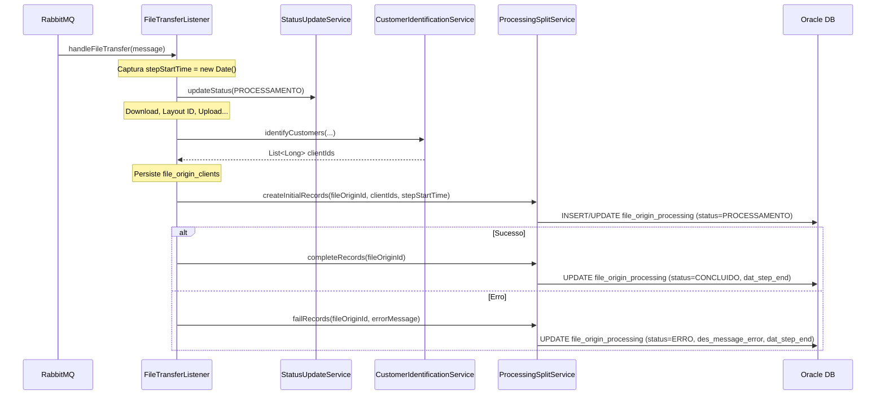
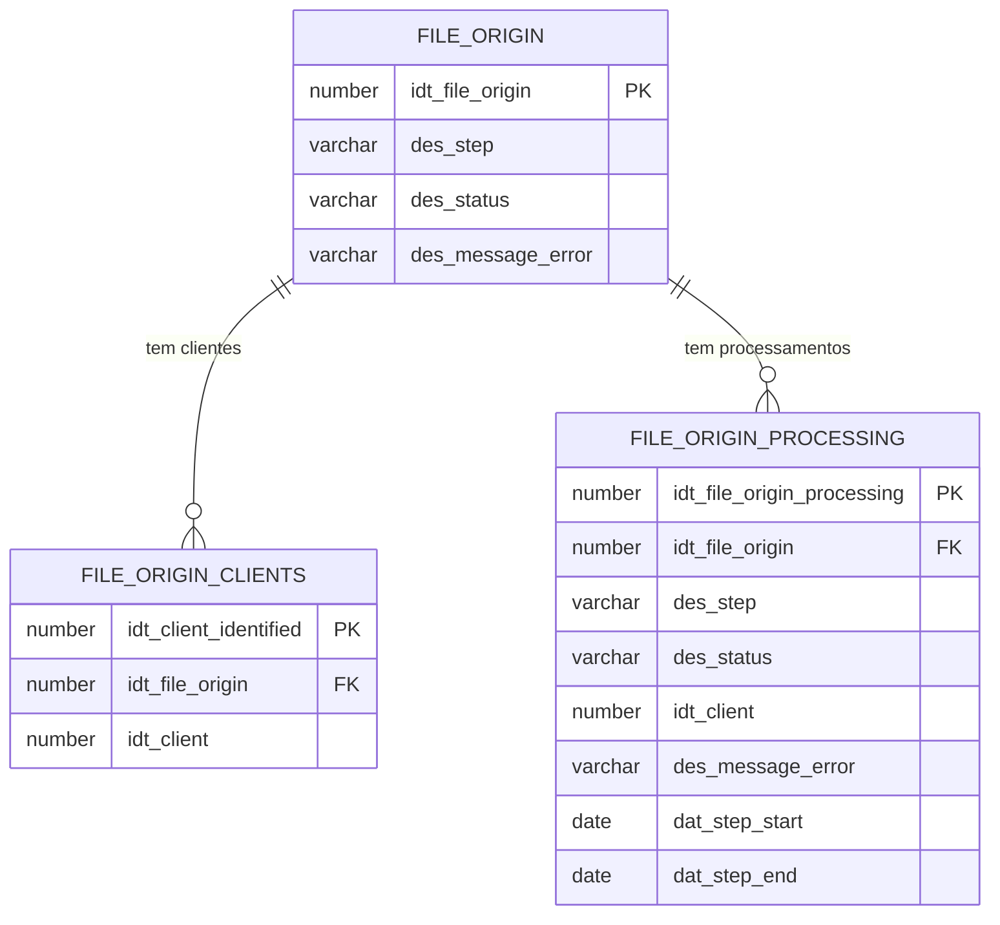

# Design — File Multiprocessing Tracking

## Visão Geral

Esta funcionalidade introduz o rastreamento granular do processamento de arquivos por cliente e por etapa (step) no pipeline EDI. O objetivo é criar uma nova tabela `file_origin_processing` que registra o estado de processamento para cada combinação de `arquivo × cliente × etapa`, permitindo visibilidade individual e preparando o sistema para que etapas futuras (ORDENACAO, PROCESSAMENTO) possam atualizar status de forma independente por cliente.

O escopo atual cobre apenas a etapa de COLETA no Consumer. O novo `ProcessingSplitService` será responsável por criar e atualizar registros na `file_origin_processing` após a identificação de clientes, mantendo step/status espelhados com a tabela `file_origin`.

### Decisões de Design

1. **Upsert por combinação natural**: Em vez de usar uma constraint UNIQUE no banco, o serviço faz um `findBy` antes de inserir. Isso permite distinguir retry (atualiza registro existente) de reprocessamento total (insere novo registro), conforme regras de negócio.
2. **Timestamp capturado no início**: O `dat_step_start` é capturado no início do `handleFileTransfer`, antes de qualquer operação, e passado como parâmetro para o serviço.
3. **Mesmo agente de alteração**: O `nam_change_agent` reutiliza o valor `"consumer-service"` do `StatusUpdateService` para consistência.
4. **Módulo commons para entidade/repositório**: Seguindo o padrão existente, a entidade e o repositório ficam no módulo `commons`, enquanto o serviço fica no módulo `consumer`.

## Arquitetura

O fluxo de processamento no `FileTransferListener` será estendido com chamadas ao novo `ProcessingSplitService`:



### Componentes Afetados

| Componente | Módulo | Ação |
|---|---|---|
| `FileOriginProcessing` (entidade) | commons | Novo |
| `FileOriginProcessingRepository` | commons | Novo |
| `ProcessingSplitService` | consumer | Novo |
| `FileTransferListener` | consumer | Modificado |
| DDL script `12_create_file_origin_processing_table.sql` | scripts/ddl | Novo |
| `00_run_all.sql` | scripts/ddl | Modificado |

## Componentes e Interfaces

### 1. FileOriginProcessing (Entidade JPA)

Nova entidade no pacote `com.concil.edi.commons.entity`, seguindo o padrão de `FileOriginClients`:

```java
@Entity
@Table(name = "file_origin_processing")
@Data
@NoArgsConstructor
@AllArgsConstructor
public class FileOriginProcessing {
    @Id
    @GeneratedValue(strategy = GenerationType.SEQUENCE, generator = "file_origin_processing_seq_gen")
    @SequenceGenerator(name = "file_origin_processing_seq_gen", 
                       sequenceName = "file_origin_processing_seq", allocationSize = 1)
    @Column(name = "idt_file_origin_processing")
    private Long idtFileOriginProcessing;

    @Column(name = "idt_file_origin", nullable = false)
    private Long idtFileOrigin;

    @Enumerated(EnumType.STRING)
    @Column(name = "des_step", nullable = false)
    private Step desStep;

    @Enumerated(EnumType.STRING)
    @Column(name = "des_status", nullable = false)
    private Status desStatus;

    @Column(name = "idt_client")
    private Long idtClient; // NULL quando cliente não identificado

    @Column(name = "des_message_error", length = 4000)
    private String desMessageError;

    @Column(name = "des_message_alert", length = 4000)
    private String desMessageAlert;

    @Temporal(TemporalType.TIMESTAMP)
    @Column(name = "dat_step_start")
    private Date datStepStart;

    @Temporal(TemporalType.TIMESTAMP)
    @Column(name = "dat_step_end")
    private Date datStepEnd;

    @Column(name = "jsn_additional_info", length = 4000)
    private String jsnAdditionalInfo;

    @Temporal(TemporalType.TIMESTAMP)
    @Column(name = "dat_creation", nullable = false)
    private Date datCreation;

    @Temporal(TemporalType.TIMESTAMP)
    @Column(name = "dat_update")
    private Date datUpdate;

    @Column(name = "nam_change_agent", nullable = false, length = 50)
    private String namChangeAgent;
}
```

### 2. FileOriginProcessingRepository

Repositório no pacote `com.concil.edi.commons.repository`:

```java
@Repository
public interface FileOriginProcessingRepository extends JpaRepository<FileOriginProcessing, Long> {
    
    Optional<FileOriginProcessing> findByIdtFileOriginAndIdtClientAndDesStep(
        Long idtFileOrigin, Long idtClient, Step desStep);

    // Para idt_client NULL (arquivo sem cliente identificado)
    Optional<FileOriginProcessing> findByIdtFileOriginAndIdtClientIsNullAndDesStep(
        Long idtFileOrigin, Step desStep);

    List<FileOriginProcessing> findByIdtFileOriginAndDesStep(Long idtFileOrigin, Step desStep);
}
```

### 3. ProcessingSplitService

Novo serviço no pacote `com.concil.edi.consumer.service`, seguindo o padrão do `StatusUpdateService`:

```java
@Service
@RequiredArgsConstructor
@Slf4j
public class ProcessingSplitService {
    
    private static final String CHANGE_AGENT = "consumer-service";
    private final FileOriginProcessingRepository repository;

    @Transactional
    public void createInitialRecords(Long fileOriginId, List<Long> clientIds, Date stepStartTime);

    @Transactional
    public void completeRecords(Long fileOriginId);

    @Transactional
    public void failRecords(Long fileOriginId, String errorMessage);
}
```

**Métodos:**

- `createInitialRecords`: Cria ou atualiza registros na `file_origin_processing` com `des_step=COLETA` e `des_status=PROCESSAMENTO`. Se `clientIds` estiver vazio, cria um registro com `idt_client=NULL`. Para cada cliente, busca registro existente (retry) ou cria novo.
- `completeRecords`: Atualiza todos os registros do arquivo com step COLETA para `des_status=CONCLUIDO`, preenchendo `dat_step_end` e `dat_update`.
- `failRecords`: Atualiza todos os registros do arquivo com step COLETA para `des_status=ERRO`, preenchendo `des_message_error`, `dat_step_end` e `dat_update`.

### 4. FileTransferListener (Modificações)

Alterações no `handleFileTransfer`:

1. **Início**: Capturar `Date stepStartTime = new Date()` antes de qualquer operação.
2. **Após identificação de clientes**: Chamar `processingSplitService.createInitialRecords(fileOriginId, identifiedClients, stepStartTime)`.
3. **Sucesso (após `executeRemoval`)**: Chamar `processingSplitService.completeRecords(fileOriginId)`.
4. **Erro (no `handleError`)**: Chamar `processingSplitService.failRecords(fileOriginId, e.getMessage())`.

### 5. Script DDL

Novo script `scripts/ddl/12_create_file_origin_processing_table.sql` seguindo o padrão do script 10:

- Drop condicional da tabela e sequence
- Criação da sequence `file_origin_processing_seq`
- Criação da tabela com todas as colunas conforme prompt
- Foreign key para `file_origin(idt_file_origin)`
- Índices de performance em `idt_file_origin` e `idt_client`
- Comentários nas colunas
- COMMIT ao final

## Modelo de Dados

### Tabela: file_origin_processing

```
┌─────────────────────────────────────────────────────────────────────┐
│ file_origin_processing                                              │
├─────────────────────────────┬───────────────┬───────────────────────┤
│ Coluna                      │ Tipo          │ Restrição             │
├─────────────────────────────┼───────────────┼───────────────────────┤
│ idt_file_origin_processing  │ NUMBER(19)    │ PK, NOT NULL, SEQ     │
│ idt_file_origin             │ NUMBER(19)    │ FK, NOT NULL          │
│ des_step                    │ VARCHAR2(50)  │ NOT NULL              │
│ des_status                  │ VARCHAR2(50)  │ NOT NULL              │
│ idt_client                  │ NUMBER(20)    │ NULL                  │
│ des_message_error           │ VARCHAR2(4000)│ NULL                  │
│ des_message_alert           │ VARCHAR2(4000)│ NULL                  │
│ dat_step_start              │ DATE          │ NULL                  │
│ dat_step_end                │ DATE          │ NULL                  │
│ jsn_additional_info         │ VARCHAR2(4000)│ NULL                  │
│ dat_creation                │ DATE          │ NOT NULL              │
│ dat_update                  │ DATE          │ NULL                  │
│ nam_change_agent            │ VARCHAR2(50)  │ NOT NULL              │
└─────────────────────────────┴───────────────┴───────────────────────┘
```

### Relacionamentos



### Regras de Unicidade (Lógica no Serviço)

- **Retry (mesmo ciclo)**: O `ProcessingSplitService` busca por `idt_file_origin + idt_client + des_step=COLETA`. Se encontrar, atualiza o registro existente.
- **Reprocessamento total**: Quando já existem registros de steps posteriores à COLETA, novos registros de COLETA são inseridos, gerando um novo ciclo.

### Índices

| Índice | Colunas | Justificativa |
|---|---|---|
| `idx_fop_file_origin` | `idt_file_origin` | Consultas frequentes por arquivo |
| `idx_fop_client` | `idt_client` | Consultas futuras por cliente |


## Propriedades de Corretude

*Uma propriedade é uma característica ou comportamento que deve ser verdadeiro em todas as execuções válidas de um sistema — essencialmente, uma declaração formal sobre o que o sistema deve fazer. Propriedades servem como ponte entre especificações legíveis por humanos e garantias de corretude verificáveis por máquina.*

### Property 1: Criação de registros iniciais preserva a correspondência com clientes

*Para qualquer* lista de clientIds (incluindo lista vazia) e qualquer timestamp de início válido, ao chamar `createInitialRecords`, o serviço deve criar exatamente `max(1, clientIds.size())` registros na `file_origin_processing`, onde cada registro possui: `des_step=COLETA`, `des_status=PROCESSAMENTO`, `dat_step_start` igual ao timestamp fornecido, `nam_change_agent="consumer-service"`, `dat_creation` não nulo, e `idt_client` correspondendo ao clientId respectivo (ou NULL se a lista estiver vazia).

**Validates: Requirements 5.1, 5.2, 5.3, 5.5**

### Property 2: Finalização com sucesso atualiza todos os registros para CONCLUIDO

*Para qualquer* conjunto de N registros existentes na `file_origin_processing` com `des_step=COLETA` para um dado `idt_file_origin`, ao chamar `completeRecords`, todos os N registros devem ter `des_status=CONCLUIDO`, `dat_step_end` não nulo, `dat_update` não nulo, e `des_message_error=NULL`.

**Validates: Requirements 6.1, 6.2**

### Property 3: Finalização com erro propaga a mensagem para todos os registros

*Para qualquer* conjunto de N registros existentes na `file_origin_processing` com `des_step=COLETA` para um dado `idt_file_origin`, e *para qualquer* string de mensagem de erro, ao chamar `failRecords`, todos os N registros devem ter `des_status=ERRO`, `dat_step_end` não nulo, `dat_update` não nulo, e `des_message_error` igual à mensagem fornecida.

**Validates: Requirements 7.1, 7.2**

### Property 4: Retry no mesmo ciclo é idempotente em contagem de registros

*Para qualquer* `idt_file_origin` e lista de clientIds, ao chamar `createInitialRecords` duas vezes consecutivas com os mesmos parâmetros, o número total de registros na `file_origin_processing` para aquele arquivo e step COLETA deve permanecer o mesmo (sem duplicatas). Os campos `des_status`, `dat_step_start`, `dat_update` e `nam_change_agent` devem refletir os valores da segunda chamada.

**Validates: Requirements 8.1, 8.2**

## Tratamento de Erros

### Erros no ProcessingSplitService

| Cenário | Comportamento |
|---|---|
| Falha ao criar registros iniciais | Log de erro. Não deve impedir o fluxo principal de coleta. O arquivo continua sendo processado normalmente. |
| Falha ao atualizar registros (complete/fail) | Log de erro. O status na `file_origin` já foi atualizado pelo `StatusUpdateService`, então a inconsistência é apenas na `file_origin_processing`. |
| Registro não encontrado para atualização | Log de warning. Pode ocorrer se o registro inicial não foi criado (falha anterior). |

### Resiliência

- O `ProcessingSplitService` não deve lançar exceções que interrompam o fluxo principal do `FileTransferListener`. Erros devem ser logados e tratados internamente.
- Em caso de falha na criação/atualização dos registros de processing, o fluxo de coleta (download, upload, remoção) deve continuar normalmente.
- O try-catch no `FileTransferListener` ao redor das chamadas ao `ProcessingSplitService` garante que falhas no tracking não afetem o processamento do arquivo.

## Estratégia de Testes

### Testes Unitários

Testes unitários com mocks para validar a lógica do `ProcessingSplitService`:

- Criação de registros com lista de clientes (1, 2, N clientes)
- Criação de registro com lista vazia (idt_client=NULL)
- Atualização para CONCLUIDO
- Atualização para ERRO com mensagem
- Retry: atualização de registro existente ao invés de criação
- Verificação de campos obrigatórios (nam_change_agent, dat_creation, dat_step_start)

### Testes Property-Based (jqwik)

A biblioteca **jqwik 1.8.2** será utilizada para testes property-based, já configurada no projeto.

Cada property test deve:
- Executar no mínimo **100 iterações**
- Referenciar a property do design com tag no formato: `Feature: file-multiprocessing-tracking, Property {number}: {título}`
- Usar `@ForAll` para gerar inputs aleatórios
- Mockar o `FileOriginProcessingRepository` para isolar a lógica do serviço

**Properties a implementar:**
1. **Property 1**: Gerar listas aleatórias de clientIds (0 a 10 elementos), timestamps aleatórios. Verificar contagem e campos dos registros criados.
2. **Property 2**: Gerar N registros existentes (1 a 5), chamar completeRecords, verificar que todos foram atualizados corretamente.
3. **Property 3**: Gerar N registros existentes e mensagens de erro aleatórias, chamar failRecords, verificar atualização.
4. **Property 4**: Gerar clientIds, chamar createInitialRecords duas vezes, verificar idempotência.

### Testes de Integração (E2E)

Os testes E2E existentes no projeto (`FileTransferE2ETest`) devem ser estendidos para validar:
- Registros na `file_origin_processing` após coleta com sucesso (com e sem clientes)
- Registros na `file_origin_processing` após coleta com erro
- Timestamps `dat_step_start` < `dat_step_end`
- Unicidade de registros durante retry
