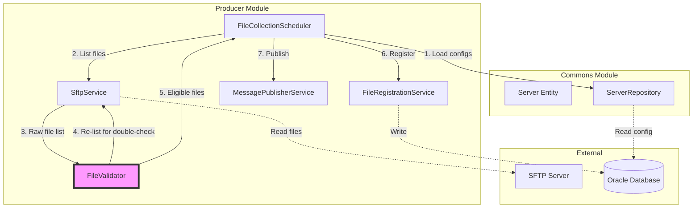
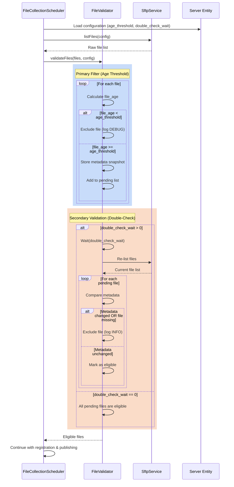

# Design Document: File Transfer Validation with Age Threshold

## Overview

This design implements a hybrid validation approach to prevent processing files that are still being uploaded to SFTP servers. The system combines two complementary strategies:

1. **Primary Filter (Age Threshold)**: A fast, efficient check that excludes files modified within a configurable time window. This handles the majority of cases and minimizes unnecessary processing.

2. **Secondary Validation (Double-Check)**: A metadata comparison that re-examines files after a short wait period to detect ongoing writes. This catches edge cases where timestamps are unreliable due to timezone issues, clock skew, or null values.

The hybrid approach balances efficiency with reliability: the age threshold quickly filters out most in-progress uploads, while the double-check provides a safety net for edge cases without requiring double-checking every file.

### Key Design Decisions

- **Server-level configuration**: Both validation parameters are configured per server in the database, allowing different thresholds for different SFTP sources based on their characteristics
- **Backward compatibility**: Default values of 0 for both parameters disable validation, preserving existing behavior
- **Fail-safe approach**: Edge cases (null timestamps, negative values, future timestamps) are handled conservatively by excluding files
- **Streaming integration**: Validation occurs before file registration, preventing invalid files from entering the processing pipeline
- **Observability-first**: Comprehensive logging at appropriate levels (DEBUG for routine exclusions, INFO for summaries, WARN for edge cases)

## Architecture

### Component Diagram



### Sequence Diagram: Hybrid Validation Flow



## Components and Interfaces

### 1. FileValidator Service

New service component responsible for hybrid validation logic.

**Location**: `producer/src/main/java/com/concil/edi/producer/service/FileValidator.java`

**Responsibilities**:
- Apply primary filter using age threshold
- Store metadata snapshots for files passing primary filter
- Execute secondary validation with double-check
- Handle edge cases (null timestamps, future dates, negative values)
- Provide comprehensive logging for observability

**Key Methods**:

```java
public class FileValidator {
    /**
     * Validate files using hybrid approach (age threshold + double-check).
     * 
     * @param files Raw file list from SFTP
     * @param config Server configuration with validation parameters
     * @return List of eligible files that passed both validations
     */
    public List<FileMetadataDTO> validateFiles(
        List<FileMetadataDTO> files, 
        ServerConfigurationDTO config
    );
    
    /**
     * Apply primary filter using age threshold.
     * Excludes files with age < threshold.
     * 
     * @param files Raw file list
     * @param ageThresholdSeconds Minimum age in seconds
     * @param codServer Server code for logging
     * @return Files passing age threshold with their snapshots
     */
    private Map<String, FileMetadataSnapshot> applyPrimaryFilter(
        List<FileMetadataDTO> files,
        int ageThresholdSeconds,
        String codServer
    );
    
    /**
     * Apply secondary validation using double-check.
     * Re-lists files and compares metadata to detect ongoing writes.
     * 
     * @param snapshots Metadata snapshots from primary filter
     * @param config Server configuration
     * @param doubleCheckWaitSeconds Wait duration before re-check
     * @return List of eligible files with unchanged metadata
     */
    private List<FileMetadataDTO> applySecondaryValidation(
        Map<String, FileMetadataSnapshot> snapshots,
        ServerConfigurationDTO config,
        int doubleCheckWaitSeconds
    );
    
    /**
     * Calculate file age in milliseconds with UTC normalization.
     * Converts both lastModified and currentTime to UTC before calculating age.
     * Handles edge cases: 
     * - Future timestamps within 24h tolerance return 0
     * - Future timestamps > 24h are rejected (return -1)
     * - Null timestamps return -1
     * 
     * @param lastModified File's last modified timestamp
     * @param currentTimeMillis Current system time
     * @return Age in milliseconds, or 0 if future within tolerance, or -1 if null/invalid
     */
    private long calculateFileAge(Timestamp lastModified, long currentTimeMillis);
    
    /**
     * Normalize validation parameter (treat null or negative as 0).
     * 
     * @param value Parameter value from database
     * @return Normalized value (>= 0)
     */
    private int normalizeParameter(Integer value);
}
```

### 2. FileMetadataSnapshot DTO

New internal DTO for storing file metadata during validation.

**Location**: `producer/src/main/java/com/concil/edi/producer/dto/FileMetadataSnapshot.java`

```java
@Data
@AllArgsConstructor
public class FileMetadataSnapshot {
    private String filename;
    private Timestamp lastModified;
    private Long size;
    private FileType fileType;
    
    /**
     * Compare with current metadata to detect changes.
     * 
     * @param current Current file metadata
     * @return true if metadata unchanged, false if changed
     */
    public boolean matches(FileMetadataDTO current) {
        return this.lastModified.equals(current.getTimestamp()) 
            && this.size.equals(current.getFileSize());
    }
}
```

### 3. Server Entity (Modified)

**Location**: `commons/src/main/java/com/concil/edi/commons/entity/Server.java`

**New Fields**:
```java
@Column(name = "num_min_age_seconds")
private Integer numMinAgeSeconds;  // Nullable, defaults to 0

@Column(name = "num_double_check_wait_seconds")
private Integer numDoubleCheckWaitSeconds;  // Nullable, defaults to 0
```

### 4. ServerConfigurationDTO (Modified)

**Location**: `producer/src/main/java/com/concil/edi/producer/dto/ServerConfigurationDTO.java`

**New Fields**:
```java
private Integer minAgeSeconds;
private Integer doubleCheckWaitSeconds;
```

### 5. FileCollectionScheduler (Modified)

**Location**: `producer/src/main/java/com/concil/edi/producer/scheduler/FileCollectionScheduler.java`

**Integration Point**:
```java
private void processConfiguration(ServerConfigurationDTO config) {
    // ... existing code ...
    
    List<FileMetadataDTO> rawFiles = sftpService.listFiles(config);
    
    // NEW: Apply hybrid validation
    List<FileMetadataDTO> eligibleFiles = fileValidator.validateFiles(rawFiles, config);
    
    if (eligibleFiles.isEmpty()) {
        log.debug("No eligible files after validation for configuration: {}", 
            config.getCodServer());
        return;
    }
    
    log.info("Found {} eligible files after validation for configuration: {}", 
        eligibleFiles.size(), config.getCodServer());
    
    for (FileMetadataDTO file : eligibleFiles) {
        processFile(file, config);
    }
}
```

### 6. ConfigurationService (Modified)

**Location**: `producer/src/main/java/com/concil/edi/producer/service/ConfigurationService.java`

**Modified Method**:
```java
public List<ServerConfigurationDTO> loadActiveConfigurations() {
    // ... existing query ...
    // Add minAgeSeconds and doubleCheckWaitSeconds to projection
}
```

## Data Models

### Database Schema Changes

**Table**: `server`

**New Columns**:
```sql
ALTER TABLE server ADD (
    num_min_age_seconds NUMBER(10) DEFAULT 0,
    num_double_check_wait_seconds NUMBER(10) DEFAULT 0
);

COMMENT ON COLUMN server.num_min_age_seconds IS 
    'Minimum age in seconds for files to pass primary filter. 0 = disabled.';
    
COMMENT ON COLUMN server.num_double_check_wait_seconds IS 
    'Wait duration in seconds before re-checking file metadata. 0 = disabled.';
```

**Migration Strategy**:
- Add columns as nullable with default value 0
- Existing rows will have NULL, which is treated as 0 by the application
- No data migration required (backward compatible)
- Administrators can configure thresholds per server as needed

### Entity Mapping

**Server Entity** (updated):
```java
@Entity
@Table(name = "server")
public class Server {
    // ... existing fields ...
    
    @Column(name = "num_min_age_seconds")
    private Integer numMinAgeSeconds;
    
    @Column(name = "num_double_check_wait_seconds")
    private Integer numDoubleCheckWaitSeconds;
}
```

### DTO Mapping

**ServerConfigurationDTO** (updated):
```java
@Data
public class ServerConfigurationDTO {
    // ... existing fields ...
    
    private Integer minAgeSeconds;
    private Integer doubleCheckWaitSeconds;
}
```

**FileMetadataSnapshot** (new):
```java
@Data
@AllArgsConstructor
public class FileMetadataSnapshot {
    private String filename;
    private Timestamp lastModified;
    private Long size;
    private FileType fileType;
}
```

## Infrastructure Configuration

### Timezone Consistency Across Containers

To ensure consistent timestamp handling across the entire system, all local infrastructure components must be configured with the same timezone: `America/Sao_Paulo`.

**Rationale**: While the FileValidator uses UTC normalization for all timestamp comparisons (eliminating timezone-related calculation errors), configuring a consistent timezone across all infrastructure components provides:
- Consistent log timestamps for debugging and correlation
- Predictable database timestamp storage behavior
- Simplified troubleshooting when comparing logs across services

### Docker Compose Configuration

**File**: `docker-compose.yml`

All service containers must include the `TZ` environment variable:

```yaml
version: '3.8'

services:
  oracle:
    image: gvenzl/oracle-xe:21-slim
    environment:
      - TZ=America/Sao_Paulo
      # ... other environment variables
    # ... rest of configuration

  rabbitmq:
    image: rabbitmq:3.12-management
    environment:
      - TZ=America/Sao_Paulo
      # ... other environment variables
    # ... rest of configuration

  producer:
    build:
      context: ./producer
      dockerfile: Dockerfile
    environment:
      - TZ=America/Sao_Paulo
      # ... other environment variables
    # ... rest of configuration

  consumer:
    build:
      context: ./consumer
      dockerfile: Dockerfile
    environment:
      - TZ=America/Sao_Paulo
      # ... other environment variables
    # ... rest of configuration
```

### Dockerfile Configuration

**Producer Dockerfile** (`producer/Dockerfile`):

```dockerfile
FROM eclipse-temurin:21-jre-alpine

# Set timezone
ENV TZ=America/Sao_Paulo

# ... rest of Dockerfile
```

**Consumer Dockerfile** (`consumer/Dockerfile`):

```dockerfile
FROM eclipse-temurin:21-jre-alpine

# Set timezone
ENV TZ=America/Sao_Paulo

# ... rest of Dockerfile
```

### Implementation Details

**UTC Normalization in FileValidator**:

The `calculateFileAge()` method performs UTC normalization:

```java
private long calculateFileAge(Timestamp lastModified, long currentTimeMillis) {
    if (lastModified == null) {
        return -1; // Invalid timestamp
    }
    
    // Convert both timestamps to UTC
    Instant lastModifiedUTC = lastModified.toInstant();
    Instant currentTimeUTC = Instant.ofEpochMilli(currentTimeMillis);
    
    // Calculate age in milliseconds
    long ageMillis = currentTimeUTC.toEpochMilli() - lastModifiedUTC.toEpochMilli();
    
    // Handle future timestamps with 24h tolerance
    if (ageMillis < 0) {
        long futureOffsetHours = Math.abs(ageMillis) / (1000 * 60 * 60);
        
        if (futureOffsetHours <= 24) {
            // Within tolerance: treat as age 0
            log.info("File has future timestamp within tolerance: {} hours ahead", 
                futureOffsetHours);
            return 0;
        } else {
            // Beyond tolerance: reject file
            log.warn("File has future timestamp beyond tolerance: {} hours ahead", 
                futureOffsetHours);
            return -1;
        }
    }
    
    return ageMillis;
}
```

**Key Points**:
- `Timestamp.toInstant()` automatically converts to UTC (Instant is always UTC)
- `Instant.ofEpochMilli()` creates UTC instant from system time
- Age calculation uses UTC milliseconds, eliminating timezone discrepancies
- Future timestamp tolerance (24h) allows for minor clock skew
- Infrastructure timezone (America/Sao_Paulo) only affects logging and database storage, not calculations

## Correctness Properties

*A property is a characteristic or behavior that should hold true across all valid executions of a system-essentially, a formal statement about what the system should do. Properties serve as the bridge between human-readable specifications and machine-verifiable correctness guarantees.*

### Property 1: Validation Parameters Accept Non-Negative Values

*For any* Server entity with validation parameters (numMinAgeSeconds, numDoubleCheckWaitSeconds), when the parameters are set to non-negative integer values, the entity should be persisted successfully without validation errors.

**Validates: Requirements 1.3, 1.4**

### Property 2: File Age Calculation with UTC Normalization

*For any* file with a lastModified timestamp and current system time, when both timestamps are converted to UTC, the calculated file age should equal (currentTimeUTC_millis - lastModifiedUTC_millis) with millisecond precision, unless the timestamp is in the future by more than 24 hours (in which case age should be -1 for rejection), within 24h future tolerance (age should be 0), or null (age should be -1).

**Validates: Requirements 2.2, 5.1, 5.2, 5.3, 5.4, 6.1, 6.2**

### Property 3: Primary Filter Excludes Young Files

*For any* file with file_age less than age_threshold, the primary filter should exclude the file from further processing.

**Validates: Requirements 2.3**

### Property 4: Primary Filter Passes Old Files

*For any* file with file_age greater than or equal to age_threshold, the primary filter should pass the file to secondary validation and store a metadata snapshot.

**Validates: Requirements 2.4, 3.1**

### Property 5: Metadata Comparison Detects Changes

*For any* pair of file metadata (snapshot and current), when either lastModified or size has changed, the comparison should detect the change and return false for matches().

**Validates: Requirements 3.4, 3.5**

### Property 6: Metadata Comparison Confirms Unchanged Files

*For any* pair of file metadata (snapshot and current), when both lastModified and size are unchanged, the comparison should confirm the match and return true for matches().

**Validates: Requirements 3.4, 3.6**

## Error Handling

### Edge Case Handling

**1. Null Timestamps**
- **Scenario**: File metadata has null lastModified
- **Handling**: Exclude file immediately, log WARNING with filename and server
- **Rationale**: Cannot calculate age without timestamp; safer to exclude than risk processing incomplete upload

**2. Future Timestamps**
- **Scenario**: File's lastModified is in the future (clock skew)
- **Handling**: 
  - If timestamp is within 24h in the future: treat file age as 0 (will fail age threshold check)
  - If timestamp is > 24h in the future: exclude file immediately (return -1), log WARNING
- **Rationale**: Minor clock skew (< 24h) is tolerated by treating age as 0; extreme future timestamps (> 24h) indicate serious clock issues and are rejected

**3. Negative or Null Size**
- **Scenario**: File metadata has null or negative size
- **Handling**: Exclude file immediately, log WARNING with filename and server
- **Rationale**: Invalid size indicates corrupted metadata; safer to exclude

**4. Negative Configuration Values**
- **Scenario**: Database contains negative values for validation parameters
- **Handling**: Normalize to 0 (disable validation)
- **Rationale**: Treat invalid configuration as "disabled" rather than failing

**5. Null Configuration Values**
- **Scenario**: Database has NULL for validation parameters
- **Handling**: Normalize to 0 (disable validation)
- **Rationale**: Backward compatibility with existing configurations

**6. File Disappears During Re-Check**
- **Scenario**: File present in initial listing but missing during double-check
- **Handling**: Exclude file from eligible list, log INFO with filename
- **Rationale**: File may have been deleted or moved; safer to exclude

**7. SFTP Connection Error During Re-Check**
- **Scenario**: Cannot re-list files due to SFTP connection failure
- **Handling**: Exclude all pending files, log ERROR with server and exception
- **Rationale**: Cannot verify file stability without re-check; fail-safe approach excludes all

### Exception Handling Strategy

```java
public List<FileMetadataDTO> validateFiles(
    List<FileMetadataDTO> files, 
    ServerConfigurationDTO config) {
    
    try {
        // Primary filter
        Map<String, FileMetadataSnapshot> snapshots = 
            applyPrimaryFilter(files, config.getMinAgeSeconds(), config.getCodServer());
        
        // Secondary validation
        return applySecondaryValidation(
            snapshots, config, config.getDoubleCheckWaitSeconds());
            
    } catch (Exception e) {
        log.error("Validation failed for server: {}, excluding all files", 
            config.getCodServer(), e);
        return Collections.emptyList(); // Fail-safe: exclude all files
    }
}
```

### Logging Levels

- **DEBUG**: Routine exclusions by primary filter (high volume)
- **INFO**: Secondary validation results, summaries, file disappearance
- **WARN**: Edge cases (null timestamps, invalid sizes)
- **ERROR**: SFTP connection failures, unexpected exceptions

## Testing Strategy

### Dual Testing Approach

This feature requires both unit tests and property-based tests for comprehensive coverage:

**Unit Tests**: Focus on specific examples, edge cases, and integration points
- Specific configuration scenarios (both params = 0, only age threshold, only double-check)
- Edge cases (null timestamps, future dates, negative values, missing files)
- Integration with FileCollectionScheduler
- Error handling paths (SFTP failures, exceptions)

**Property-Based Tests**: Verify universal properties across all inputs
- File age calculation correctness across random timestamps
- Primary filter behavior across random file ages and thresholds
- Metadata comparison across random file metadata pairs
- Parameter normalization across random input values

### Property-Based Testing Configuration

**Framework**: jqwik 1.8.2 (already in project dependencies)

**Test Configuration**:
- Minimum 100 iterations per property test
- Each test tagged with feature name and property number
- Tag format: `@Tag("Feature: file-transfer-validation-age-threshold, Property {N}: {description}")`

### Test Structure

**Unit Tests** (`FileValidatorTest.java`):
```java
@SpringBootTest
class FileValidatorTest {
    
    @Test
    void shouldProcessAllFilesWhenBothParametersAreZero() {
        // Validates backward compatibility (Req 1.7, 4.3)
    }
    
    @Test
    void shouldExcludeFileWithNullTimestamp() {
        // Validates edge case (Req 5.4)
    }
    
    @Test
    void shouldExcludeFileWithNegativeSize() {
        // Validates edge case (Req 5.5)
    }
    
    @Test
    void shouldTreatNullParametersAsZero() {
        // Validates backward compatibility (Req 4.1, 4.2)
    }
    
    @Test
    void shouldExcludeFileWhenDisappearedDuringRecheck() {
        // Validates edge case (Req 3.7)
    }
    
    @Test
    void shouldSkipPrimaryFilterWhenAgeThresholdIsZero() {
        // Validates edge case (Req 2.5)
    }
    
    @Test
    void shouldSkipSecondaryValidationWhenDoubleCheckIsZero() {
        // Validates edge case (Req 3.8)
    }
    
    @Test
    void shouldTreatFutureTimestampAsAgeZero() {
        // Validates edge case (Req 6.1) - within 24h tolerance
    }
    
    @Test
    void shouldRejectFutureTimestampBeyondTolerance() {
        // Validates edge case (Req 6.2) - beyond 24h tolerance
    }
    
    @Test
    void shouldNormalizeTimestampsToUTC() {
        // Validates UTC normalization (Req 5.1, 5.2, 5.3)
    }
    
    @Test
    void shouldNormalizeNegativeAgeThreshold() {
        // Validates edge case (Req 5.2)
    }
    
    @Test
    void shouldNormalizeNegativeDoubleCheckWait() {
        // Validates edge case (Req 5.3)
    }
}
```

**Property-Based Tests** (`FileValidatorPropertyTest.java`):
```java
@Tag("Feature: file-transfer-validation-age-threshold")
class FileValidatorPropertyTest {
    
    @Property(tries = 100)
    @Tag("Property 1: Validation parameters accept non-negative values")
    void validationParametersAcceptNonNegativeValues(
        @ForAll @IntRange(min = 0, max = 86400) int minAge,
        @ForAll @IntRange(min = 0, max = 3600) int doubleCheckWait
    ) {
        // Test that Server entity accepts non-negative parameters
        // Validates Requirements 1.3, 1.4
    }
    
    @Property(tries = 100)
    @Tag("Property 2: File age calculation with UTC normalization")
    void fileAgeCalculationWithUTCNormalization(
        @ForAll @LongRange(min = 0) long lastModifiedMillis,
        @ForAll @LongRange(min = 0) long currentMillis
    ) {
        // Test age calculation with UTC normalization
        // Handle future timestamps: within 24h tolerance returns 0, beyond returns -1
        // Validates Requirements 2.2, 5.1, 5.2, 5.3, 5.4, 6.1, 6.2
    }
    
    @Property(tries = 100)
    @Tag("Property 3: Primary filter excludes young files")
    void primaryFilterExcludesYoungFiles(
        @ForAll @IntRange(min = 1, max = 3600) int ageThreshold,
        @ForAll @IntRange(min = 0, max = 3599) int fileAge
    ) {
        // Assume: fileAge < ageThreshold
        // Test that file is excluded by primary filter
        // Validates Requirement 2.3
    }
    
    @Property(tries = 100)
    @Tag("Property 4: Primary filter passes old files")
    void primaryFilterPassesOldFiles(
        @ForAll @IntRange(min = 0, max = 3600) int ageThreshold,
        @ForAll @IntRange(min = 0, max = 7200) int fileAge
    ) {
        // Assume: fileAge >= ageThreshold
        // Test that file passes to secondary validation
        // Validates Requirements 2.4, 3.1
    }
    
    @Property(tries = 100)
    @Tag("Property 5: Metadata comparison detects changes")
    void metadataComparisonDetectsChanges(
        @ForAll("fileMetadata") FileMetadataDTO original,
        @ForAll("fileMetadata") FileMetadataDTO modified
    ) {
        // Assume: modified has different timestamp OR size
        // Test that matches() returns false
        // Validates Requirements 3.4, 3.5
    }
    
    @Property(tries = 100)
    @Tag("Property 6: Metadata comparison confirms unchanged files")
    void metadataComparisonConfirmsUnchangedFiles(
        @ForAll("fileMetadata") FileMetadataDTO original
    ) {
        // Create identical copy
        // Test that matches() returns true
        // Validates Requirements 3.4, 3.6
    }
    
    @Provide
    Arbitrary<FileMetadataDTO> fileMetadata() {
        return Combinators.combine(
            Arbitraries.strings().alpha().ofLength(10),
            Arbitraries.longs().greaterOrEqual(0),
            Arbitraries.longs().greaterOrEqual(0),
            Arbitraries.of(FileType.values())
        ).as((name, size, timestamp, type) -> 
            new FileMetadataDTO(name, size, new Timestamp(timestamp), type)
        );
    }
}
```

### Integration Testing

**E2E Test Scenarios**:
1. Full hybrid validation flow with real SFTP mock
2. File upload in progress detected by double-check
3. Multiple servers with different thresholds
4. Backward compatibility with existing configurations

**Test Location**: `commons/src/test/java/com/concil/edi/commons/e2e/FileValidationE2ETest.java`

### Test Coverage Goals

- **Line Coverage**: > 85% for FileValidator
- **Branch Coverage**: > 80% for edge case handling
- **Property Tests**: 100% of identified properties implemented
- **Edge Cases**: 100% of edge cases from Requirement 5 covered

## Implementation Notes

### Performance Considerations

1. **Primary Filter Efficiency**: Age threshold check is O(1) per file, minimal overhead
2. **Double-Check Cost**: Re-listing files has network cost; only applied to files passing primary filter
3. **Memory Usage**: Metadata snapshots are lightweight (filename + timestamp + size); stored in HashMap for O(1) lookup
4. **Recommended Thresholds**:
   - Age threshold: 60-300 seconds (1-5 minutes) for most use cases
   - Double-check wait: 5-30 seconds for quick verification

### Configuration Recommendations

**Conservative (High Reliability)**:
- `num_min_age_seconds`: 300 (5 minutes)
- `num_double_check_wait_seconds`: 30 (30 seconds)
- Use case: Critical financial data, large files

**Balanced (Default)**:
- `num_min_age_seconds`: 120 (2 minutes)
- `num_double_check_wait_seconds`: 10 (10 seconds)
- Use case: Standard EDI files, moderate upload times

**Aggressive (Low Latency)**:
- `num_min_age_seconds`: 60 (1 minute)
- `num_double_check_wait_seconds`: 5 (5 seconds)
- Use case: Small files, fast uploads, low risk

**Disabled (Backward Compatible)**:
- `num_min_age_seconds`: 0
- `num_double_check_wait_seconds`: 0
- Use case: Existing integrations, testing, trusted sources

### Deployment Strategy

1. **Phase 1**: Deploy with both parameters defaulting to 0 (no validation)
2. **Phase 2**: Enable age threshold only for pilot servers (e.g., 120 seconds)
3. **Phase 3**: Monitor logs and tune thresholds based on observed file upload patterns
4. **Phase 4**: Enable double-check for servers with known timestamp issues
5. **Phase 5**: Roll out to all servers with tuned thresholds

### Monitoring and Observability

**Key Metrics to Track**:
- Files excluded by primary filter (per server)
- Files excluded by secondary validation (per server)
- Average file age at collection time
- Double-check detection rate (files with metadata changes)
- SFTP re-listing errors

**Log Analysis Queries**:
```
# Files excluded by age threshold
grep "Excluding file by age threshold" producer.log | wc -l

# Files excluded by double-check
grep "Excluding file by double-check" producer.log | wc -l

# Edge cases encountered
grep "WARN.*FileValidator" producer.log
```

**Alerting Recommendations**:
- Alert if > 50% of files excluded by primary filter (threshold too high)
- Alert if double-check detection rate > 10% (upload timing issues)
- Alert on SFTP re-listing errors (connectivity problems)
