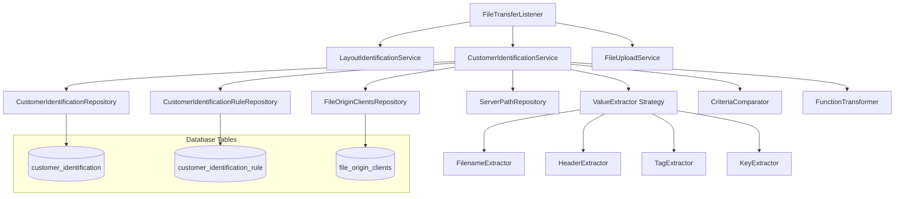
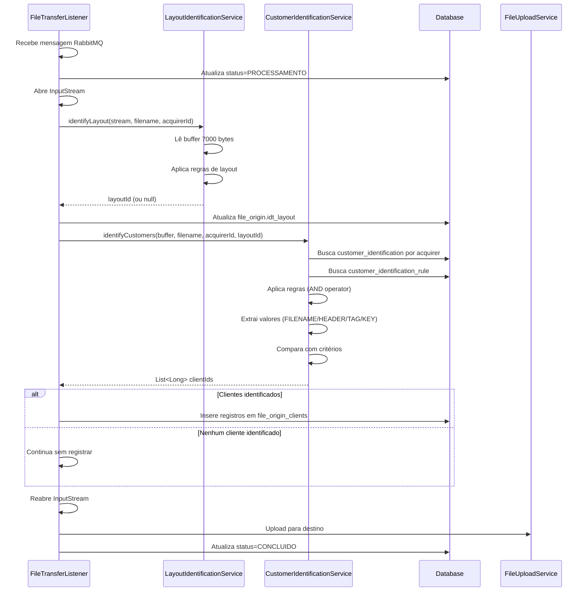

# Design Document: Identificação de Clientes em Arquivos EDI

## Overview

Este documento descreve o design técnico da funcionalidade de identificação de clientes em arquivos EDI. O sistema identifica automaticamente qual(is) cliente(s) é(são) proprietário(s) de cada arquivo processado, baseando-se em regras configuráveis que analisam o nome do arquivo e seu conteúdo.

A identificação ocorre no Consumer durante a transferência, logo após a identificação do layout, utilizando o mesmo buffer de 7000 bytes já carregado. O processo suporta quatro tipos de identificação: FILENAME (nome do arquivo), HEADER (conteúdo posicional), TAG (caminhos XML) e KEY (caminhos JSON).

Um arquivo pode pertencer a múltiplos clientes simultaneamente. Quando nenhum cliente é identificado, o processamento continua normalmente, finalizando com step=COLETA e status=CONCLUIDO, sem registrar dados na tabela file_origin_clients.

### Key Design Decisions

1. **Reutilização de Buffer**: Utiliza o mesmo buffer de 7000 bytes já carregado para identificação de layout, evitando leitura duplicada do arquivo
2. **Múltiplos Clientes**: Suporta identificação de múltiplos clientes por arquivo através de registros independentes na tabela file_origin_clients
3. **Operador AND**: Todas as regras ativas de um customer_identification devem ser satisfeitas para identificação
4. **Filtro por Adquirente**: Apenas regras da adquirente correspondente são consideradas, otimizando performance
5. **Continuidade do Processamento**: Falha na identificação não interrompe a transferência do arquivo
6. **Tratamento de Erros em TAG/KEY**: Erros ao ler TAG ou KEY são registrados em log e o processamento continua para a próxima regra
7. **Refatoração para Commons**: Move componentes compartilhados (ValueExtractor, CriteriaComparator, TransformationApplier, RuleValidator) para o módulo commons, permitindo reutilização entre identificação de layout e identificação de clientes
8. **Interface Comum**: Cria interface `IdentificationRule` implementada por ambas as entidades de regra, eliminando necessidade de adapters

## Architecture

### High-Level Architecture



### Integration Point

A identificação de clientes é integrada no FileTransferListener, logo após a identificação do layout:

```
1. FileTransferListener recebe mensagem RabbitMQ
2. Atualiza status para PROCESSAMENTO
3. Abre InputStream do arquivo SFTP
4. LayoutIdentificationService identifica layout (lê buffer de 7000 bytes)
5. Atualiza file_origin.idt_layout
6. **CustomerIdentificationService identifica clientes (reutiliza buffer)**
7. **Registra clientes identificados em file_origin_clients**
8. Reabre InputStream para upload
9. FileUploadService faz upload para destino
10. Atualiza status para CONCLUIDO
```

### Component Interaction Flow



## Components and Interfaces

### 1. CustomerIdentificationService

Serviço principal responsável pela identificação de clientes. Segue o mesmo padrão do LayoutIdentificationService.

```java
package com.concil.edi.consumer.service.customer;

import com.concil.edi.commons.entity.CustomerIdentification;
import com.concil.edi.commons.entity.CustomerIdentificationRule;
import com.concil.edi.commons.entity.Layout;
import com.concil.edi.commons.repository.CustomerIdentificationRepository;
import com.concil.edi.commons.repository.CustomerIdentificationRuleRepository;
import com.concil.edi.commons.repository.LayoutRepository;
import com.concil.edi.commons.service.CriteriaComparator;
import com.concil.edi.commons.service.RuleValidator;
import com.concil.edi.commons.service.extractor.ValueExtractor;
import org.slf4j.Logger;
import org.slf4j.LoggerFactory;
import org.springframework.stereotype.Service;

import java.util.ArrayList;
import java.util.List;

/**
 * Service responsible for identifying customers that own EDI files.
 * 
 * Identification process:
 * 1. Retrieves customer_identification records filtered by acquirer (and layout if identified)
 * 2. For each identification, retrieves active rules
 * 3. Applies all rules with AND operator
 * 4. Returns list of all identified customer IDs
 * 
 * Supports four identification types:
 * - FILENAME: Based on file name
 * - HEADER: Based on file content (positional for TXT, column for CSV)
 * - TAG: Based on XML paths (XPath)
 * - KEY: Based on JSON paths (dot notation)
 * 
 * USES SHARED COMPONENTS FROM COMMONS:
 * - CriteriaComparator: For comparing values with criteria types
 * - TransformationApplier: For applying transformation functions (via CriteriaComparator)
 * - RuleValidator: For validating rule configurations
 * - ValueExtractor implementations: For extracting values from files
 */
@Service
public class CustomerIdentificationService {
    
    private static final Logger logger = LoggerFactory.getLogger(CustomerIdentificationService.class);
    
    private final CustomerIdentificationRepository customerIdentificationRepository;
    private final CustomerIdentificationRuleRepository ruleRepository;
    private final LayoutRepository layoutRepository;
    private final List<ValueExtractor> extractors;
    private final CriteriaComparator criteriaComparator;
    private final RuleValidator ruleValidator;
    
    public CustomerIdentificationService(
            CustomerIdentificationRepository customerIdentificationRepository,
            CustomerIdentificationRuleRepository ruleRepository,
            LayoutRepository layoutRepository,
            List<ValueExtractor> extractors,
            CriteriaComparator criteriaComparator,
            RuleValidator ruleValidator) {
        this.customerIdentificationRepository = customerIdentificationRepository;
        this.ruleRepository = ruleRepository;
        this.layoutRepository = layoutRepository;
        this.extractors = extractors;
        this.criteriaComparator = criteriaComparator;
        this.ruleValidator = ruleValidator;
    }
    
    /**
     * Identifies customers that own the file based on configured rules.
     * 
     * @param buffer First 7000 bytes of the file (reused from layout identification)
     * @param filename Name of the file
     * @param acquirerId ID of the acquirer
     * @param layoutId ID of the identified layout (null if not identified)
     * @return List of customer IDs that own the file (empty if none identified)
     */
    public List<Long> identifyCustomers(byte[] buffer, String filename, Long acquirerId, Long layoutId) {
        logger.info("Starting customer identification for file: {}, acquirer: {}, layout: {}", 
                    filename, acquirerId, layoutId);
        
        List<Long> identifiedClients = new ArrayList<>();
        
        // Retrieve customer identifications based on layout status
        List<CustomerIdentification> identifications = retrieveIdentifications(acquirerId, layoutId);
        logger.debug("Found {} customer identifications to check", identifications.size());
        
        // Check each identification
        for (CustomerIdentification identification : identifications) {
            if (matchesIdentification(buffer, filename, identification, layoutId)) {
                identifiedClients.add(identification.getIdtClient());
                logger.info("Customer {} identified for file: {}", 
                           identification.getIdtClient(), filename);
            }
        }
        
        if (identifiedClients.isEmpty()) {
            logger.info("No customers identified for file: {}", filename);
        } else {
            logger.info("Identified {} customer(s) for file: {}", identifiedClients.size(), filename);
        }
        
        return identifiedClients;
    }
    
    // Additional private methods follow the same pattern as LayoutIdentificationService
    // (retrieveIdentifications, matchesIdentification, extractValue, etc.)
}
```

### 2. ValueExtractor Strategy (REFACTORED TO COMMONS)

**REFATORAÇÃO NECESSÁRIA**: A interface ValueExtractor e suas implementações atualmente estão em `com.concil.edi.consumer.service.layout.extractor` mas devem ser **movidas para commons** já que serão compartilhadas entre identificação de layout e identificação de clientes.

**Nova localização**: `com.concil.edi.commons.service.extractor`

As implementações existentes são:
- **FilenameExtractor**: Extrai o nome do arquivo (sem extensão)
- **HeaderTxtExtractor**: Extrai valores de arquivos TXT usando byte offset
- **HeaderCsvExtractor**: Extrai valores de arquivos CSV usando índice de coluna
- **XmlTagExtractor**: Extrai valores de arquivos XML usando XPath
- **JsonKeyExtractor**: Extrai valores de arquivos JSON usando notação de ponto

**Mudança na Interface ValueExtractor**:

Para suportar tanto LayoutIdentificationRule quanto CustomerIdentificationRule sem adapter, a interface será modificada para usar uma interface comum `IdentificationRule`:

```java
package com.concil.edi.commons.service.extractor;

import com.concil.edi.commons.entity.Layout;
import com.concil.edi.commons.enums.FileType;
import com.concil.edi.commons.enums.ValueOrigin;

/**
 * Strategy interface for extracting values from files based on identification rules.
 * Shared between layout identification and customer identification.
 */
public interface ValueExtractor {
    
    /**
     * Extracts value from buffer based on the rule.
     * 
     * @param buffer Buffer of bytes from the file
     * @param filename Name of the file
     * @param rule Identification rule (can be LayoutIdentificationRule or CustomerIdentificationRule)
     * @param layout Layout configuration (for accessing des_column_separator, etc)
     * @return Extracted value or null if not found
     */
    String extractValue(byte[] buffer, String filename, IdentificationRule rule, Layout layout);
    
    /**
     * Checks if this extractor supports the given value origin and file type.
     * 
     * @param valueOrigin The origin of the value (FILENAME, HEADER, TAG, KEY)
     * @param fileType The type of file (TXT, CSV, XML, JSON, OFX)
     * @return true if this extractor can handle the combination
     */
    boolean supports(ValueOrigin valueOrigin, FileType fileType);
}
```

**Nova Interface Comum: IdentificationRule**

```java
package com.concil.edi.commons.service.extractor;

import com.concil.edi.commons.enums.CriteriaType;
import com.concil.edi.commons.enums.FunctionType;
import com.concil.edi.commons.enums.ValueOrigin;

/**
 * Common interface for identification rules.
 * Implemented by both LayoutIdentificationRule and CustomerIdentificationRule.
 */
public interface IdentificationRule {
    ValueOrigin getDesValueOrigin();
    CriteriaType getDesCriteriaType();
    Integer getNumStartPosition();
    Integer getNumEndPosition();
    String getDesValue();
    String getDesTag();
    String getDesKey();
    FunctionType getDesFunctionOrigin();
    FunctionType getDesFunctionDest();
    String getDesRule();
}
```

**Implementação nas Entidades**:

Tanto `LayoutIdentificationRule` quanto `CustomerIdentificationRule` implementarão a interface `IdentificationRule` (apenas adicionar `implements IdentificationRule` - os métodos já existem via Lombok).

**Vantagens desta Abordagem**:
- ✅ Sem adapter necessário
- ✅ Type-safe (interface comum)
- ✅ Código limpo e direto
- ✅ Fácil de estender para futuras identificações

### 3. CriteriaComparator (REFACTORED TO COMMONS)

**REFATORAÇÃO NECESSÁRIA**: O componente CriteriaComparator atualmente está em `com.concil.edi.consumer.service.layout.CriteriaComparator` mas deve ser **movido para commons**.

**Nova localização**: `com.concil.edi.commons.service.CriteriaComparator`

O componente já implementa:
- Comparação com todos os tipos de critério (COMECA_COM, TERMINA_COM, CONTEM, CONTIDO, IGUAL)
- Aplicação de funções de transformação (via TransformationApplier)
- Tratamento de valores nulos

**Nenhuma modificação na lógica** - apenas mudança de pacote.

### 4. TransformationApplier (REFACTORED TO COMMONS)

**REFATORAÇÃO NECESSÁRIA**: O componente TransformationApplier atualmente está em `com.concil.edi.consumer.service.layout.TransformationApplier` mas deve ser **movido para commons**.

**Nova localização**: `com.concil.edi.commons.service.TransformationApplier`

O componente já implementa:
- Todas as funções de transformação (UPPERCASE, LOWERCASE, INITCAP, TRIM, NONE)
- Tratamento de valores nulos
- Lógica especial para INITCAP (primeira letra maiúscula)

**Nenhuma modificação na lógica** - apenas mudança de pacote.

### 5. RuleValidator (REFACTORED TO COMMONS)

**REFATORAÇÃO NECESSÁRIA**: O componente RuleValidator atualmente está em `com.concil.edi.consumer.service.layout.RuleValidator` mas deve ser **movido para commons**.

**Nova localização**: `com.concil.edi.commons.service.RuleValidator`

**Modificação necessária**: Atualizar para usar a interface `IdentificationRule` em vez de `LayoutIdentificationRule` diretamente:

```java
package com.concil.edi.commons.service;

import com.concil.edi.commons.entity.Layout;
import com.concil.edi.commons.service.extractor.IdentificationRule;
import org.springframework.stereotype.Component;

/**
 * Component responsible for validating identification rule configurations.
 * Shared between layout identification and customer identification.
 */
@Component
public class RuleValidator {
    
    /**
     * Validates an identification rule configuration.
     * 
     * @param rule The rule to validate (LayoutIdentificationRule or CustomerIdentificationRule)
     * @param layout The layout configuration (needed for CSV validation)
     * @throws IllegalArgumentException if the rule configuration is invalid
     */
    public void validate(IdentificationRule rule, Layout layout) {
        // Same validation logic, but using IdentificationRule interface
    }
}
```

## Data Models

### Entity: CustomerIdentification

```java
package com.concil.edi.commons.entity;

import jakarta.persistence.*;
import lombok.AllArgsConstructor;
import lombok.Data;
import lombok.NoArgsConstructor;
import java.util.Date;

/**
 * JPA Entity representing customer identification configuration.
 * Maps to the 'customer_identification' table in Oracle database.
 */
@Entity
@Table(name = "customer_identification")
@Data
@NoArgsConstructor
@AllArgsConstructor
public class CustomerIdentification {

    @Id
    @GeneratedValue(strategy = GenerationType.SEQUENCE, generator = "customer_identification_seq_gen")
    @SequenceGenerator(name = "customer_identification_seq_gen", 
                       sequenceName = "customer_identification_seq", 
                       allocationSize = 1)
    @Column(name = "idt_identification")
    private Long idtIdentification;

    @Column(name = "idt_client", nullable = false)
    private Long idtClient;

    @Column(name = "idt_acquirer", nullable = false)
    private Long idtAcquirer;

    @Column(name = "idt_layout")
    private Long idtLayout;

    @Column(name = "idt_merchant")
    private Long idtMerchant;

    @Temporal(TemporalType.DATE)
    @Column(name = "dat_start")
    private Date datStart;

    @Temporal(TemporalType.DATE)
    @Column(name = "dat_end")
    private Date datEnd;

    @Column(name = "idt_plan")
    private Long idtPlan;

    @Column(name = "flg_is_priority")
    private Integer flgIsPriority;

    @Column(name = "num_process_weight")
    private Integer numProcessWeight;

    @Temporal(TemporalType.DATE)
    @Column(name = "dat_creation", nullable = false)
    private Date datCreation;

    @Temporal(TemporalType.DATE)
    @Column(name = "dat_update")
    private Date datUpdate;

    @Column(name = "nam_change_agent", nullable = false, length = 50)
    private String namChangeAgent;

    @Column(name = "flg_active", nullable = false)
    private Integer flgActive;
}
```

### Entity: CustomerIdentificationRule

```java
package com.concil.edi.commons.entity;

import com.concil.edi.commons.enums.CriteriaType;
import com.concil.edi.commons.enums.FunctionType;
import com.concil.edi.commons.enums.ValueOrigin;
import jakarta.persistence.*;
import lombok.AllArgsConstructor;
import lombok.Data;
import lombok.NoArgsConstructor;
import java.util.Date;

/**
 * JPA Entity representing a rule for customer identification.
 * Maps to the 'customer_identification_rule' table in Oracle database.
 */
@Entity
@Table(name = "customer_identification_rule")
@Data
@NoArgsConstructor
@AllArgsConstructor
public class CustomerIdentificationRule {

    @Id
    @GeneratedValue(strategy = GenerationType.SEQUENCE, generator = "customer_identification_rule_seq_gen")
    @SequenceGenerator(name = "customer_identification_rule_seq_gen", 
                       sequenceName = "customer_identification_rule_seq", 
                       allocationSize = 1)
    @Column(name = "idt_rule")
    private Long idtRule;

    @Column(name = "idt_identification", nullable = false)
    private Long idtIdentification;

    @Column(name = "des_rule", nullable = false, length = 255)
    private String desRule;

    @Enumerated(EnumType.STRING)
    @Column(name = "des_value_origin", nullable = false, length = 10)
    private ValueOrigin desValueOrigin;

    @Enumerated(EnumType.STRING)
    @Column(name = "des_criteria_type", nullable = false, length = 15)
    private CriteriaType desCriteriaType;

    @Column(name = "num_start_position")
    private Integer numStartPosition;

    @Column(name = "num_end_position")
    private Integer numEndPosition;

    @Column(name = "des_value", length = 255)
    private String desValue;

    @Column(name = "des_tag", length = 255)
    private String desTag;

    @Column(name = "des_key", length = 255)
    private String desKey;

    @Enumerated(EnumType.STRING)
    @Column(name = "des_function_origin", length = 10)
    private FunctionType desFunctionOrigin;

    @Enumerated(EnumType.STRING)
    @Column(name = "des_function_dest", length = 10)
    private FunctionType desFunctionDest;

    @Temporal(TemporalType.DATE)
    @Column(name = "dat_creation", nullable = false)
    private Date datCreation;

    @Temporal(TemporalType.DATE)
    @Column(name = "dat_update")
    private Date datUpdate;

    @Column(name = "nam_change_agent", nullable = false, length = 50)
    private String namChangeAgent;

    @Column(name = "flg_active", nullable = false)
    private Integer flgActive;
}
```

### Entity: FileOriginClients

```java
package com.concil.edi.commons.entity;

import jakarta.persistence.*;
import lombok.AllArgsConstructor;
import lombok.Data;
import lombok.NoArgsConstructor;
import java.util.Date;

/**
 * JPA Entity representing identified customers for a file.
 * Maps to the 'file_origin_clients' table in Oracle database.
 */
@Entity
@Table(name = "file_origin_clients",
       uniqueConstraints = @UniqueConstraint(columnNames = {"idt_file_origin", "idt_client"}))
@Data
@NoArgsConstructor
@AllArgsConstructor
public class FileOriginClients {

    @Id
    @GeneratedValue(strategy = GenerationType.SEQUENCE, generator = "file_origin_clients_seq_gen")
    @SequenceGenerator(name = "file_origin_clients_seq_gen", 
                       sequenceName = "file_origin_clients_seq", 
                       allocationSize = 1)
    @Column(name = "idt_client_identified")
    private Long idtClientIdentified;

    @Column(name = "idt_file_origin", nullable = false)
    private Long idtFileOrigin;

    @Column(name = "idt_client", nullable = false)
    private Long idtClient;

    @Temporal(TemporalType.TIMESTAMP)
    @Column(name = "dat_creation", nullable = false)
    private Date datCreation;

    @Temporal(TemporalType.TIMESTAMP)
    @Column(name = "dat_update")
    private Date datUpdate;
}
```

### Repository: CustomerIdentificationRepository

```java
package com.concil.edi.commons.repository;

import com.concil.edi.commons.entity.CustomerIdentification;
import com.concil.edi.commons.enums.ValueOrigin;
import org.springframework.data.jpa.repository.JpaRepository;
import org.springframework.data.jpa.repository.Query;
import org.springframework.data.repository.query.Param;
import org.springframework.stereotype.Repository;
import java.util.List;

/**
 * Repository for CustomerIdentification entity.
 */
@Repository
public interface CustomerIdentificationRepository extends JpaRepository<CustomerIdentification, Long> {
    
    /**
     * Finds active customer identifications for FILENAME rules (layout not required).
     * Used when layout is not identified.
     * 
     * @param acquirerId ID of the acquirer
     * @param valueOrigin Value origin (FILENAME)
     * @return List of customer identifications ordered by num_process_weight DESC
     */
    @Query("SELECT DISTINCT ci FROM CustomerIdentification ci " +
           "JOIN CustomerIdentificationRule cir ON ci.idtIdentification = cir.idtIdentification " +
           "WHERE ci.idtAcquirer = :acquirerId " +
           "AND ci.flgActive = 1 " +
           "AND cir.flgActive = 1 " +
           "AND cir.desValueOrigin = :valueOrigin " +
           "ORDER BY ci.numProcessWeight DESC NULLS LAST")
    List<CustomerIdentification> findByAcquirerAndValueOrigin(
            @Param("acquirerId") Long acquirerId,
            @Param("valueOrigin") ValueOrigin valueOrigin);
    
    /**
     * Finds active customer identifications for content-based rules (HEADER, TAG, KEY).
     * Used when layout is identified.
     * 
     * @param acquirerId ID of the acquirer
     * @param layoutId ID of the layout
     * @param valueOrigins List of value origins (HEADER, TAG, KEY)
     * @return List of customer identifications ordered by num_process_weight DESC
     */
    @Query("SELECT DISTINCT ci FROM CustomerIdentification ci " +
           "JOIN CustomerIdentificationRule cir ON ci.idtIdentification = cir.idtIdentification " +
           "WHERE ci.idtAcquirer = :acquirerId " +
           "AND ci.idtLayout = :layoutId " +
           "AND ci.flgActive = 1 " +
           "AND cir.flgActive = 1 " +
           "AND cir.desValueOrigin IN :valueOrigins " +
           "ORDER BY ci.numProcessWeight DESC NULLS LAST")
    List<CustomerIdentification> findByAcquirerAndLayoutAndValueOrigins(
            @Param("acquirerId") Long acquirerId,
            @Param("layoutId") Long layoutId,
            @Param("valueOrigins") List<ValueOrigin> valueOrigins);
}
```

### Repository: CustomerIdentificationRuleRepository

```java
package com.concil.edi.commons.repository;

import com.concil.edi.commons.entity.CustomerIdentificationRule;
import org.springframework.data.jpa.repository.JpaRepository;
import org.springframework.stereotype.Repository;
import java.util.List;

/**
 * Repository for CustomerIdentificationRule entity.
 */
@Repository
public interface CustomerIdentificationRepository extends JpaRepository<CustomerIdentificationRule, Long> {
    
    /**
     * Finds active rules for a customer identification.
     * 
     * @param identificationId ID of the customer identification
     * @param flgActive Active flag (1 for active)
     * @return List of active rules
     */
    List<CustomerIdentificationRule> findByIdtIdentificationAndFlgActive(
            Long identificationId, Integer flgActive);
}
```

### Repository: FileOriginClientsRepository

```java
package com.concil.edi.commons.repository;

import com.concil.edi.commons.entity.FileOriginClients;
import org.springframework.data.jpa.repository.JpaRepository;
import org.springframework.stereotype.Repository;

/**
 * Repository for FileOriginClients entity.
 */
@Repository
public interface FileOriginClientsRepository extends JpaRepository<FileOriginClients, Long> {
    // Basic CRUD operations provided by JpaRepository
}
```


## Detailed Algorithm Design

### Main Identification Algorithm

```
FUNCTION identifyCustomers(buffer, filename, acquirerId, layoutId):
    identifiedClients = []
    
    // Step 1: Retrieve customer identifications based on layout status
    IF layoutId IS NULL THEN
        // Layout not identified: only FILENAME rules
        identifications = findByAcquirerAndValueOrigin(acquirerId, FILENAME)
    ELSE
        // Layout identified: FILENAME + content-based rules
        filenameIdentifications = findByAcquirerAndValueOrigin(acquirerId, FILENAME)
        contentIdentifications = findByAcquirerAndLayoutAndValueOrigins(
            acquirerId, layoutId, [HEADER, TAG, KEY])
        identifications = UNION(filenameIdentifications, contentIdentifications)
    END IF
    
    // Step 2: For each identification, check if all rules are satisfied
    FOR EACH identification IN identifications:
        rules = findActiveRulesByIdentification(identification.id)
        
        IF rules IS EMPTY THEN
            CONTINUE // Skip identifications without rules
        END IF
        
        allRulesSatisfied = TRUE
        
        // Step 3: Apply AND operator - all rules must be satisfied
        FOR EACH rule IN rules:
            TRY
                // Extract value based on rule type
                extractedValue = extractValue(buffer, filename, rule, layoutId)
                
                IF extractedValue IS NULL THEN
                    allRulesSatisfied = FALSE
                    BREAK
                END IF
                
                // Apply transformation functions
                transformedOrigin = applyFunction(extractedValue, rule.functionOrigin)
                transformedDest = applyFunction(rule.desValue, rule.functionDest)
                
                // Compare using criteria type
                matches = compareByCriteria(
                    transformedOrigin, 
                    transformedDest, 
                    rule.criteriaType)
                
                IF NOT matches THEN
                    allRulesSatisfied = FALSE
                    BREAK
                END IF
            CATCH Exception e:
                IF rule.valueOrigin IN [TAG, KEY] THEN
                    LOG_ERROR("Failed to extract value for rule", rule, e)
                    allRulesSatisfied = FALSE
                    BREAK
                ELSE
                    THROW e
                END IF
            END TRY
        END FOR
        
        // Step 4: If all rules satisfied, add client to result
        IF allRulesSatisfied THEN
            identifiedClients.ADD(identification.idtClient)
        END IF
    END FOR
    
    // Step 5: Return identified clients (may be empty)
    RETURN identifiedClients
END FUNCTION
```

### Value Extraction Algorithm

```
FUNCTION extractValue(buffer, filename, rule, layoutId):
    SWITCH rule.valueOrigin:
        CASE FILENAME:
            RETURN filename
            
        CASE HEADER:
            IF layoutId IS NULL THEN
                RETURN NULL // Cannot extract HEADER without layout
            END IF
            
            layout = findLayoutById(layoutId)
            
            IF layout.fileType == TXT THEN
                RETURN extractFromTxtHeader(buffer, rule.startPosition, rule.endPosition)
            ELSE IF layout.fileType == CSV THEN
                RETURN extractFromCsvHeader(buffer, rule.startPosition, layout.columnSeparator)
            ELSE
                RETURN NULL
            END IF
            
        CASE TAG:
            IF layoutId IS NULL THEN
                RETURN NULL // Cannot extract TAG without layout
            END IF
            
            TRY
                RETURN extractFromXmlTag(buffer, rule.desTag)
            CATCH Exception e:
                LOG_ERROR("Failed to extract XML tag", rule.desTag, e)
                RETURN NULL
            END TRY
            
        CASE KEY:
            IF layoutId IS NULL THEN
                RETURN NULL // Cannot extract KEY without layout
            END IF
            
            TRY
                RETURN extractFromJsonKey(buffer, rule.desKey)
            CATCH Exception e:
                LOG_ERROR("Failed to extract JSON key", rule.desKey, e)
                RETURN NULL
            END TRY
    END SWITCH
END FUNCTION
```

### TXT Header Extraction

```
FUNCTION extractFromTxtHeader(buffer, startPosition, endPosition):
    // Convert buffer to string
    content = convertToString(buffer)
    
    // Find first line (or use entire buffer if no newline)
    firstLine = findFirstLine(content)
    
    // Extract substring using 0-based indexing
    IF endPosition IS NULL THEN
        // Extract from startPosition to end of line
        RETURN substring(firstLine, startPosition)
    ELSE
        // Extract from startPosition to endPosition (exclusive)
        RETURN substring(firstLine, startPosition, endPosition)
    END IF
END FUNCTION

FUNCTION findFirstLine(content):
    newlineIndex = indexOf(content, '\n')
    
    IF newlineIndex == -1 THEN
        // No newline found, entire buffer is one line
        RETURN content
    ELSE
        RETURN substring(content, 0, newlineIndex)
    END IF
END FUNCTION
```

### CSV Header Extraction

```
FUNCTION extractFromCsvHeader(buffer, columnIndex, separator):
    // Convert buffer to string
    content = convertToString(buffer)
    
    // Process line by line
    lines = splitByNewline(content)
    
    FOR EACH line IN lines:
        columns = split(line, separator)
        
        IF columnIndex < length(columns) THEN
            RETURN columns[columnIndex]
        END IF
    END FOR
    
    // Column not found in any line
    RETURN NULL
END FUNCTION
```

### XML Tag Extraction

```
FUNCTION extractFromXmlTag(buffer, tagPath):
    // Convert buffer to string
    content = convertToString(buffer)
    
    // Parse XML
    xmlDocument = parseXml(content)
    
    // Extract value using XPath
    value = evaluateXPath(xmlDocument, tagPath)
    
    RETURN value
END FUNCTION
```

### JSON Key Extraction

```
FUNCTION extractFromJsonKey(buffer, keyPath):
    // Convert buffer to string
    content = convertToString(buffer)
    
    // Parse JSON
    jsonObject = parseJson(content)
    
    // Navigate using dot notation
    keys = split(keyPath, '.')
    currentObject = jsonObject
    
    FOR EACH key IN keys:
        IF currentObject HAS key THEN
            currentObject = currentObject[key]
        ELSE
            RETURN NULL
        END IF
    END FOR
    
    RETURN toString(currentObject)
END FUNCTION
```

### Criteria Comparison Algorithm

```
FUNCTION compareByCriteria(originValue, expectedValue, criteriaType):
    SWITCH criteriaType:
        CASE COMECA_COM:
            RETURN startsWith(originValue, expectedValue)
            
        CASE TERMINA_COM:
            RETURN endsWith(originValue, expectedValue)
            
        CASE CONTEM:
            RETURN contains(originValue, expectedValue)
            
        CASE CONTIDO:
            RETURN contains(expectedValue, originValue)
            
        CASE IGUAL:
            RETURN equals(originValue, expectedValue)
    END SWITCH
END FUNCTION
```

### Function Transformation Algorithm

```
FUNCTION applyFunction(value, functionType):
    IF functionType IS NULL OR functionType == NONE THEN
        RETURN value
    END IF
    
    SWITCH functionType:
        CASE UPPERCASE:
            RETURN toUpperCase(value)
            
        CASE LOWERCASE:
            RETURN toLowerCase(value)
            
        CASE INITCAP:
            RETURN toInitCap(value) // First letter uppercase, rest lowercase
            
        CASE TRIM:
            RETURN trim(value) // Remove leading/trailing whitespace
            
        DEFAULT:
            RETURN value
    END SWITCH
END FUNCTION
```

### Persistence Algorithm

```
FUNCTION persistIdentifiedClients(fileOriginId, clientIds):
    IF clientIds IS EMPTY THEN
        // No clients identified, do not persist anything
        RETURN
    END IF
    
    FOR EACH clientId IN clientIds:
        TRY
            // Create new record
            record = NEW FileOriginClients()
            record.idtFileOrigin = fileOriginId
            record.idtClient = clientId
            record.datCreation = CURRENT_TIMESTAMP
            
            // Save to database
            // Unique constraint on (idt_file_origin, idt_client) prevents duplicates
            save(record)
            
            LOG_INFO("Client identified", fileOriginId, clientId)
        CATCH DuplicateKeyException e:
            // Client already registered for this file, skip
            LOG_WARN("Duplicate client registration", fileOriginId, clientId)
        END TRY
    END FOR
END FUNCTION
```


## Correctness Properties

*A property is a characteristic or behavior that should hold true across all valid executions of a system-essentially, a formal statement about what the system should do. Properties serve as the bridge between human-readable specifications and machine-verifiable correctness guarantees.*

### Property Reflection

After analyzing all acceptance criteria, the following redundancies were identified:

- **Criteria 3.2 is redundant with 3.1**: Both state that all rules must be satisfied (AND operator)
- **Criteria 4.3, 4.4, 4.5, 4.6 are redundant with 1.2 and 1.3**: They describe the same query behavior
- **Criteria 6.5, 6.6, 6.7, 7.6, 7.7, 7.8, 8.4, 8.5, 8.6, 9.4, 9.5, 9.6 are redundant**: Criteria application and function transformation are universal across all value origins
- **Criteria 6.4 and 7.3 are redundant**: Both state zero-based indexing
- **Criteria 6.3 and 7.5 are redundant**: Both state buffer is treated as single line without newlines
- **Criteria 8.3 and 9.3 are redundant with 1.4**: All state 7000 byte buffer limit
- **Criteria 11.3 and 11.4 are redundant with 11.1 and 11.2**: Buffer reuse is already covered
- **Criteria 12.1 and 12.5 are redundant with 2.2 and 2.3**: Persistence behavior is already covered
- **Transformation functions 10.1-10.10 can be combined**: All test the same transformation mechanism with different inputs

The following properties provide unique validation value after eliminating redundancy:

### Property 1: Layout-based rule filtering

*For any* file where layout identification fails, only customer identification rules with des_value_origin=FILENAME should be evaluated, and rules with des_value_origin in {HEADER, TAG, KEY} should be skipped.

**Validates: Requirements 1.2**

### Property 2: Content-based rules require layout

*For any* file where layout is successfully identified, customer identification should evaluate both FILENAME rules and content-based rules (HEADER, TAG, KEY).

**Validates: Requirements 1.3**

### Property 3: Buffer size limit

*For any* file, customer identification should only read and use the first 7000 bytes (or FILE_ORIGIN_BUFFER_LIMIT if configured) for identification, regardless of total file size.

**Validates: Requirements 1.4**

### Property 4: Processing continues without identification

*For any* file where no customer is identified, the system should continue processing normally without throwing exceptions, and should finalize with step=COLETA and status=CONCLUIDO.

**Validates: Requirements 1.5, 1.6**

### Property 5: No persistence without identification

*For any* file where no customer is identified, no records should be inserted into the file_origin_clients table.

**Validates: Requirements 1.7**

### Property 6: All matching clients identified

*For any* file and set of active customer identification configurations, all customers whose rules are satisfied should be identified and returned, not just the first match.

**Validates: Requirements 2.1**

### Property 7: Multiple client persistence

*For any* file where multiple customers are identified, the number of records inserted into file_origin_clients should equal the number of identified customers.

**Validates: Requirements 2.2**

### Property 8: Duplicate prevention

*For any* attempt to insert a duplicate combination of (idt_file_origin, idt_client) into file_origin_clients, the database constraint should prevent the insertion.

**Validates: Requirements 2.3**

### Property 9: Result ordering by weight

*For any* set of identified customers, the results should be ordered by num_process_weight in descending order (highest weight first), with NULL weights appearing last.

**Validates: Requirements 2.4**

### Property 10: AND operator for rules

*For any* customer identification with multiple active rules, the customer should only be identified if ALL rules evaluate to true (AND operator).

**Validates: Requirements 3.1, 3.2**

### Property 11: Active flag filtering

*For any* customer identification or rule with flg_active=0, it should not be considered during the identification process.

**Validates: Requirements 3.3, 3.4**

### Property 12: Acquirer filtering

*For any* file, only customer identifications matching the file's acquirer ID should be evaluated, and identifications from other acquirers should be ignored.

**Validates: Requirements 4.2**

### Property 13: Criteria type - starts with

*For any* rule with des_criteria_type=COMECA_COM, the extracted value should match if and only if it starts with the expected value (after applying transformation functions).

**Validates: Requirements 5.1**

### Property 14: Criteria type - ends with

*For any* rule with des_criteria_type=TERMINA_COM, the extracted value should match if and only if it ends with the expected value (after applying transformation functions).

**Validates: Requirements 5.2**

### Property 15: Criteria type - contains

*For any* rule with des_criteria_type=CONTEM, the extracted value should match if and only if it contains the expected value (after applying transformation functions).

**Validates: Requirements 5.3**

### Property 16: Criteria type - contained in

*For any* rule with des_criteria_type=CONTIDO, the extracted value should match if and only if the expected value contains the extracted value (after applying transformation functions).

**Validates: Requirements 5.4**

### Property 17: Criteria type - equals

*For any* rule with des_criteria_type=IGUAL, the extracted value should match if and only if it exactly equals the expected value (after applying transformation functions).

**Validates: Requirements 5.5**

### Property 18: Function transformation round-trip

*For any* value and transformation function in {UPPERCASE, LOWERCASE, INITCAP, TRIM, NONE}, applying the function should produce a deterministic result, and applying NONE should return the original value unchanged.

**Validates: Requirements 5.6, 5.7, 10.1-10.11**

### Property 19: TXT header byte extraction

*For any* TXT file and rule with des_value_origin=HEADER, the extracted value should be the substring from num_start_position to num_end_position (or to line end if num_end_position is NULL) using zero-based indexing.

**Validates: Requirements 6.1, 6.2, 6.4**

### Property 20: Buffer as single line without newlines

*For any* file buffer without newline characters, the entire buffer should be treated as a single line for extraction purposes.

**Validates: Requirements 6.3, 7.5**

### Property 21: CSV column extraction

*For any* CSV file and rule with des_value_origin=HEADER, the extracted value should be the content of the column at index num_start_position (zero-based) using the layout's column separator.

**Validates: Requirements 7.1, 7.2**

### Property 22: CSV line-by-line processing

*For any* CSV file with multiple lines within the 7000 byte buffer, each line should be processed independently, and a match on any line should satisfy the rule.

**Validates: Requirements 7.4**

### Property 23: XML tag extraction

*For any* XML file and rule with des_value_origin=TAG, the extracted value should be obtained by evaluating the XPath expression in des_tag, supporting nested paths.

**Validates: Requirements 8.1, 8.2**

### Property 24: TAG extraction error handling

*For any* XML file where TAG extraction fails (invalid XML, path not found), the system should log the error and continue to the next customer identification rule without throwing an exception.

**Validates: Requirements 8.7, 8.8**

### Property 25: JSON key extraction

*For any* JSON file and rule with des_value_origin=KEY, the extracted value should be obtained by navigating the dot notation path in des_key, supporting nested paths.

**Validates: Requirements 9.1, 9.2**

### Property 26: KEY extraction error handling

*For any* JSON file where KEY extraction fails (invalid JSON, path not found), the system should log the error and continue to the next customer identification rule without throwing an exception.

**Validates: Requirements 9.7, 9.8**

### Property 27: Case-sensitive comparison by default

*For any* comparison where both des_function_origin and des_function_dest are NONE or NULL, the comparison should be case-sensitive.

**Validates: Requirements 10.11**

### Property 28: Persistence field population

*For any* identified customer, the file_origin_clients record should contain the correct idt_file_origin, idt_client, and a non-null dat_creation timestamp.

**Validates: Requirements 12.2, 12.3, 12.4**

### Property 29: Enum validation

*For any* rule configuration, the system should validate that des_value_origin, des_criteria_type, des_function_origin, and des_function_dest contain only valid enum values, rejecting invalid values.

**Validates: Requirements 16.4, 16.5, 16.6**


## Error Handling

### Error Categories

#### 1. Configuration Errors

**Scenario**: Invalid rule configuration (missing required fields, invalid enum values)

**Handling**:
- Validate rule configuration before applying
- Log error with rule details
- Skip the invalid rule and continue with next customer identification
- Do not fail the entire identification process

**Example**:
```java
try {
    validateRule(rule);
} catch (IllegalArgumentException e) {
    logger.error("Invalid rule configuration for identification {}: {}", 
                 identification.getIdtIdentification(), e.getMessage());
    continue; // Skip this identification
}
```

#### 2. Extraction Errors (TAG/KEY)

**Scenario**: XML parsing fails, XPath evaluation fails, JSON parsing fails, key path not found

**Handling**:
- Catch extraction exceptions
- Log error with sufficient context (file, rule, error message)
- Continue to next customer identification rule
- Do not fail the entire identification process

**Example**:
```java
try {
    String value = extractFromXmlTag(buffer, rule.getDesTag());
} catch (Exception e) {
    logger.error("Failed to extract XML tag '{}' for identification {}: {}", 
                 rule.getDesTag(), identification.getIdtIdentification(), e.getMessage());
    continue; // Skip this identification
}
```

#### 3. Database Errors

**Scenario**: Duplicate key violation when inserting file_origin_clients

**Handling**:
- Catch duplicate key exception
- Log warning (this is expected behavior due to unique constraint)
- Continue with next client
- Do not fail the entire process

**Example**:
```java
try {
    fileOriginClientsRepository.save(record);
} catch (DataIntegrityViolationException e) {
    logger.warn("Duplicate client registration for file {}, client {}", 
                fileOriginId, clientId);
    // Continue with next client
}
```

#### 4. Buffer Reading Errors

**Scenario**: IOException when reading buffer from InputStream

**Handling**:
- Propagate exception to caller (FileTransferListener)
- FileTransferListener will handle retry logic
- Update file_origin status to ERRO

**Example**:
```java
public List<Long> identifyCustomers(byte[] buffer, ...) {
    // Buffer is already read by LayoutIdentificationService
    // If buffer is null or empty, return empty list
    if (buffer == null || buffer.length == 0) {
        logger.warn("Empty buffer provided for customer identification");
        return Collections.emptyList();
    }
    // Continue with identification
}
```

### Error Logging Requirements

All error logs must include:
- File identifier (idt_file_origin or filename)
- Customer identification ID (idt_identification)
- Rule description (des_rule)
- Error message and stack trace (for unexpected errors)
- Timestamp

### Graceful Degradation

The system must continue processing even when:
- No customer is identified (return empty list)
- Some rules fail (skip failed rules, continue with others)
- TAG/KEY extraction fails (log and continue)
- Duplicate insertion attempts (log and continue)

The only scenario that should stop processing is a critical system error (database connection failure, out of memory, etc.), which will be handled by the FileTransferListener retry mechanism.

## Testing Strategy

### Dual Testing Approach

The testing strategy combines unit tests and property-based tests to ensure comprehensive coverage:

- **Unit tests**: Verify specific examples, edge cases, and error conditions
- **Property-based tests**: Verify universal properties across all inputs using randomization

Both approaches are complementary and necessary for comprehensive validation.

### Unit Testing

Unit tests focus on:

1. **Specific Examples**
   - Test with known file content and expected results
   - Verify integration points between components
   - Test E2E scenarios from requirements (4 test cases in prompt.md)

2. **Edge Cases**
   - Empty files
   - Files without newlines
   - Buffer exactly 7000 bytes
   - Buffer less than 7000 bytes
   - Invalid XML/JSON
   - Missing columns in CSV
   - NULL end position in TXT extraction

3. **Error Conditions**
   - Invalid rule configuration
   - TAG extraction failures
   - KEY extraction failures
   - Duplicate client insertion
   - Inactive rules and identifications

### Property-Based Testing

Property-based tests use **jqwik** library to verify universal properties with randomized inputs.

**Configuration**:
- Minimum 100 iterations per test (configured via `@Property(tries = 100)`)
- Each test references its design document property via comment tag
- Tag format: `// Feature: identificacao_clientes, Property {number}: {property_text}`

**Test Structure Example**:

```java
// Feature: identificacao_clientes, Property 10: AND operator for rules
@Property(tries = 100)
void allRulesMustBeSatisfiedForIdentification(
        @ForAll("customerIdentificationWithMultipleRules") CustomerIdentification identification,
        @ForAll("fileBuffer") byte[] buffer,
        @ForAll("filename") String filename) {
    
    // Given: A customer identification with multiple rules
    List<CustomerIdentificationRule> rules = generateRules(identification, 3);
    
    // When: One rule fails
    rules.get(0).setDesValue("WILL_NOT_MATCH");
    
    // Then: Customer should not be identified
    List<Long> result = service.identifyCustomers(buffer, filename, 
                                                   identification.getIdtAcquirer(), 
                                                   identification.getIdtLayout());
    
    assertThat(result).doesNotContain(identification.getIdtClient());
}
```

**Generators**:

Property-based tests require custom generators for domain objects:

```java
@Provide
Arbitrary<CustomerIdentification> customerIdentificationWithMultipleRules() {
    return Combinators.combine(
        Arbitraries.longs().between(1, 1000),      // idt_client
        Arbitraries.longs().between(1, 10),        // idt_acquirer
        Arbitraries.longs().between(1, 100),       // idt_layout
        Arbitraries.integers().between(1, 1000)    // num_process_weight
    ).as((client, acquirer, layout, weight) -> {
        CustomerIdentification ci = new CustomerIdentification();
        ci.setIdtClient(client);
        ci.setIdtAcquirer(acquirer);
        ci.setIdtLayout(layout);
        ci.setNumProcessWeight(weight);
        ci.setFlgActive(1);
        return ci;
    });
}

@Provide
Arbitrary<byte[]> fileBuffer() {
    return Arbitraries.strings()
        .alpha()
        .ofMinLength(100)
        .ofMaxLength(7000)
        .map(String::getBytes);
}

@Provide
Arbitrary<String> filename() {
    return Arbitraries.strings()
        .withCharRange('a', 'z')
        .ofMinLength(5)
        .ofMaxLength(50)
        .map(s -> s + ".txt");
}
```

### Property Test Coverage

Each correctness property must have at least one property-based test:

| Property | Test Class | Test Method |
|----------|------------|-------------|
| Property 1 | CustomerIdentificationServicePropertyTest | layoutFailureOnlyEvaluatesFilenameRules |
| Property 2 | CustomerIdentificationServicePropertyTest | layoutSuccessEvaluatesAllRuleTypes |
| Property 3 | CustomerIdentificationServicePropertyTest | onlyFirst7000BytesAreUsed |
| Property 4 | CustomerIdentificationServicePropertyTest | processingContinuesWithoutIdentification |
| Property 5 | CustomerIdentificationServicePropertyTest | noPersistenceWithoutIdentification |
| Property 6 | CustomerIdentificationServicePropertyTest | allMatchingClientsAreIdentified |
| Property 7 | CustomerIdentificationServicePropertyTest | multipleClientPersistence |
| Property 8 | CustomerIdentificationServicePropertyTest | duplicatePreventionConstraint |
| Property 9 | CustomerIdentificationServicePropertyTest | resultsOrderedByWeight |
| Property 10 | CustomerIdentificationServicePropertyTest | andOperatorForRules |
| Property 11 | CustomerIdentificationServicePropertyTest | activeFlagFiltering |
| Property 12 | CustomerIdentificationServicePropertyTest | acquirerFiltering |
| Property 13-17 | CriteriaComparatorPropertyTest | criteriaTypeComparison |
| Property 18 | FunctionTransformerPropertyTest | functionTransformationRoundTrip |
| Property 19 | HeaderExtractorPropertyTest | txtHeaderByteExtraction |
| Property 20 | HeaderExtractorPropertyTest | bufferAsSingleLineWithoutNewlines |
| Property 21 | HeaderExtractorPropertyTest | csvColumnExtraction |
| Property 22 | HeaderExtractorPropertyTest | csvLineByLineProcessing |
| Property 23 | TagExtractorPropertyTest | xmlTagExtraction |
| Property 24 | TagExtractorPropertyTest | tagExtractionErrorHandling |
| Property 25 | KeyExtractorPropertyTest | jsonKeyExtraction |
| Property 26 | KeyExtractorPropertyTest | keyExtractionErrorHandling |
| Property 27 | CriteriaComparatorPropertyTest | caseSensitiveByDefault |
| Property 28 | CustomerIdentificationServicePropertyTest | persistenceFieldPopulation |
| Property 29 | RuleValidatorPropertyTest | enumValidation |

### E2E Testing

Four E2E test scenarios from prompt.md must be implemented:

1. **Test 1**: Identificação por FILENAME - Múltiplos Clientes
   - Validates that multiple clients can be identified for the same file
   - Validates ordering by num_process_weight

2. **Test 2**: Identificação por FILENAME - Nenhum Cliente Identificado
   - Validates that processing continues when no client is identified
   - Validates that no records are inserted in file_origin_clients
   - Validates final status is CONCLUIDO

3. **Test 3**: Identificação por HEADER - Arquivo TXT com Layout Identificado
   - Validates byte offset extraction from TXT files
   - Validates AND operator between multiple rules

4. **Test 4**: Identificação por HEADER - Arquivo CSV com Layout Identificado
   - Validates column extraction from CSV files
   - Validates use of layout's column separator

### Test Execution

```bash
# Run all tests
mvn test

# Run only unit tests
mvn test -Dtest=*Test

# Run only property-based tests
mvn test -Dtest=*PropertyTest

# Run E2E tests (requires docker-compose running)
make e2e
```

### Test Coverage Goals

- **Line coverage**: Minimum 80%
- **Branch coverage**: Minimum 75%
- **Property test iterations**: Minimum 100 per property
- **E2E scenarios**: All 4 scenarios from prompt.md must pass

