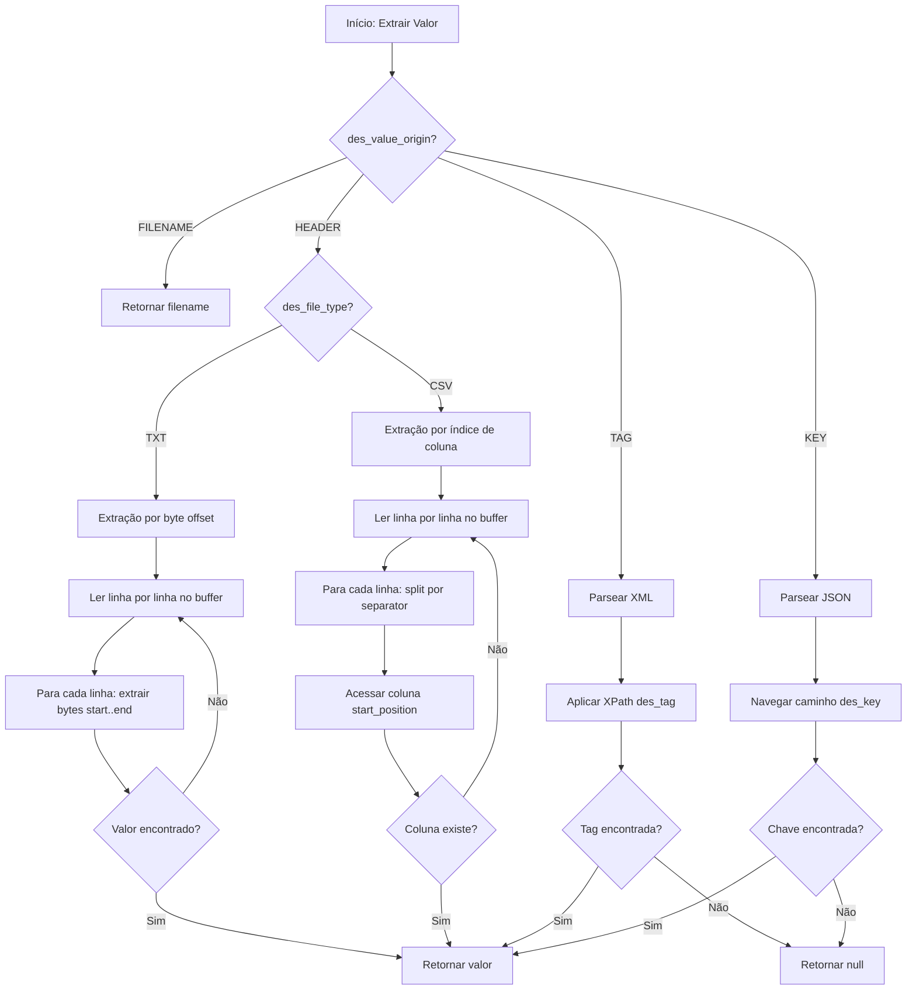
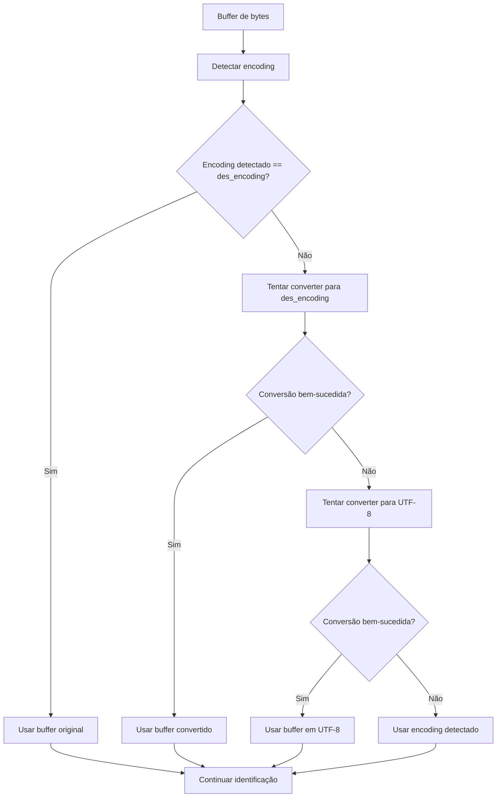

# Algoritmo de Identificação e Implementação

## Algoritmo de Identificação Detalhado

### Pseudocódigo do Algoritmo Principal

```
function identifyLayout(inputStream, filename, acquirerId):
    // 1. Ler buffer inicial
    buffer = readBuffer(inputStream, FILE_ORIGIN_BUFFER_LIMIT)
    
    // 2. Detectar encoding
    detectedEncoding = detectEncoding(buffer)
    
    // 3. Buscar layouts candidatos (ordenados por idt_layout DESC)
    layouts = layoutRepository.findByIdtAcquirerAndFlgActiveOrderByIdtLayoutDesc(acquirerId, 1)
    
    // 4. Tentar identificar com cada layout (first-match wins)
    for each layout in layouts:
        // 4.1. Buscar regras ativas do layout
        rules = ruleRepository.findByIdtLayoutAndFlgActive(layout.idtLayout, 1)
        
        // 4.2. Verificar se todas as regras são satisfeitas (AND)
        allRulesSatisfied = true
        
        for each rule in rules:
            // 4.2.1. Converter encoding se necessário
            content = convertWithFallback(buffer, layout.desEncoding, detectedEncoding)
            
            // 4.2.2. Extrair valor baseado na origem
            originValue = extractValue(content, filename, rule, layout)
            
            if originValue is null:
                allRulesSatisfied = false
                break
            
            // 4.2.3. Aplicar transformações
            transformedOrigin = applyTransformation(originValue, rule.desFunctionOrigin)
            transformedExpected = applyTransformation(rule.desValue, rule.desFunctionDest)
            
            // 4.2.4. Comparar valores
            if not compare(transformedOrigin, transformedExpected, rule.desCriteriaType):
                allRulesSatisfied = false
                break
        
        // 4.3. Se todas as regras satisfeitas, retornar layout
        if allRulesSatisfied:
            return layout.idtLayout
    
    // 5. Nenhum layout identificado
    return null
```

### Fluxo de Decisão para Extração de Valores



### Fluxo de Conversão de Encoding



## Considerações de Performance

### Otimizações

1. **Buffer Limitado**: Apenas 7000 bytes são lidos para identificação, evitando carregar arquivos grandes
2. **Lazy Loading**: InputStream é lido apenas uma vez para o buffer
3. **Early Exit**: Algoritmo para no primeiro layout identificado (first-match wins)
4. **Ordenação no Banco**: Layouts ordenados por idt_layout DESC via query
5. **Cache de Extractors**: Lista de extractors injetada uma vez via Spring

### Impacto na Transferência

- Overhead adicional: ~10-50ms para identificação (depende do número de layouts/regras)
- Memória adicional: 7KB por transferência (buffer)
- InputStream precisa ser reaberto após identificação (já era necessário para streaming)

### Monitoramento

Adicionar métricas:
- Tempo médio de identificação
- Taxa de sucesso/falha de identificação
- Distribuição de layouts identificados
- Erros de conversão de encoding

## Scripts de Banco de Dados

Os scripts DDL e DML devem ser criados em:
- `ddl/layout.sql`: Criação da tabela layout
- `ddl/layout_identification_rule.sql`: Criação da tabela layout_identification_rule
- `ddl/file_origin_alter.sql`: Adição da FK idt_layout em file_origin
- `dml/layout_examples.sql`: Dados de exemplo (5 layouts: 2 Cielo, 3 Rede)

Referência completa dos scripts está no arquivo `prompt.md`.

## Próximos Passos

1. Criar entidades JPA (Layout, LayoutIdentificationRule) e enums no módulo commons
2. Criar repositories no módulo commons
3. Implementar LayoutIdentificationService e componentes no módulo consumer
4. Integrar com FileTransferListener
5. Criar scripts DDL/DML
6. Implementar testes unitários
7. Implementar testes de propriedade com jqwik
8. Implementar testes de integração
9. Implementar testes E2E
10. Documentar configuração e uso
