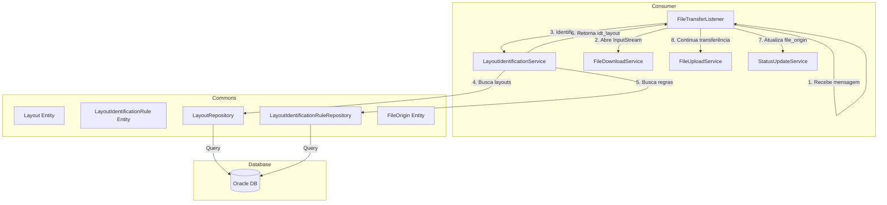
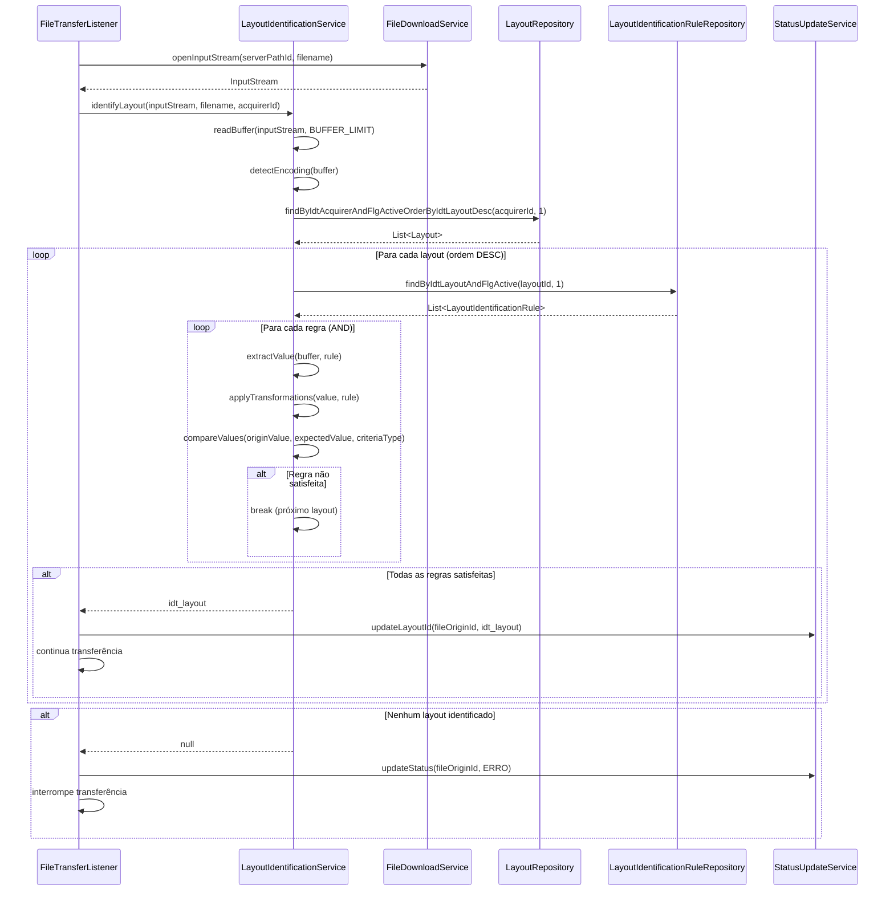

# Design Técnico - Identificação de Layouts de Arquivos EDI

## Overview

Este documento descreve o design técnico para a funcionalidade de identificação automática de layouts de arquivos EDI durante o processo de transferência no Consumer. O sistema identifica qual layout e adquirente corresponde ao arquivo sendo processado, aplicando regras configuráveis baseadas em múltiplas origens de dados (nome do arquivo, cabeçalho, tags XML, chaves JSON).

A identificação ocorre durante a transferência, após a leitura dos primeiros bytes do arquivo (buffer configurável, padrão 7000 bytes). Se o layout não for identificado, a transferência é interrompida e o arquivo é marcado com status ERRO.

### Objetivos

- Identificar automaticamente o layout de arquivos EDI durante a transferência
- Suportar múltiplas estratégias de identificação (FILENAME, HEADER TXT/CSV, TAG XML, KEY JSON)
- Aplicar regras configuráveis com diferentes critérios de comparação
- Detectar e converter encoding automaticamente
- Integrar-se ao fluxo de transferência existente sem impacto na performance

### Escopo

- Criação de entidades JPA para Layout e LayoutIdentificationRule
- Implementação do LayoutIdentificationService no Consumer
- Integração com FileTransferListener
- Suporte a 5 tipos de critérios de comparação (COMECA_COM, TERMINA_COM, CONTEM, CONTIDO, IGUAL)
- Suporte a 4 funções de transformação (UPPERCASE, LOWERCASE, INITCAP, TRIM)
- Detecção automática de encoding com fallback
- Scripts DDL/DML para criação das tabelas

## Architecture

### Visão Geral da Arquitetura



### Padrões de Design

1. **Strategy Pattern**: Diferentes estratégias de extração (FilenameExtractor, HeaderTxtExtractor, HeaderCsvExtractor, XmlTagExtractor, JsonKeyExtractor)
2. **Chain of Responsibility**: Conversão de encoding com fallback (des_encoding → UTF-8 → encoding detectado)
3. **Template Method**: Algoritmo de identificação com passos customizáveis
4. **Repository Pattern**: Acesso a dados via Spring Data JPA

### Fluxo de Identificação



## Components and Interfaces

### LayoutIdentificationService

Serviço principal responsável pela identificação de layouts.

```java
public interface LayoutIdentificationService {
    /**
     * Identifica o layout de um arquivo baseado em regras configuradas.
     * 
     * @param inputStream Stream do arquivo (será lido apenas o buffer inicial)
     * @param filename Nome do arquivo
     * @param acquirerId ID da adquirente
     * @return ID do layout identificado ou null se não identificado
     */
    Long identifyLayout(InputStream inputStream, String filename, Long acquirerId);
}
```

### ValueExtractor (Strategy Pattern)

Interface para estratégias de extração de valores.

```java
public interface ValueExtractor {
    /**
     * Extrai valor do buffer baseado na regra.
     * 
     * @param buffer Buffer de bytes do arquivo
     * @param filename Nome do arquivo
     * @param rule Regra de identificação
     * @param layout Layout (para acessar des_column_separator, etc)
     * @return Valor extraído ou null se não encontrado
     */
    String extractValue(byte[] buffer, String filename, LayoutIdentificationRule rule, Layout layout);
    
    /**
     * Verifica se este extrator suporta a regra.
     */
    boolean supports(ValueOrigin valueOrigin, FileType fileType);
}
```

Implementações:
- **FilenameExtractor**: Extrai do nome do arquivo (VALUE_ORIGIN = FILENAME)
- **HeaderTxtExtractor**: Extrai por byte offset em arquivos TXT (VALUE_ORIGIN = HEADER, FILE_TYPE = TXT)
- **HeaderCsvExtractor**: Extrai por índice de coluna em arquivos CSV (VALUE_ORIGIN = HEADER, FILE_TYPE = CSV)
- **XmlTagExtractor**: Extrai por XPath em arquivos XML (VALUE_ORIGIN = TAG)
- **JsonKeyExtractor**: Extrai por caminho JSON em arquivos JSON (VALUE_ORIGIN = KEY)

### CriteriaComparator

Componente responsável por comparar valores baseado no tipo de critério.

```java
public interface CriteriaComparator {
    /**
     * Compara valor de origem com valor esperado baseado no critério.
     * 
     * @param originValue Valor extraído do arquivo
     * @param expectedValue Valor esperado (des_value)
     * @param criteriaType Tipo de critério
     * @return true se a comparação satisfaz o critério
     */
    boolean compare(String originValue, String expectedValue, CriteriaType criteriaType);
}
```

### EncodingConverter (Chain of Responsibility)

Componente responsável por detectar e converter encoding.

```java
public interface EncodingConverter {
    /**
     * Detecta o encoding do buffer.
     * 
     * @param buffer Buffer de bytes
     * @return Encoding detectado
     */
    String detectEncoding(byte[] buffer);
    
    /**
     * Converte buffer para o encoding desejado.
     * Implementa chain: des_encoding → UTF-8 → encoding detectado
     * 
     * @param buffer Buffer original
     * @param targetEncoding Encoding desejado (des_encoding)
     * @return String convertida
     */
    String convertWithFallback(byte[] buffer, String targetEncoding);
}
```

### TransformationApplier

Componente responsável por aplicar funções de transformação.

```java
public interface TransformationApplier {
    /**
     * Aplica função de transformação em um valor.
     * 
     * @param value Valor original
     * @param functionType Tipo de função (UPPERCASE, LOWERCASE, INITCAP, TRIM, NONE)
     * @return Valor transformado
     */
    String applyTransformation(String value, FunctionType functionType);
}
```

## Data Models

### Entidades JPA

#### Layout

```java
@Entity
@Table(name = "layout")
public class Layout {
    @Id
    @GeneratedValue(strategy = GenerationType.SEQUENCE, generator = "layout_seq_gen")
    @SequenceGenerator(name = "layout_seq_gen", sequenceName = "layout_seq", allocationSize = 1)
    @Column(name = "idt_layout")
    private Long idtLayout;
    
    @Column(name = "cod_layout", nullable = false, length = 100)
    private String codLayout;
    
    @Column(name = "idt_acquirer", nullable = false)
    private Long idtAcquirer;
    
    @Column(name = "des_version", length = 30)
    private String desVersion;
    
    @Enumerated(EnumType.STRING)
    @Column(name = "des_file_type", nullable = false, length = 10)
    private FileType desFileType;
    
    @Column(name = "des_column_separator", length = 2)
    private String desColumnSeparator;
    
    @Enumerated(EnumType.STRING)
    @Column(name = "des_transaction_type", nullable = false, length = 20)
    private TransactionType desTransactionType;
    
    @Enumerated(EnumType.STRING)
    @Column(name = "des_distribution_type", nullable = false, length = 20)
    private DistributionType desDistributionType;
    
    @Column(name = "des_encoding", length = 10)
    private String desEncoding;
    
    @Temporal(TemporalType.DATE)
    @Column(name = "dat_creation", nullable = false)
    private Date datCreation;
    
    @Temporal(TemporalType.DATE)
    @Column(name = "dat_update")
    private Date datUpdate;
    
    @Column(name = "nam_change_agent", nullable = false, length = 50)
    private String namChangeAgent;
    
    @Column(name = "flg_active", nullable = false)
    private Integer flgActive;
}
```

#### LayoutIdentificationRule

```java
@Entity
@Table(name = "layout_identification_rule")
public class LayoutIdentificationRule {
    @Id
    @GeneratedValue(strategy = GenerationType.SEQUENCE, generator = "layout_identification_rule_seq_gen")
    @SequenceGenerator(name = "layout_identification_rule_seq_gen", 
                       sequenceName = "layout_identification_rule_seq", 
                       allocationSize = 1)
    @Column(name = "idt_rule")
    private Long idtRule;
    
    @Column(name = "idt_layout", nullable = false)
    private Long idtLayout;
    
    @Column(name = "des_rule", nullable = false, length = 255)
    private String desRule;
    
    @Enumerated(EnumType.STRING)
    @Column(name = "des_value_origin", nullable = false, length = 10)
    private ValueOrigin desValueOrigin;
    
    @Enumerated(EnumType.STRING)
    @Column(name = "des_criteria_type", nullable = false, length = 15)
    private CriteriaType desCriteriaType;
    
    @Column(name = "num_start_position")
    private Integer numStartPosition;
    
    @Column(name = "num_end_position")
    private Integer numEndPosition;
    
    @Column(name = "des_value", length = 255)
    private String desValue;
    
    @Column(name = "des_tag", length = 255)
    private String desTag;
    
    @Column(name = "des_key", length = 255)
    private String desKey;
    
    @Enumerated(EnumType.STRING)
    @Column(name = "des_function_origin", length = 10)
    private FunctionType desFunctionOrigin;
    
    @Enumerated(EnumType.STRING)
    @Column(name = "des_function_dest", length = 10)
    private FunctionType desFunctionDest;
    
    @Temporal(TemporalType.DATE)
    @Column(name = "dat_creation", nullable = false)
    private Date datCreation;
    
    @Temporal(TemporalType.DATE)
    @Column(name = "dat_update")
    private Date datUpdate;
    
    @Column(name = "nam_change_agent", nullable = false, length = 50)
    private String namChangeAgent;
    
    @Column(name = "flg_active", nullable = false)
    private Integer flgActive;
}
```

### Enums

#### ValueOrigin

```java
public enum ValueOrigin {
    FILENAME,  // Identificação pelo nome do arquivo
    HEADER,    // Identificação pelo cabeçalho (TXT ou CSV)
    TAG,       // Identificação por tag XML
    KEY        // Identificação por chave JSON
}
```

#### CriteriaType

```java
public enum CriteriaType {
    COMECA_COM,   // Origin value começa com expected value
    TERMINA_COM,  // Origin value termina com expected value
    CONTEM,       // Origin value contém expected value
    CONTIDO,      // Origin value está contido em expected value
    IGUAL         // Origin value é igual a expected value
}
```

#### FunctionType

```java
public enum FunctionType {
    UPPERCASE,  // Converte para maiúsculas
    LOWERCASE,  // Converte para minúsculas
    INITCAP,    // Primeira letra maiúscula, demais minúsculas
    TRIM,       // Remove espaços em branco no início e fim
    NONE        // Nenhuma transformação
}
```

#### DistributionType

```java
public enum DistributionType {
    DIARIO,
    DIAS_UTEIS,
    SEGUNDA_A_SEXTA,
    DOMINGO,
    SEGUNDA_FEIRA,
    TERCA_FEIRA,
    QUARTA_FEIRA,
    QUINTA_FEIRA,
    SEXTA_FEIRA,
    SABADO,
    SAZONAL
}
```

### Repositories

#### LayoutRepository

```java
public interface LayoutRepository extends JpaRepository<Layout, Long> {
    /**
     * Busca layouts ativos de uma adquirente, ordenados por ID descendente.
     * First-match wins: layouts mais recentes primeiro.
     */
    List<Layout> findByIdtAcquirerAndFlgActiveOrderByIdtLayoutDesc(Long idtAcquirer, Integer flgActive);
}
```

#### LayoutIdentificationRuleRepository

```java
public interface LayoutIdentificationRuleRepository extends JpaRepository<LayoutIdentificationRule, Long> {
    /**
     * Busca regras ativas de um layout.
     */
    List<LayoutIdentificationRule> findByIdtLayoutAndFlgActive(Long idtLayout, Integer flgActive);
}
```

### Atualização em FileOrigin

A entidade FileOrigin já possui o campo `idt_layout`, que será populado após a identificação bem-sucedida.


## Correctness Properties

*A property is a characteristic or behavior that should hold true across all valid executions of a system—essentially, a formal statement about what the system should do. Properties serve as the bridge between human-readable specifications and machine-verifiable correctness guarantees.*

### Property Reflection

Após análise dos critérios de aceitação, identificamos as seguintes redundâncias que foram eliminadas:

**Redundâncias Identificadas:**

1. **Critérios de comparação duplicados**: Os requisitos 6.2-6.6 duplicam 5.1-5.5 no contexto de FILENAME. Como os critérios de comparação são aplicados uniformemente independente da origem, uma única propriedade por critério é suficiente.

2. **Aplicação de critérios redundante**: Os requisitos 7.8, 8.7, 9.5, 10.5 todos afirmam que des_criteria_type deve ser aplicado para comparação. Isso é coberto pelas propriedades 5.1-5.5.

3. **Leitura linha por linha duplicada**: Os requisitos 7.5 e 8.4 (leitura linha por linha) e 7.6 e 8.6 (tentativa de identificação por linha) são idênticos para TXT e CSV. Uma única propriedade cobre ambos os casos.

4. **Validação dentro do buffer duplicada**: Os requisitos 9.3 e 10.3 duplicam 3.2 (leitura até BUFFER_LIMIT). Uma única propriedade cobre todos os tipos de extração.

5. **Extração de valor duplicada**: Os requisitos 9.4 e 10.4 apenas reafirmam 9.1 e 10.1. Removidos por redundância.

6. **Regras AND duplicadas**: Os requisitos 4.4 e 4.5 expressam a mesma regra (todas as regras devem ser satisfeitas). Consolidados em uma única propriedade.

7. **Falha de identificação duplicada**: Os requisitos 3.5, 3.6, 3.7 e 14.3 tratam do mesmo comportamento (falha de identificação). Consolidados em uma única propriedade abrangente.

8. **Case-sensitivity duplicada**: Os requisitos 5.7 e 12.11 expressam a mesma regra. Consolidados em uma única propriedade.

9. **Invocação do serviço duplicada**: Os requisitos 3.1 e 14.1 expressam a mesma integração. Consolidados em um único exemplo.

**Propriedades Consolidadas:**

Após eliminação de redundâncias, mantemos propriedades únicas que fornecem valor de validação distinto:

- Propriedades de critérios de comparação (5 propriedades únicas)
- Propriedades de extração por tipo de origem (5 estratégias únicas)
- Propriedades de transformação (10 funções únicas)
- Propriedades de encoding (3 comportamentos de fallback)
- Propriedades de algoritmo de identificação (ordenação, AND, first-match)
- Propriedades de integração (buffer limit, atualização de estado)

### Property 1: Critério COMECA_COM

*For any* origin value e expected value, quando des_criteria_type é COMECA_COM, a comparação deve retornar true se e somente se origin value começa com expected value.

**Validates: Requirements 5.1**

### Property 2: Critério TERMINA_COM

*For any* origin value e expected value, quando des_criteria_type é TERMINA_COM, a comparação deve retornar true se e somente se origin value termina com expected value.

**Validates: Requirements 5.2**

### Property 3: Critério CONTEM

*For any* origin value e expected value, quando des_criteria_type é CONTEM, a comparação deve retornar true se e somente se origin value contém expected value em qualquer posição.

**Validates: Requirements 5.3**

### Property 4: Critério CONTIDO

*For any* origin value e expected value, quando des_criteria_type é CONTIDO, a comparação deve retornar true se e somente se origin value está contido em expected value.

**Validates: Requirements 5.4**

### Property 5: Critério IGUAL

*For any* origin value e expected value, quando des_criteria_type é IGUAL, a comparação deve retornar true se e somente se origin value é exatamente igual a expected value.

**Validates: Requirements 5.5**

### Property 6: Transformações aplicadas antes da comparação

*For any* rule com des_function_origin ou des_function_dest definidos, as transformações devem ser aplicadas nos valores antes da execução da comparação do critério.

**Validates: Requirements 5.6**

### Property 7: Comparação case-sensitive por padrão

*For any* rule sem funções de transformação (NONE ou NULL), a comparação deve ser case-sensitive, distinguindo entre maiúsculas e minúsculas.

**Validates: Requirements 5.7**

### Property 8: Extração por nome de arquivo

*For any* filename e rule com des_value_origin igual a FILENAME, o valor extraído deve ser o próprio nome do arquivo.

**Validates: Requirements 6.1**

### Property 9: Extração TXT por byte offset

*For any* arquivo TXT e rule com des_value_origin igual a HEADER, a extração deve usar num_start_position como byte offset inicial (0-indexed) e num_end_position como byte offset final.

**Validates: Requirements 7.1, 7.2, 7.4**

### Property 10: Extração TXT até fim da linha quando end_position é NULL

*For any* arquivo TXT e rule com num_end_position igual a NULL, a extração deve continuar até o fim da linha ou até o fim do buffer.

**Validates: Requirements 7.3**

### Property 11: Processamento linha por linha

*For any* arquivo TXT ou CSV, o serviço deve ler o buffer linha por linha e tentar identificação a cada linha lida.

**Validates: Requirements 7.5, 7.6, 8.4, 8.5**

### Property 12: Extração CSV por índice de coluna

*For any* arquivo CSV e rule com des_value_origin igual a HEADER, a extração deve usar num_start_position como índice da coluna (0-indexed) e des_column_separator do layout como separador.

**Validates: Requirements 8.1, 8.2, 8.3**

### Property 13: Extração XML por XPath

*For any* arquivo XML e rule com des_value_origin igual a TAG, a extração deve usar des_tag como caminho XPath, suportando caminhos aninhados.

**Validates: Requirements 9.1, 9.2**

### Property 14: Extração JSON por caminho

*For any* arquivo JSON e rule com des_value_origin igual a KEY, a extração deve usar des_key como caminho JSON com notação de ponto, suportando caminhos aninhados.

**Validates: Requirements 10.1, 10.2**

### Property 15: Leitura limitada ao buffer

*For any* arquivo, o serviço deve ler no máximo FILE_ORIGIN_BUFFER_LIMIT bytes do início do arquivo para identificação.

**Validates: Requirements 3.2**

### Property 16: Detecção automática de encoding

*For any* arquivo, o serviço deve detectar automaticamente o encoding do buffer e comparar com des_encoding do layout.

**Validates: Requirements 11.1, 11.2**

### Property 17: Conversão de encoding com fallback

*For any* arquivo com encoding diferente de des_encoding, o serviço deve tentar converter para des_encoding, depois para UTF-8, e finalmente usar o encoding detectado se ambas as conversões falharem.

**Validates: Requirements 11.3, 11.4, 11.5**

### Property 18: Transformação UPPERCASE

*For any* valor e function_type igual a UPPERCASE, a transformação deve converter todos os caracteres para maiúsculas.

**Validates: Requirements 12.1, 12.6**

### Property 19: Transformação LOWERCASE

*For any* valor e function_type igual a LOWERCASE, a transformação deve converter todos os caracteres para minúsculas.

**Validates: Requirements 12.2, 12.7**

### Property 20: Transformação INITCAP

*For any* valor e function_type igual a INITCAP, a transformação deve converter a primeira letra para maiúscula e as demais para minúsculas.

**Validates: Requirements 12.3, 12.8**

### Property 21: Transformação TRIM

*For any* valor e function_type igual a TRIM, a transformação deve remover espaços em branco no início e fim do valor.

**Validates: Requirements 12.4, 12.9**

### Property 22: Transformação NONE

*For any* valor e function_type igual a NONE ou NULL, nenhuma transformação deve ser aplicada ao valor.

**Validates: Requirements 12.5, 12.10**

### Property 23: Filtro por adquirente e flag ativa

*For any* acquirer ID, o serviço deve buscar apenas layouts com idt_acquirer correspondente e flg_active igual a 1.

**Validates: Requirements 4.1**

### Property 24: Ordenação por idt_layout DESC

*For any* conjunto de layouts retornados, eles devem estar ordenados por idt_layout em ordem descendente (layouts mais recentes primeiro).

**Validates: Requirements 4.2**

### Property 25: Filtro de regras ativas

*For any* layout, o serviço deve buscar apenas regras com flg_active igual a 1.

**Validates: Requirements 4.3**

### Property 26: Operador AND entre regras

*For any* layout com múltiplas regras, todas as regras devem ser satisfeitas (operador AND) para que o layout seja considerado identificado.

**Validates: Requirements 4.4, 4.5**

### Property 27: First-match wins

*For any* conjunto de layouts onde múltiplos layouts satisfazem todas as regras, o primeiro layout na ordem (maior idt_layout) deve ser retornado.

**Validates: Requirements 4.6**

### Property 28: Retorno de idt_layout

*For any* identificação bem-sucedida, o serviço deve retornar o idt_layout do layout identificado.

**Validates: Requirements 4.7**

### Property 29: Falha de identificação interrompe transferência

*For any* arquivo onde nenhum layout é identificado, o serviço deve retornar null, a transferência deve ser interrompida, file_origin deve ser atualizado com step igual a COLETA e status igual a ERRO, e a mensagem "Layout do arquivo não foi identificado" deve ser registrada.

**Validates: Requirements 3.5, 3.6, 3.7**

### Property 30: Atualização de idt_layout em file_origin

*For any* identificação bem-sucedida, o campo idt_layout em file_origin deve ser atualizado com o valor retornado pelo serviço.

**Validates: Requirements 14.2**

### Property 31: Continuação da transferência após identificação

*For any* identificação bem-sucedida, o processo de transferência deve continuar normalmente após a atualização de idt_layout.

**Validates: Requirements 14.4**

### Property 32: Round-trip de configuração

*For any* configuração de layout válida carregada do banco, parsear a configuração em objetos de domínio, formatá-la com o pretty printer, e parseá-la novamente deve produzir um objeto equivalente.

**Validates: Requirements 13.4**

### Property 33: Erro descritivo para configuração inválida

*For any* configuração de layout inválida, o serviço deve retornar um erro descritivo indicando o problema.

**Validates: Requirements 13.2**

## Error Handling

### Estratégia de Tratamento de Erros

1. **Falha de Identificação**
   - Retornar null do LayoutIdentificationService
   - FileTransferListener atualiza file_origin: step=COLETA, status=ERRO
   - Mensagem: "Layout do arquivo não foi identificado"
   - Transferência é interrompida

2. **Erro de Leitura do Buffer**
   - IOException ao ler InputStream
   - Propagar exceção para FileTransferListener
   - Tratamento padrão de erro com retry

3. **Erro de Conversão de Encoding**
   - Tentar des_encoding → UTF-8 → encoding detectado
   - Se todas as conversões falharem, usar encoding detectado
   - Não falhar a identificação por erro de encoding

4. **Erro de Extração (XPath/JSON inválido)**
   - Logar warning
   - Considerar regra como não satisfeita
   - Continuar para próximo layout

5. **Configuração Inválida**
   - Validar regras ao carregar do banco
   - Lançar IllegalArgumentException com mensagem descritiva
   - Exemplos: num_start_position negativo, des_tag vazio para TAG, etc.

### Validações de Configuração

```java
public class RuleValidator {
    public void validate(LayoutIdentificationRule rule, Layout layout) {
        // FILENAME: des_value obrigatório
        if (rule.getDesValueOrigin() == ValueOrigin.FILENAME && rule.getDesValue() == null) {
            throw new IllegalArgumentException("des_value is required for FILENAME rules");
        }
        
        // HEADER TXT: num_start_position obrigatório
        if (rule.getDesValueOrigin() == ValueOrigin.HEADER && 
            layout.getDesFileType() == FileType.txt && 
            rule.getNumStartPosition() == null) {
            throw new IllegalArgumentException("num_start_position is required for HEADER TXT rules");
        }
        
        // HEADER CSV: num_start_position obrigatório, des_column_separator obrigatório
        if (rule.getDesValueOrigin() == ValueOrigin.HEADER && 
            layout.getDesFileType() == FileType.csv) {
            if (rule.getNumStartPosition() == null) {
                throw new IllegalArgumentException("num_start_position is required for HEADER CSV rules");
            }
            if (layout.getDesColumnSeparator() == null) {
                throw new IllegalArgumentException("des_column_separator is required for CSV layouts");
            }
        }
        
        // TAG: des_tag obrigatório
        if (rule.getDesValueOrigin() == ValueOrigin.TAG && rule.getDesTag() == null) {
            throw new IllegalArgumentException("des_tag is required for TAG rules");
        }
        
        // KEY: des_key obrigatório
        if (rule.getDesValueOrigin() == ValueOrigin.KEY && rule.getDesKey() == null) {
            throw new IllegalArgumentException("des_key is required for KEY rules");
        }
        
        // Posições não podem ser negativas
        if (rule.getNumStartPosition() != null && rule.getNumStartPosition() < 0) {
            throw new IllegalArgumentException("num_start_position cannot be negative");
        }
        if (rule.getNumEndPosition() != null && rule.getNumEndPosition() < 0) {
            throw new IllegalArgumentException("num_end_position cannot be negative");
        }
    }
}
```

## Testing Strategy

### Abordagem Dual de Testes

O sistema utiliza uma abordagem complementar com testes unitários e testes baseados em propriedades:

**Testes Unitários:**
- Exemplos específicos de identificação (arquivos Cielo, Rede)
- Casos de borda (buffer sem quebra de linha, encoding inválido)
- Condições de erro (configuração inválida, XPath malformado)
- Integração entre componentes

**Testes Baseados em Propriedades:**
- Propriedades universais que devem valer para todos os inputs
- Cobertura abrangente através de geração aleatória
- Validação de invariantes do sistema
- Mínimo 100 iterações por teste

### Configuração de Property-Based Testing

Utilizaremos **jqwik 1.8.2** (já presente no projeto) para testes baseados em propriedades.

Cada teste de propriedade deve:
- Executar mínimo 100 iterações (`@Property(tries = 100)`)
- Referenciar a propriedade do design via comentário
- Usar geradores apropriados para o domínio

Formato de tag:
```java
/**
 * Feature: identificacao_layouts, Property 1: Critério COMECA_COM
 * For any origin value e expected value, quando des_criteria_type é COMECA_COM,
 * a comparação deve retornar true se e somente se origin value começa com expected value.
 */
@Property(tries = 100)
void criterioComecaComProperty(@ForAll String originValue, @ForAll String expectedValue) {
    // Test implementation
}
```

### Estrutura de Testes

```
consumer/src/test/java/com/concil/edi/consumer/
├── service/
│   ├── LayoutIdentificationServiceTest.java          # Testes unitários
│   ├── LayoutIdentificationServicePropertyTest.java  # Testes de propriedade
│   ├── CriteriaComparatorTest.java
│   ├── CriteriaComparatorPropertyTest.java
│   ├── TransformationApplierTest.java
│   ├── TransformationApplierPropertyTest.java
│   └── EncodingConverterTest.java
├── extractor/
│   ├── FilenameExtractorTest.java
│   ├── HeaderTxtExtractorTest.java
│   ├── HeaderCsvExtractorTest.java
│   ├── XmlTagExtractorTest.java
│   └── JsonKeyExtractorTest.java
└── integration/
    ├── LayoutIdentificationIntegrationTest.java      # Testes com banco
    └── FileTransferWithIdentificationE2ETest.java    # Testes E2E
```

### Exemplos de Testes de Propriedade

#### Property 1: Critério COMECA_COM

```java
/**
 * Feature: identificacao_layouts, Property 1: Critério COMECA_COM
 */
@Property(tries = 100)
void criterioComecaComProperty(
    @ForAll @StringLength(min = 1, max = 50) String prefix,
    @ForAll @StringLength(min = 0, max = 50) String suffix) {
    
    String originValue = prefix + suffix;
    String expectedValue = prefix;
    
    boolean result = criteriaComparator.compare(originValue, expectedValue, CriteriaType.COMECA_COM);
    
    assertTrue(result, "Origin value should start with expected value");
}
```

#### Property 15: Leitura limitada ao buffer

```java
/**
 * Feature: identificacao_layouts, Property 15: Leitura limitada ao buffer
 */
@Property(tries = 100)
void bufferLimitProperty(@ForAll @IntRange(min = 7001, max = 100000) int fileSize) {
    byte[] fileContent = generateRandomBytes(fileSize);
    InputStream inputStream = new ByteArrayInputStream(fileContent);
    
    byte[] buffer = layoutIdentificationService.readBuffer(inputStream, BUFFER_LIMIT);
    
    assertEquals(BUFFER_LIMIT, buffer.length, "Buffer should be limited to BUFFER_LIMIT");
}
```

#### Property 26: Operador AND entre regras

```java
/**
 * Feature: identificacao_layouts, Property 26: Operador AND entre regras
 */
@Property(tries = 100)
void andOperatorProperty(
    @ForAll @Size(min = 2, max = 5) List<@From("ruleGenerator") LayoutIdentificationRule> rules) {
    
    // Configurar mock para retornar as regras
    when(ruleRepository.findByIdtLayoutAndFlgActive(anyLong(), eq(1))).thenReturn(rules);
    
    // Simular que apenas a primeira regra é satisfeita
    when(extractor.extractValue(any(), any(), eq(rules.get(0)), any())).thenReturn("match");
    for (int i = 1; i < rules.size(); i++) {
        when(extractor.extractValue(any(), any(), eq(rules.get(i)), any())).thenReturn("no-match");
    }
    
    Long result = layoutIdentificationService.identifyLayout(inputStream, "test.txt", 1L);
    
    assertNull(result, "Layout should not be identified when not all rules are satisfied");
}
```

### Testes de Integração

Testes de integração verificam:
- Queries JPA funcionam corretamente
- Filtros por idt_acquirer e flg_active
- Ordenação por idt_layout DESC
- Atualização de file_origin.idt_layout
- Transações e rollback em caso de erro

### Testes End-to-End

Testes E2E simulam o fluxo completo:
1. Arquivo é publicado na fila RabbitMQ
2. Consumer recebe mensagem
3. Abre InputStream do arquivo
4. Identifica layout
5. Atualiza file_origin
6. Continua transferência para S3/SFTP

Cenários E2E:
- Identificação bem-sucedida por FILENAME (Cielo)
- Identificação bem-sucedida por HEADER CSV (Rede EEVD)
- Identificação bem-sucedida por HEADER TXT (Rede EEVC/EEFI)
- Falha de identificação (arquivo desconhecido)
- Múltiplos layouts candidatos (first-match wins)

