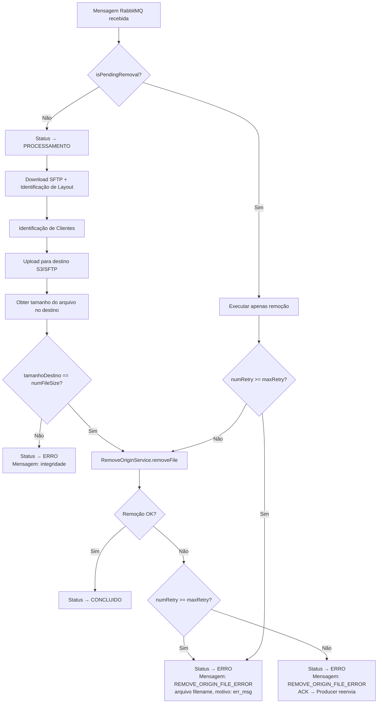
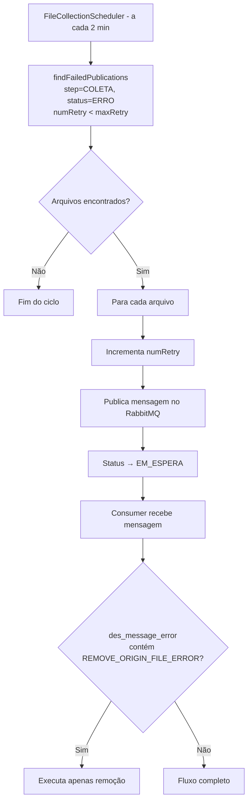

# Design Técnico: Remove File Origin

## Visão Geral

A funcionalidade **Remove File Origin** adiciona a etapa de remoção do arquivo da pasta de origem ao final do fluxo de transferência existente. Após o upload bem-sucedido para o destino (S3 ou SFTP), o Consumer valida a integridade do arquivo comparando o tamanho no destino com o valor registrado em `num_file_size`, e então remove o arquivo da origem via SFTP.

Em caso de falha na remoção, o registro é marcado com `step=COLETA`, `status=ERRO` e uma mensagem contendo o marcador `REMOVE_ORIGIN_FILE_ERROR`. O Producer existente detecta esse estado e reenvia a mensagem. Na retentativa, o Consumer identifica o marcador e executa apenas a remoção, pulando toda a etapa de transferência.

## Arquitetura

### Fluxo Principal (Transferência + Remoção)



### Fluxo de Retentativa (Producer)



## Componentes e Interfaces

### RemoveOriginService (novo)

Localização: `consumer/src/main/java/com/concil/edi/consumer/service/RemoveOriginService.java`

```java
@Service
@RequiredArgsConstructor
@Slf4j
public class RemoveOriginService {

    private final ServerPathRepository serverPathRepository;
    private final SftpConfig sftpConfig;

    /**
     * Remove o arquivo da pasta de origem via SFTP.
     * Propaga exceção em caso de falha para que o chamador trate o erro.
     *
     * @param serverPathOriginId ID do caminho de origem (sever_paths)
     * @param filename           Nome do arquivo a ser removido
     * @throws RuntimeException se a operação SFTP falhar
     */
    public void removeFile(Long serverPathOriginId, String filename);
}
```

### FileTransferListener (modificado)

Novos métodos privados adicionados:

```java
/**
 * Verifica se o arquivo possui remoção pendente.
 * Retorna true se status=ERRO e des_message_error contém REMOVE_ORIGIN_FILE_ERROR.
 */
private boolean isPendingRemoval(FileOrigin fileOrigin);

/**
 * Obtém o tamanho em bytes do arquivo no destino após o upload.
 * Suporta S3 e SFTP.
 *
 * @param destConfig             Configuração do servidor de destino
 * @param filename               Nome do arquivo
 * @param keyOrPath              Chave S3 ou caminho SFTP completo
 * @return tamanho em bytes do arquivo no destino
 */
private long getDestinationFileSize(ServerConfigurationDTO destConfig, String filename, String keyOrPath);

/**
 * Executa a remoção do arquivo da origem com tratamento de erro e atualização de status.
 */
private void executeRemoval(Long fileOriginId, Long serverPathOriginId, String filename, FileOrigin fileOrigin);
```

### FileUploadService (modificado)

Novos métodos para obter tamanho do arquivo no destino:

```java
/**
 * Retorna o tamanho em bytes do objeto no S3.
 *
 * @param bucketName Nome do bucket
 * @param key        Chave do objeto
 * @return tamanho em bytes
 */
public long getS3ObjectSize(String bucketName, String key);

/**
 * Retorna o tamanho em bytes do arquivo no SFTP de destino.
 *
 * @param config     Configuração do servidor SFTP
 * @param remotePath Caminho remoto completo do arquivo
 * @return tamanho em bytes
 */
public long getSftpFileSize(ServerConfigurationDTO config, String remotePath);
```

### FileOriginRepository (modificado)

Novo método de consulta no commons:

```java
/**
 * Busca arquivos com remoção pendente para retentativa.
 * Critério: step=COLETA, status=ERRO, des_message_error contém REMOVE_ORIGIN_FILE_ERROR,
 * numRetry < maxRetry.
 */
@Query("SELECT f FROM FileOrigin f WHERE f.desStep = :step AND f.desStatus = :status " +
       "AND f.desMessageError LIKE %:marker% AND f.numRetry < f.maxRetry AND f.flgActive = 1")
List<FileOrigin> findPendingRemovalFiles(
    @Param("step") Step step,
    @Param("status") Status status,
    @Param("marker") String marker
);
```

> **Nota:** O `findFailedPublications` existente já captura esses registros (step=COLETA, status=ERRO, numRetry < maxRetry), portanto o Producer não precisa de alteração. O novo método é opcional para consultas específicas.

## Modelos de Dados

### FileOrigin — campos relevantes (sem alteração de schema)

| Campo              | Tipo    | Uso nesta feature                                                    |
|--------------------|---------|----------------------------------------------------------------------|
| `num_file_size`    | NUMBER  | Tamanho esperado do arquivo (registrado na coleta)                   |
| `des_step`         | VARCHAR | Definido como `COLETA` em caso de erro de remoção                    |
| `des_status`       | VARCHAR | `ERRO` em falha de remoção; `CONCLUIDO` em sucesso                   |
| `des_message_error`| VARCHAR | Contém `REMOVE_ORIGIN_FILE_ERROR` para identificar remoção pendente  |
| `num_retry`        | NUMBER  | Incrementado pelo Producer a cada reenvio                            |
| `max_retry`        | NUMBER  | Limite máximo de tentativas                                          |

### Constante de marcador

```java
// Em FileTransferListener ou classe de constantes
static final String REMOVE_ORIGIN_FILE_ERROR = "REMOVE_ORIGIN_FILE_ERROR";
```

### Mensagens de erro padronizadas

| Situação                          | Mensagem                                                                      |
|-----------------------------------|-------------------------------------------------------------------------------|
| Divergência de tamanho            | `"Erro de integridade: tamanho do arquivo no destino difere do esperado"`     |
| Falha na remoção (retry disponível)| `"REMOVE_ORIGIN_FILE_ERROR. arquivo <filename>, motivo: <err_msg>"`          |
| Falha na remoção (max retry)      | `"REMOVE_ORIGIN_FILE_ERROR. arquivo <filename>, motivo: <err_msg>"`           |

## Propriedades de Correção

*Uma propriedade é uma característica ou comportamento que deve ser verdadeiro em todas as execuções válidas de um sistema — essencialmente, uma declaração formal sobre o que o sistema deve fazer. Propriedades servem como ponte entre especificações legíveis por humanos e garantias de correção verificáveis por máquina.*

### Propriedade 1: Validação de integridade determina o fluxo

*Para qualquer* par de valores `(tamanhoDestino, numFileSize)`, a comparação deve retornar `true` se e somente se os valores forem iguais, e o fluxo de remoção deve ser executado apenas quando a comparação retornar `true`.

**Valida: Requisitos 1.1, 1.2, 1.3, 1.4**

### Propriedade 2: Remoção bem-sucedida resulta em CONCLUIDO

*Para qualquer* arquivo com validação de integridade bem-sucedida, quando a operação de remoção SFTP for concluída sem exceção, o status do registro `file_origin` deve ser atualizado para `CONCLUIDO`.

**Valida: Requisitos 2.1, 2.2**

### Propriedade 3: Falha na remoção registra erro com marcador

*Para qualquer* exceção lançada durante a operação de remoção SFTP, o registro `file_origin` deve ser atualizado com `step=COLETA`, `status=ERRO`, e a mensagem de erro deve conter o texto `REMOVE_ORIGIN_FILE_ERROR`.

**Valida: Requisitos 2.3, 2.4, 5.4**

### Propriedade 4: Detecção de remoção pendente pula a transferência

*Para qualquer* registro `file_origin` com `status=ERRO` e `des_message_error` contendo `REMOVE_ORIGIN_FILE_ERROR`, o Consumer deve executar apenas a etapa de remoção, sem invocar `FileDownloadService`, `LayoutIdentificationService`, `CustomerIdentificationService` ou `FileUploadService`.

**Valida: Requisitos 3.1, 3.2, 3.3**

### Propriedade 5: Limite de tentativas encerra o processamento

*Para qualquer* par `(numRetry, maxRetry)` onde `numRetry >= maxRetry`, o Consumer não deve executar a tentativa de remoção e deve finalizar o registro com `step=COLETA`, `status=ERRO`, e mensagem contendo `REMOVE_ORIGIN_FILE_ERROR`.

**Valida: Requisitos 4.2, 4.3, 4.4**

## Tratamento de Erros

### Divergência de integridade

- Condição: `tamanhoDestino != numFileSize`
- Ação: `statusUpdateService.updateStatusWithError(fileOriginId, Status.ERRO, "Erro de integridade: tamanho do arquivo no destino difere do esperado")`
- `desStep` permanece como estava (não altera para COLETA neste caso, pois o arquivo foi transferido)
- Não lança exceção — o processamento termina normalmente com status ERRO

### Falha na remoção (retry disponível)

- Condição: exceção no `RemoveOriginService.removeFile` e `numRetry < maxRetry`
- Ação: `statusUpdateService.updateStatusWithError(fileOriginId, Status.ERRO, "REMOVE_ORIGIN_FILE_ERROR. arquivo " + filename + ", motivo: " + e.getMessage())`
- O `desStep` é atualizado para `COLETA`
- O Producer detecta `step=COLETA, status=ERRO, numRetry < maxRetry` e reenvia a mensagem

### Falha na remoção (max retry atingido)

- Condição: exceção no `RemoveOriginService.removeFile` e `numRetry >= maxRetry`
- Ação: mesma mensagem de erro, mas o Producer não reenviará (numRetry >= maxRetry)
- O registro fica em estado terminal de erro

### Exceção SFTP no RemoveOriginService

- O serviço propaga a exceção sem capturá-la
- O chamador (`FileTransferListener`) é responsável pelo tratamento e atualização de status

## Estratégia de Testes

### Abordagem dual

Testes unitários cobrem exemplos específicos e casos de borda. Testes baseados em propriedades (PBT) verificam propriedades universais com 100+ iterações usando **jqwik 1.8.2**.

### Testes unitários

- `RemoveOriginServiceTest`: verifica chamada SFTP com parâmetros corretos; verifica propagação de exceção
- `FileTransferListenerTest`: verifica fluxo completo com remoção bem-sucedida; verifica detecção de remoção pendente; verifica divergência de integridade
- `FileUploadServiceTest`: verifica `getS3ObjectSize` e `getSftpFileSize`

### Testes de propriedade (jqwik)

Localização: `consumer/src/test/java/com/concil/edi/consumer/RemoveFileOriginPropertyTest.java`

Cada teste de propriedade deve executar no mínimo 100 iterações e referenciar a propriedade do design no comentário:

```
// Feature: remove-file-origin, Propriedade 1: Validação de integridade determina o fluxo
```

**Propriedade 1** — Gerar pares `(long tamanhoDestino, long numFileSize)` aleatórios e verificar que `tamanhoDestino == numFileSize` é a única condição que permite a remoção.

**Propriedade 2** — Gerar `FileOrigin` com tamanhos iguais e mock SFTP sem exceção; verificar que o status final é `CONCLUIDO`.

**Propriedade 3** — Gerar qualquer `RuntimeException` e mock SFTP que a lança; verificar que `des_message_error` contém `REMOVE_ORIGIN_FILE_ERROR` e `des_step = COLETA`.

**Propriedade 4** — Gerar `FileOrigin` com `status=ERRO` e `desMessageError` contendo `REMOVE_ORIGIN_FILE_ERROR`; verificar que os mocks de download/upload/layout/customer nunca são invocados.

**Propriedade 5** — Gerar pares `(numRetry, maxRetry)` onde `numRetry >= maxRetry`; verificar que o mock de remoção SFTP nunca é invocado e o status final é `ERRO`.

### Testes de integração

- Verificar fluxo completo com SFTP real (docker-compose): upload → validação de integridade → remoção → status CONCLUIDO
- Verificar retentativa: simular falha na remoção → Producer reenvia → Consumer detecta marcador → executa apenas remoção
