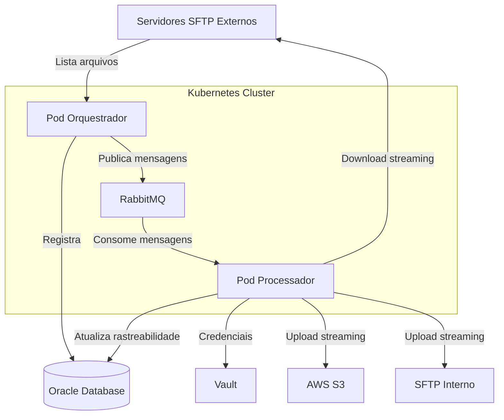
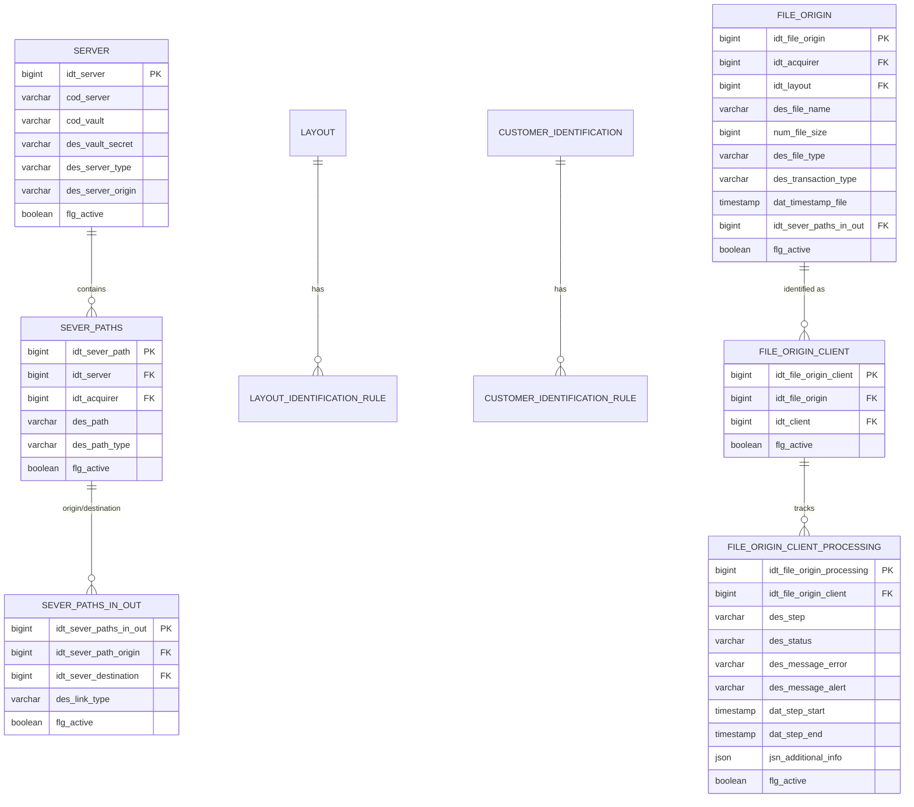

# Documento de Design - Controle de Arquivos

## Overview

O sistema "Controle de Arquivos" é uma solução distribuída para coleta, identificação e encaminhamento de arquivos EDI de adquirentes. A arquitetura é baseada em microserviços orquestrados via mensageria, com foco em processamento eficiente de arquivos grandes através de streaming.

### Objetivos do Sistema

- Coletar arquivos EDI de múltiplos servidores SFTP de forma automatizada
- Identificar cliente e layout de cada arquivo usando regras configuráveis
- Encaminhar arquivos para destinos apropriados (S3 ou SFTP interno)
- Manter rastreabilidade completa de todas as etapas de processamento
- Processar arquivos de qualquer tamanho sem limitações de memória

### Contexto de Negócio

O sistema atua como ponto de entrada para o processo de conciliação de cartão, recebendo arquivos de adquirentes (instituições financeiras que processam transações) e preparando-os para processamento posterior. A identificação correta de cliente e layout é crítica para garantir que cada arquivo seja processado com as regras de negócio apropriadas.


## Arquitetura

### Visão Geral da Arquitetura

O sistema é composto por dois pods principais que se comunicam via RabbitMQ:



### Pod Orquestrador

Responsabilidades:
- Executar ciclos periódicos de coleta (scheduler)
- Carregar configurações de servidores SFTP do banco de dados
- Listar arquivos em diretórios SFTP configurados
- Registrar novos arquivos na tabela `file_origin`
- Publicar mensagens no RabbitMQ para processamento
- Controlar concorrência de execução via `job_concurrency_control`

Características técnicas:
- Spring Boot 3 com Spring Scheduling
- Conexão SFTP via JSch ou Apache MINA SSHD
- Integração com Vault para credenciais
- Pool de conexões para banco de dados Oracle
- Cliente RabbitMQ com confirmação de publicação

### Pod Processador

Responsabilidades:
- Consumir mensagens do RabbitMQ
- Baixar arquivos via streaming (sem carregar em memória)
- Identificar cliente usando regras baseadas no nome do arquivo
- Identificar layout usando regras baseadas no nome ou conteúdo
- Fazer upload para destino (S3 ou SFTP) via streaming
- Atualizar rastreabilidade em `file_origin_client_processing`

Características técnicas:
- Spring Boot 3 com Spring AMQP
- Processamento streaming com InputStream/OutputStream encadeados
- AWS SDK v2 para S3 multipart upload
- Conexão SFTP para upload em destinos internos
- Transações de banco de dados para garantir consistência

### Padrões Arquiteturais

1. **Event-Driven Architecture**: Comunicação assíncrona via RabbitMQ permite escalabilidade independente dos pods
2. **Streaming Processing**: Processamento de arquivos em chunks para suportar arquivos de qualquer tamanho
3. **Rule Engine**: Sistema de regras configurável para identificação de cliente e layout
4. **Audit Trail**: Rastreabilidade completa através de registros em banco de dados


## Componentes e Interfaces

### Componente: OrquestradorService

Responsável pela orquestração da coleta de arquivos.

Interfaces públicas:
- `void executarCicloColeta()`: Executa um ciclo completo de coleta
- `List<ConfiguracaoServidor> carregarConfiguracoes()`: Carrega configurações do banco

Dependências:
- `SFTPClient`: Cliente para conexão SFTP
- `FileOriginRepository`: Repositório para tabela file_origin
- `RabbitMQPublisher`: Publicador de mensagens
- `VaultClient`: Cliente para obter credenciais
- `JobConcurrencyService`: Controle de concorrência

### Componente: ProcessadorService

Responsável pelo processamento de arquivos.

Interfaces públicas:
- `void processarArquivo(MensagemProcessamento msg)`: Processa um arquivo
- `Cliente identificarCliente(String nomeArquivo)`: Identifica cliente
- `Layout identificarLayout(String nomeArquivo, InputStream header)`: Identifica layout

Dependências:
- `SFTPClient`: Cliente para download de arquivos
- `S3Client`: Cliente AWS S3
- `ClienteIdentificationService`: Serviço de identificação de cliente
- `LayoutIdentificationService`: Serviço de identificação de layout
- `RastreabilidadeService`: Serviço de rastreabilidade
- `VaultClient`: Cliente para credenciais


### Componente: ClienteIdentificationService

Responsável pela identificação de cliente usando regras.

Interfaces públicas:
- `Optional<Cliente> identificar(String nomeArquivo, Integer idAdquirente)`: Identifica cliente
- `boolean aplicarRegra(RegraIdentificacao regra, String nomeArquivo)`: Aplica uma regra

Lógica de identificação:
1. Carregar todas as regras ativas de `customer_identification_rule` para o adquirente
2. Para cada `customer_identification` candidato:
   - Aplicar TODAS as regras associadas
   - Se todas retornarem true, considerar como match
3. Se múltiplos matches, selecionar o com maior `num_processing_weight`
4. Retornar cliente identificado ou Optional.empty()

Critérios suportados:
- `COMECA-COM`: Substring do nome do arquivo começa com valor esperado
- `TERMINA-COM`: Substring do nome do arquivo termina com valor esperado
- `CONTEM`: Substring do nome do arquivo contém valor esperado
- `IGUAL`: Substring do nome do arquivo é exatamente igual ao valor esperado

### Componente: LayoutIdentificationService

Responsável pela identificação de layout usando regras.

Interfaces públicas:
- `Optional<Layout> identificar(String nomeArquivo, InputStream headerStream, Integer idCliente, Integer idAdquirente)`: Identifica layout
- `boolean aplicarRegra(RegraLayout regra, String origem, String conteudo)`: Aplica uma regra

Lógica de identificação:
1. Carregar todas as regras ativas de `layout_identification_rule` para cliente e adquirente
2. Para cada `layout` candidato:
   - Aplicar TODAS as regras associadas
   - Para regras com `des_value_origin = FILENAME`, usar nome do arquivo
   - Para regras com `des_value_origin = HEADER`, ler primeiros 7000 bytes via streaming
   - Se todas retornarem true, considerar como match
3. Retornar layout identificado ou Optional.empty()


### Componente: StreamingTransferService

Responsável pela transferência de arquivos via streaming.

Interfaces públicas:
- `void transferirSFTPparaS3(InputStream source, String bucket, String key, long tamanho)`: Transfere SFTP para S3
- `void transferirSFTPparaSFTP(InputStream source, String destino, String caminho, long tamanho)`: Transfere SFTP para SFTP

Implementação de streaming:
```java
// Exemplo conceitual de transferência SFTP -> S3
public void transferirSFTPparaS3(InputStream source, String bucket, String key, long tamanho) {
    CreateMultipartUploadRequest createRequest = CreateMultipartUploadRequest.builder()
        .bucket(bucket)
        .key(key)
        .build();
    
    String uploadId = s3Client.createMultipartUpload(createRequest).uploadId();
    
    try {
        List<CompletedPart> parts = new ArrayList<>();
        byte[] buffer = new byte[5 * 1024 * 1024]; // 5MB chunks
        int partNumber = 1;
        int bytesRead;
        
        while ((bytesRead = source.read(buffer)) != -1) {
            UploadPartRequest uploadPartRequest = UploadPartRequest.builder()
                .bucket(bucket)
                .key(key)
                .uploadId(uploadId)
                .partNumber(partNumber)
                .build();
            
            UploadPartResponse response = s3Client.uploadPart(
                uploadPartRequest,
                RequestBody.fromBytes(Arrays.copyOf(buffer, bytesRead))
            );
            
            parts.add(CompletedPart.builder()
                .partNumber(partNumber)
                .eTag(response.eTag())
                .build());
            
            partNumber++;
        }
        
        s3Client.completeMultipartUpload(CompleteMultipartUploadRequest.builder()
            .bucket(bucket)
            .key(key)
            .uploadId(uploadId)
            .multipartUpload(CompletedMultipartUpload.builder().parts(parts).build())
            .build());
    } catch (Exception e) {
        s3Client.abortMultipartUpload(AbortMultipartUploadRequest.builder()
            .bucket(bucket)
            .key(key)
            .uploadId(uploadId)
            .build());
        throw new RuntimeException("Erro na transferência", e);
    }
}
```


### Componente: RastreabilidadeService

Responsável por registrar todas as etapas de processamento.

Interfaces públicas:
- `void registrarEtapa(Long idFileOriginClient, String step, String status)`: Registra nova etapa
- `void atualizarStatus(Long idProcessing, String status, String mensagemErro)`: Atualiza status
- `void registrarInicio(Long idProcessing)`: Registra início de processamento
- `void registrarConclusao(Long idProcessing, Map<String, Object> infoAdicional)`: Registra conclusão

Etapas do processamento:
- `COLETA`: Arquivo identificado no SFTP
- `RAW`: Arquivo baixado do SFTP
- `STAGING`: Cliente e layout identificados
- `ORDINATION`: Arquivo preparado para upload
- `PROCESSING`: Upload em andamento
- `PROCESSED`: Upload concluído com sucesso
- `DELETE`: Arquivo removido da origem (opcional)

Status possíveis:
- `EM_ESPERA`: Aguardando processamento
- `PROCESSAMENTO`: Em processamento
- `CONCLUIDO`: Concluído com sucesso
- `ERRO`: Erro durante processamento

### Componente: VaultClient

Responsável por obter credenciais do Vault.

Interfaces públicas:
- `Credenciais obterCredenciais(String codVault, String secretPath)`: Obtém credenciais

Implementação:
- Usar Spring Cloud Vault ou cliente HTTP direto
- Cache de credenciais com TTL configurável
- Renovação automática de tokens
- Nunca logar credenciais


## Data Models

### Modelo de Dados - Tabelas Principais




### Entidades de Domínio

**ConfiguracaoServidor**
```java
public class ConfiguracaoServidor {
    private Long id;
    private String codigoServidor;
    private String codigoVault;
    private String caminhoSecretoVault;
    private TipoServidor tipo; // S3, SFTP, NFS, BLOB_STORAGE, OBJECT_STORAGE
    private OrigemServidor origem; // INTERNO, EXTERNO
    private List<CaminhoServidor> caminhos;
}
```

**CaminhoServidor**
```java
public class CaminhoServidor {
    private Long id;
    private Long idServidor;
    private Long idAdquirente;
    private String caminho;
    private TipoCaminho tipo; // ORIGIN, DESTINATION
}
```

**MapeamentoOrigemDestino**
```java
public class MapeamentoOrigemDestino {
    private Long id;
    private Long idCaminhoOrigem;
    private Long idServidorDestino;
    private TipoLink tipoLink; // PRINCIPAL, SECUNDARIO
}
```

**ArquivoOrigem**
```java
public class ArquivoOrigem {
    private Long id;
    private Long idAdquirente;
    private Long idLayout;
    private String nomeArquivo;
    private Long tamanhoArquivo;
    private String tipoArquivo;
    private String tipoTransacao;
    private Instant timestampArquivo;
    private Long idMapeamentoOrigemDestino;
}
```

**RegraIdentificacaoCliente**
```java
public class RegraIdentificacaoCliente {
    private Long id;
    private Long idCustomerIdentification;
    private TipoCriterio criterio; // COMECA_COM, TERMINA_COM, CONTEM, IGUAL
    private Integer posicaoInicio;
    private Integer posicaoFim;
    private String valor;
}
```

**RegraIdentificacaoLayout**
```java
public class RegraIdentificacaoLayout {
    private Long id;
    private Long idLayout;
    private OrigemValor origemValor; // HEADER, TAG, FILENAME, KEY
    private TipoCriterio criterio; // COMECA_COM, TERMINA_COM, CONTEM, IGUAL
    private Integer posicaoInicio;
    private Integer posicaoFim;
    private String valor;
    private String tag;
    private String chave;
}
```


**RegistroRastreabilidade**
```java
public class RegistroRastreabilidade {
    private Long id;
    private Long idFileOriginClient;
    private EtapaProcessamento etapa; // COLETA, RAW, STAGING, ORDINATION, PROCESSING, PROCESSED, DELETE
    private StatusProcessamento status; // EM_ESPERA, PROCESSAMENTO, CONCLUIDO, ERRO
    private String mensagemErro;
    private String mensagemAlerta;
    private Instant inicioEtapa;
    private Instant fimEtapa;
    private Map<String, Object> informacoesAdicionais;
}
```

**MensagemProcessamento**
```java
public class MensagemProcessamento {
    private Long idFileOrigin;
    private String nomeArquivo;
    private Long idMapeamentoOrigemDestino;
    private String correlationId;
}
```

### Índices e Constraints

Índices importantes:
- `file_origin`: Índice único em `(des_file_name, idt_acquirer, dat_timestamp_file, flg_active)`
- `file_origin`: Índice em `idt_sever_paths_in_out` para busca por configuração
- `file_origin_client_processing`: Índice em `idt_file_origin_client` para rastreabilidade
- `customer_identification_rule`: Índice em `idt_customer_identification` para busca de regras
- `layout_identification_rule`: Índice em `idt_layout` para busca de regras

Constraints de integridade:
- Todas as chaves estrangeiras devem ter constraints FK
- `flg_active` deve ter valor padrão `true`
- Campos de data devem permitir NULL exceto timestamps de criação
- Campos de mensagem de erro devem permitir NULL


## Propriedades de Corretude

*Uma propriedade é uma característica ou comportamento que deve ser verdadeiro em todas as execuções válidas de um sistema - essencialmente, uma declaração formal sobre o que o sistema deve fazer. Propriedades servem como ponte entre especificações legíveis por humanos e garantias de corretude verificáveis por máquina.*

### Propriedade 1: Validação de Configurações

*Para qualquer* configuração carregada do banco de dados, se a configuração não possui servidor de origem e destino válidos, então o sistema deve registrar um erro estruturado e pular essa configuração.

**Valida: Requisitos 1.2, 1.3**

### Propriedade 2: Obtenção de Credenciais do Vault

*Para qualquer* servidor que requer autenticação, o sistema deve obter credenciais usando cod_vault e des_vault_secret da tabela server, e nunca deve registrar essas credenciais em logs ou banco de dados.

**Valida: Requisitos 2.1, 11.1, 11.2, 11.4**

### Propriedade 3: Deduplicação de Arquivos

*Para qualquer* arquivo que já existe na tabela file_origin com mesmo nome, adquirente e timestamp, o Orquestrador deve ignorar esse arquivo durante a coleta.

**Valida: Requisitos 2.3**

### Propriedade 4: Coleta de Metadados

*Para qualquer* arquivo novo encontrado em servidor SFTP, o Orquestrador deve coletar e registrar nome, tamanho e timestamp do arquivo.

**Valida: Requisitos 2.4**


### Propriedade 5: Recuperação de Falhas de Conexão SFTP

*Para qualquer* falha de conexão SFTP durante coleta, o Orquestrador deve registrar o erro e continuar tentando o próximo servidor configurado.

**Valida: Requisitos 2.5**

### Propriedade 6: Registro de Arquivo Novo

*Para qualquer* arquivo novo identificado, o Orquestrador deve inserir um registro na tabela file_origin com status inicial COLETA e EM_ESPERA, incluindo des_file_name, num_file_size, dat_timestamp_file e idt_sever_paths_in_out.

**Valida: Requisitos 3.1, 3.2, 3.3**

### Propriedade 7: Garantia de Unicidade

*Para qualquer* tentativa de inserir um arquivo em file_origin, o sistema deve garantir unicidade usando o índice (des_file_name, idt_acquirer, dat_timestamp_file, flg_active), e se houver violação, deve registrar um alerta e continuar.

**Valida: Requisitos 3.4, 3.5**

### Propriedade 8: Serialização de Mensagens RabbitMQ

*Para qualquer* mensagem publicada no RabbitMQ, a mensagem deve conter idt_file_origin, des_file_name e idt_sever_paths_in_out, e ao ser consumida, esses campos devem ser extraídos corretamente (round-trip).

**Valida: Requisitos 4.2, 6.2**

### Propriedade 9: Retry de Publicação

*Para qualquer* falha de publicação no RabbitMQ, o Orquestrador deve tentar reenviar até 3 vezes antes de desistir.

**Valida: Requisitos 4.5**

### Propriedade 10: Controle de Concorrência

*Para qualquer* ciclo de coleta iniciado, o Orquestrador deve criar registro com status RUNNING em job_concurrency_control, atualizar para COMPLETED ao finalizar com sucesso, ou atualizar para PENDING em caso de falha.

**Valida: Requisitos 5.3, 5.4, 5.5**


### Propriedade 11: Validação de Mensagem Recebida

*Para qualquer* mensagem recebida do RabbitMQ, o Processador deve validar que o arquivo existe na tabela file_origin, e se não existir ou já foi processado, deve descartar a mensagem e registrar alerta.

**Valida: Requisitos 6.3, 6.4**

### Propriedade 12: Confirmação de Mensagens

*Para qualquer* processamento concluído com sucesso, o Processador deve confirmar (ACK) a mensagem, e para qualquer falha, deve rejeitar (NACK) a mensagem para reprocessamento.

**Valida: Requisitos 6.5, 6.6**

### Propriedade 13: Download com Streaming

*Para qualquer* arquivo a ser baixado, o Processador deve obter credenciais do Vault e abrir uma conexão SFTP para obter um InputStream, e em caso de falha, deve registrar erro e liberar recursos.

**Valida: Requisitos 7.1, 7.2, 7.5**

### Propriedade 14: Aplicação de Regras de Identificação de Cliente

*Para qualquer* arquivo processado e qualquer regra de customer_identification_rule, o Processador deve aplicar o critério (COMECA-COM, TERMINA-COM, CONTEM, IGUAL) à substring extraída do nome do arquivo usando num_starting_position e num_ending_position, e considerar o cliente identificado apenas se TODAS as regras ativas retornarem true.

**Valida: Requisitos 8.1, 8.2, 8.3, 8.4**

### Propriedade 15: Tratamento de Falha de Identificação de Cliente

*Para qualquer* arquivo onde nenhum cliente for identificado, o Processador deve registrar erro e atualizar status para ERRO.

**Valida: Requisitos 8.5**

### Propriedade 16: Desempate de Múltiplos Clientes

*Para qualquer* arquivo onde múltiplos clientes satisfazem as regras, o Processador deve selecionar o cliente com maior num_processing_weight.

**Valida: Requisitos 8.6**


### Propriedade 17: Aplicação de Regras de Identificação de Layout

*Para qualquer* arquivo após identificação de cliente e qualquer regra de layout_identification_rule, o Processador deve aplicar a regra ao nome do arquivo (se des_value_origin = FILENAME) ou aos primeiros 7000 bytes (se des_value_origin = HEADER), usando os critérios COMECA-COM, TERMINA-COM, CONTEM ou IGUAL, e considerar o layout identificado apenas se TODAS as regras ativas retornarem true.

**Valida: Requisitos 9.1, 9.2, 9.3, 9.4, 9.5**

### Propriedade 18: Tratamento de Falha de Identificação de Layout

*Para qualquer* arquivo onde nenhum layout for identificado, o Processador deve registrar erro e atualizar status para ERRO.

**Valida: Requisitos 9.6**

### Propriedade 19: Determinação de Destino

*Para qualquer* arquivo com cliente e layout identificados, o Processador deve determinar o destino usando idt_sever_destination de sever_paths_in_out.

**Valida: Requisitos 10.1**

### Propriedade 20: Upload para S3 com Multipart

*Para qualquer* arquivo cujo destino é S3, o Processador deve usar multipart upload com InputStream encadeado.

**Valida: Requisitos 10.2**

### Propriedade 21: Upload para SFTP com Streaming

*Para qualquer* arquivo cujo destino é SFTP, o Processador deve usar OutputStream encadeado diretamente do InputStream de origem.

**Valida: Requisitos 10.3**

### Propriedade 22: Validação de Tamanho após Upload

*Para qualquer* upload concluído, o Processador deve validar que o tamanho do arquivo no destino corresponde ao tamanho original, e em caso de falha, deve registrar erro detalhado e manter o arquivo na origem.

**Valida: Requisitos 10.5, 10.6**


### Propriedade 23: Segurança de Credenciais

*Para qualquer* erro ao recuperar credenciais do Vault, o Sistema deve registrar erro sem expor informações sensíveis.

**Valida: Requisitos 11.5**

### Propriedade 24: Máquina de Estados de Rastreabilidade

*Para qualquer* etapa de processamento, o Processador deve inserir registro com status EM_ESPERA ao iniciar, atualizar para PROCESSAMENTO com dat_step_start ao começar processamento, atualizar para CONCLUIDO com dat_step_end ao concluir com sucesso, ou atualizar para ERRO com des_message_error em caso de falha.

**Valida: Requisitos 12.1, 12.2, 12.3, 12.4**

### Propriedade 25: Armazenamento de Informações Adicionais

*Para qualquer* etapa onde informações adicionais são relevantes, o Processador deve armazenar dados estruturados em jsn_additional_info.

**Valida: Requisitos 12.5**

### Propriedade 26: Associação Arquivo-Cliente

*Para qualquer* identificação bem-sucedida de cliente, o Processador deve inserir ou atualizar registro em file_origin_client com idt_file_origin, idt_client e flg_active = true, e usar idt_file_origin_client para rastreabilidade subsequente.

**Valida: Requisitos 13.1, 13.2, 13.3, 13.4, 13.5**

### Propriedade 27: Atualização de Layout em File Origin

*Para qualquer* identificação de layout, o Processador deve atualizar idt_layout, des_file_type e des_transaction_type na tabela file_origin, e atualizar timestamp de última modificação, e em caso de falha, deve registrar erro mas continuar processamento.

**Valida: Requisitos 14.1, 14.2, 14.3, 14.4**


### Propriedade 28: Registro Completo de Erros

*Para qualquer* erro durante processamento, o Sistema deve registrar log estruturado com contexto completo, atualizar file_origin_client_processing com des_status ERRO e des_message_error, e incluir stack trace em jsn_additional_info.

**Valida: Requisitos 15.1, 15.2, 15.5**

### Propriedade 29: Classificação de Erros Recuperáveis

*Para qualquer* erro recuperável, o Sistema deve permitir reprocessamento via NACK no RabbitMQ, e para qualquer erro não recuperável, deve marcar o arquivo como ERRO permanente.

**Valida: Requisitos 15.3, 15.4**

### Propriedade 30: Limite de Reprocessamento

*Para qualquer* arquivo com múltiplos erros, o Sistema deve limitar tentativas a 5 reprocessamentos.

**Valida: Requisitos 15.6**

### Propriedade 31: Health Check com Dependências

*Para qualquer* execução de health check, o Sistema deve verificar conectividade com banco de dados e RabbitMQ, retornando status UP quando todas as dependências estão disponíveis, ou status DOWN se alguma dependência crítica estiver indisponível.

**Valida: Requisitos 16.3, 16.4, 16.5**

### Propriedade 32: Validação de Configurações Obrigatórias

*Para qualquer* inicialização do sistema, o Sistema deve validar que todas as configurações obrigatórias estão presentes, e falhar a inicialização se alguma estiver faltando.

**Valida: Requisitos 19.5**

### Propriedade 33: Formato de Logs Estruturados

*Para qualquer* log gerado, o Sistema deve usar formato JSON com campos timestamp, level, logger, message e context.

**Valida: Requisitos 20.1**


### Propriedade 34: Correlation ID em Logs

*Para qualquer* log relacionado ao processamento de um arquivo, o Sistema deve incluir correlation_id para rastreamento.

**Valida: Requisitos 20.2**

### Propriedade 35: Níveis de Log Apropriados

*Para qualquer* operação bem-sucedida, o Sistema deve registrar log de nível INFO, para qualquer falha deve registrar log de nível ERROR com stack trace, e para qualquer situação anômala que não impede processamento deve registrar log de nível WARN.

**Valida: Requisitos 20.3, 20.4, 20.5**


## Tratamento de Erros

### Estratégia Geral

O sistema implementa uma estratégia de tratamento de erros em múltiplas camadas:

1. **Validação Preventiva**: Validar dados antes de processamento
2. **Recuperação Automática**: Retry automático para erros transientes
3. **Isolamento de Falhas**: Falha em um arquivo não deve afetar outros
4. **Rastreabilidade Completa**: Todos os erros devem ser registrados com contexto

### Categorias de Erros

**Erros Recuperáveis** (permitem retry):
- Falhas de conexão SFTP temporárias
- Timeouts de rede
- Falhas de conexão com banco de dados (transientes)
- Falhas de publicação no RabbitMQ
- Erros de throttling do S3

Ação: NACK da mensagem RabbitMQ para reprocessamento automático

**Erros Não Recuperáveis** (não permitem retry):
- Arquivo não encontrado no SFTP
- Cliente não identificado (nenhuma regra match)
- Layout não identificado (nenhuma regra match)
- Credenciais inválidas no Vault
- Violação de constraint de banco de dados

Ação: Marcar arquivo como ERRO permanente e registrar detalhes

### Tratamento por Componente

**Orquestrador**:
- Falha ao carregar configurações: Registrar erro e continuar com configurações válidas
- Falha de conexão SFTP: Registrar erro e tentar próximo servidor
- Falha ao inserir em file_origin: Registrar alerta (pode ser duplicata) e continuar
- Falha ao publicar no RabbitMQ: Retry até 3 vezes, depois registrar erro crítico

**Processador**:
- Falha ao baixar arquivo: Registrar erro, NACK mensagem (retry automático)
- Falha na identificação: Registrar erro, marcar como ERRO permanente, ACK mensagem
- Falha no upload: Registrar erro, manter arquivo na origem, NACK mensagem
- Falha ao atualizar rastreabilidade: Registrar erro mas continuar processamento


### Limites e Circuit Breakers

**Limite de Reprocessamento**:
- Máximo de 5 tentativas por arquivo
- Após 5 falhas, marcar como ERRO permanente e alertar equipe

**Circuit Breaker para Dependências Externas**:
- Vault: Após 3 falhas consecutivas, usar cache de credenciais (se disponível)
- SFTP: Após 5 falhas consecutivas no mesmo servidor, marcar servidor como indisponível temporariamente
- S3: Implementar backoff exponencial para erros de throttling

### Logging de Erros

Todos os erros devem ser registrados com:
- Timestamp preciso
- Correlation ID (para rastreamento)
- Contexto completo (arquivo, cliente, layout, etapa)
- Stack trace (para erros técnicos)
- Mensagem amigável (para erros de negócio)

Formato JSON estruturado:
```json
{
  "timestamp": "2024-01-15T10:30:45.123Z",
  "level": "ERROR",
  "logger": "ProcessadorService",
  "message": "Falha ao identificar cliente",
  "correlationId": "abc-123-def",
  "context": {
    "arquivo": "CIELO_20240115.txt",
    "adquirente": "CIELO",
    "etapa": "STAGING"
  },
  "error": {
    "type": "ClienteNaoIdentificadoException",
    "message": "Nenhuma regra de identificação retornou match",
    "stackTrace": "..."
  }
}
```


## Estratégia de Testes

### Abordagem Dual de Testes

O sistema utiliza uma abordagem complementar de testes:

**Testes Unitários**: Verificam exemplos específicos, casos extremos e condições de erro
**Testes Baseados em Propriedades**: Verificam propriedades universais através de múltiplas entradas geradas

Ambos são necessários para cobertura abrangente - testes unitários capturam bugs concretos, testes de propriedade verificam corretude geral.

### Biblioteca de Property-Based Testing

Para Java, utilizaremos **jqwik** (https://jqwik.net/), uma biblioteca moderna de property-based testing integrada com JUnit 5.

Configuração Maven:
```xml
<dependency>
    <groupId>net.jqwik</groupId>
    <artifactId>jqwik</artifactId>
    <version>1.8.2</version>
    <scope>test</scope>
</dependency>
```

### Configuração de Testes de Propriedade

Cada teste de propriedade deve:
- Executar mínimo de 100 iterações (configurável via `@Property(tries = 100)`)
- Referenciar a propriedade do documento de design via comentário
- Usar geradores apropriados para o domínio

Formato de tag:
```java
/**
 * Feature: controle-de-arquivos, Property 14: Aplicação de Regras de Identificação de Cliente
 * 
 * Para qualquer arquivo processado e qualquer regra de customer_identification_rule,
 * o Processador deve aplicar o critério à substring extraída do nome do arquivo
 * e considerar o cliente identificado apenas se TODAS as regras ativas retornarem true.
 */
@Property(tries = 100)
void identificacaoClienteAplicaTodasRegras(
    @ForAll("nomeArquivo") String nomeArquivo,
    @ForAll("regrasCliente") List<RegraIdentificacaoCliente> regras) {
    // Test implementation
}
```


### Estratégia de Testes por Componente

**ClienteIdentificationService**:
- Testes unitários: Exemplos específicos de cada critério (COMECA-COM, TERMINA-COM, CONTEM, IGUAL)
- Testes de propriedade:
  - Propriedade 14: Aplicação de regras com múltiplas combinações de nomes e regras
  - Propriedade 16: Desempate por peso com múltiplos clientes
  - Geradores: Nomes de arquivo aleatórios, regras com posições e valores variados

**LayoutIdentificationService**:
- Testes unitários: Exemplos de identificação por FILENAME e HEADER
- Testes de propriedade:
  - Propriedade 17: Aplicação de regras de layout com múltiplas combinações
  - Geradores: Nomes de arquivo, conteúdo de header (primeiros 7000 bytes), regras variadas

**StreamingTransferService**:
- Testes unitários: Transferência de arquivos pequenos, médios e grandes
- Testes de propriedade:
  - Propriedade 22: Validação de tamanho após upload (round-trip)
  - Geradores: InputStreams com tamanhos variados (1KB a 100MB)
  - Mock de S3 e SFTP para testes

**RastreabilidadeService**:
- Testes unitários: Transições específicas de status
- Testes de propriedade:
  - Propriedade 24: Máquina de estados (todas as transições válidas)
  - Geradores: Sequências de etapas e status

**OrquestradorService**:
- Testes unitários: Ciclo completo de coleta com dados mockados
- Testes de propriedade:
  - Propriedade 3: Deduplicação de arquivos
  - Propriedade 7: Garantia de unicidade
  - Geradores: Listas de arquivos com duplicatas

**ProcessadorService**:
- Testes unitários: Fluxo completo de processamento com mocks
- Testes de propriedade:
  - Propriedade 12: Confirmação de mensagens (ACK/NACK)
  - Propriedade 30: Limite de reprocessamento
  - Geradores: Mensagens válidas e inválidas, cenários de erro


### Testes de Integração

**Ambiente de Teste**:
- Docker Compose com todos os serviços (Oracle, RabbitMQ, LocalStack S3, SFTP)
- Testcontainers para testes de integração automatizados
- Dados de teste representativos em scripts SQL

**Cenários de Integração**:
1. Fluxo completo: Coleta → Identificação → Upload → Rastreabilidade
2. Cenários de erro: Arquivo não encontrado, cliente não identificado, falha de upload
3. Concorrência: Múltiplas instâncias do Orquestrador
4. Recuperação: Reprocessamento após falha

**Testes de Performance**:
- Streaming de arquivos grandes (1GB+) sem esgotar memória
- Throughput: Processar 1000 arquivos pequenos em tempo aceitável
- Latência: Tempo médio de processamento por arquivo

### Testes de Contrato

**Contratos de Mensageria**:
- Schema de mensagens RabbitMQ (JSON Schema)
- Validação de campos obrigatórios
- Compatibilidade entre versões

**Contratos de API**:
- Health check endpoints
- Formato de resposta padronizado

### Cobertura de Testes

Metas de cobertura:
- Cobertura de linha: Mínimo 80%
- Cobertura de branch: Mínimo 75%
- Cobertura de propriedades: 100% das propriedades de corretude implementadas

Ferramentas:
- JaCoCo para cobertura de código
- SonarQube para análise de qualidade
- jqwik para property-based testing

