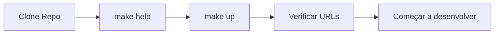
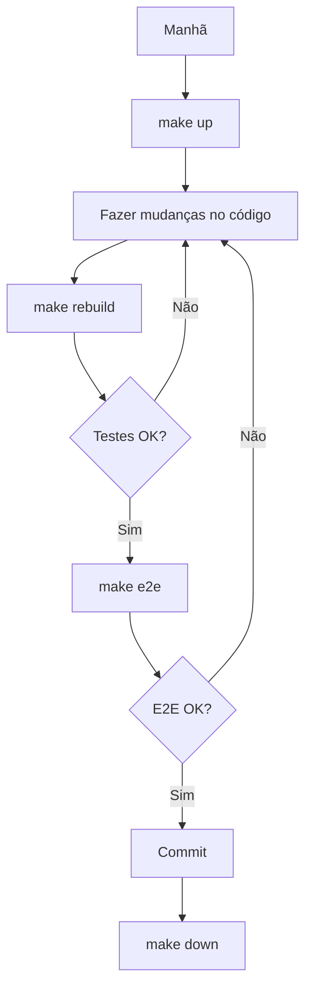
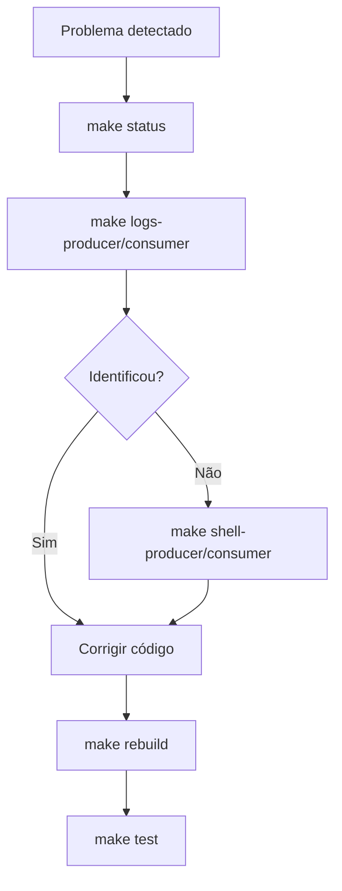
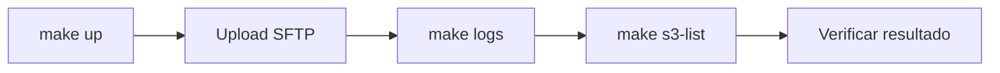
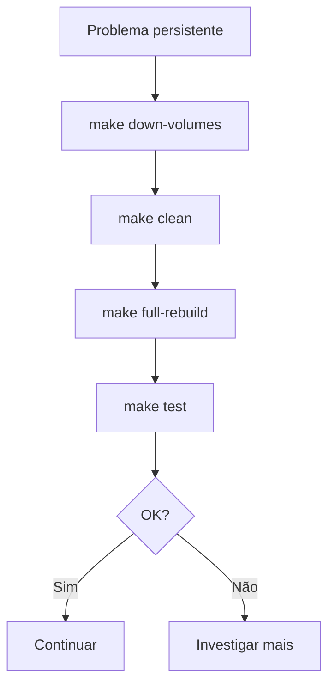
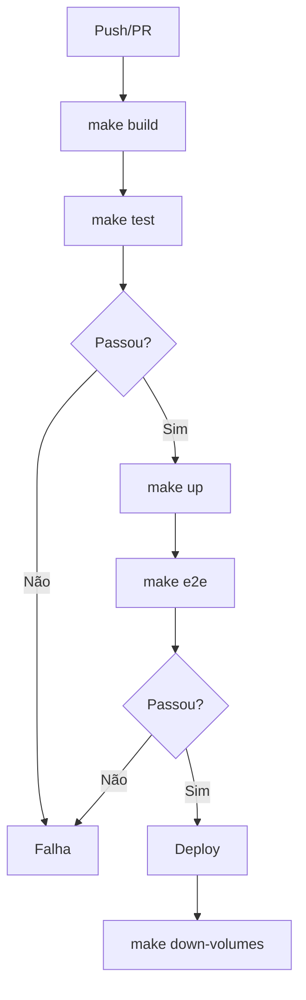
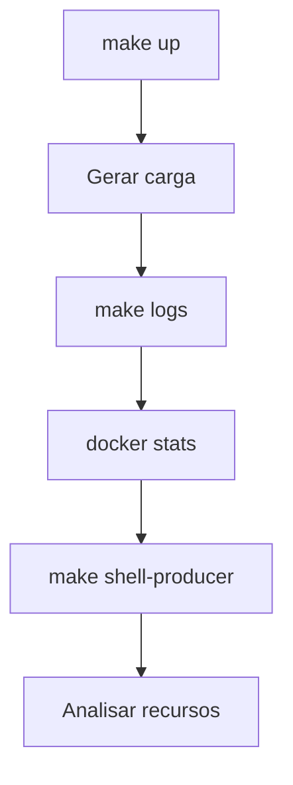

# 🔄 Workflows do Makefile

Este documento mostra os principais workflows e fluxos de trabalho usando o Makefile.

## 📊 Diagrama de Comandos

```
                                    make help
                                        |
                    ┌───────────────────┼───────────────────┐
                    |                   |                   |
              Docker Compose       Build & Test        Utilities
                    |                   |                   |
        ┌───────────┼───────────┐      |          ┌────────┼────────┐
        |           |           |       |          |        |        |
     make up    make down   make restart|      make logs  make status
        |                               |          |
        └───────────┬───────────────────┘          └────────┬────────┘
                    |                                       |
            ┌───────┴───────┐                      ┌────────┴────────┐
            |               |                      |                 |
        make build      make test              make shell-*    make *-queues
            |               |
            └───────┬───────┘
                    |
              make rebuild
                    |
            make full-rebuild
```

## 🎯 Fluxo de Desenvolvimento

### 1. Primeiro Uso



**Comandos:**
```bash
git clone <repo>
cd controle-arquivos-edi
make help
make up
# Acessar http://localhost:8080/actuator/health
```

### 2. Desenvolvimento Diário



**Comandos:**
```bash
# Manhã
make up

# Durante o dia
# ... editar código ...
make rebuild

# Testes
make test
make e2e

# Fim do dia
make down
```

### 3. Debugging



**Comandos:**
```bash
# Verificar status
make status

# Ver logs
make logs-producer
make logs-consumer

# Acessar container
make shell-producer

# Verificar serviços
make rabbitmq-queues
make s3-list

# Corrigir e testar
make rebuild
make test
```

### 4. Teste Manual E2E



**Comandos:**
```bash
# Terminal 1: Iniciar e monitorar
make up
make logs

# Terminal 2: Upload arquivo
sftp -P 2222 cielo@localhost
put test.csv upload/test.csv
exit

# Terminal 1: Verificar
make s3-list
make shell-oracle
# SELECT * FROM file_origin;
```

### 5. Limpeza e Reset



**Comandos:**
```bash
# Reset completo
make down-volumes
make clean
make full-rebuild

# Verificar
make test
make e2e
```

## 🔀 Fluxos Alternativos

### Desenvolvimento Local (sem Docker)


**Comandos:**
```bash
# Apenas infraestrutura
docker-compose up -d oracle rabbitmq localstack sftp-origin sftp-destination

# Terminal 1: Producer local
cd producer
mvn spring-boot:run

# Terminal 2: Consumer local
cd consumer
mvn spring-boot:run

# Mudanças no código recarregam automaticamente
```

### CI/CD Pipeline



**Comandos:**
```bash
# CI/CD script
make build
make test
make up
sleep 30
make e2e
make down-volumes
```

### Investigação de Performance



**Comandos:**
```bash
# Terminal 1: Monitorar
make up
make logs-consumer

# Terminal 2: Recursos
docker stats edi-producer edi-consumer

# Terminal 3: Investigar
make shell-consumer
top
df -h
free -m
```

## 📈 Fluxo de Comandos por Frequência

### Uso Diário (Alta Frequência)
```
make up ────────────────────────────────────────────── 100%
make down ──────────────────────────────────────────── 100%
make logs ──────────────────────────────────────────── 80%
make rebuild ───────────────────────────────────────── 70%
make test ──────────────────────────────────────────── 60%
make status ────────────────────────────────────────── 50%
```

### Uso Semanal (Média Frequência)
```
make e2e ───────────────────────────────────────────── 40%
make logs-producer ─────────────────────────────────── 30%
make logs-consumer ─────────────────────────────────── 30%
make shell-producer ────────────────────────────────── 20%
make clean ─────────────────────────────────────────── 20%
```

### Uso Mensal (Baixa Frequência)
```
make full-rebuild ──────────────────────────────────── 10%
make down-volumes ──────────────────────────────────── 10%
make shell-oracle ──────────────────────────────────── 5%
make rabbitmq-queues ───────────────────────────────── 5%
make s3-list ───────────────────────────────────────── 5%
```

## 🎭 Personas e Workflows

### 👨‍💻 Desenvolvedor Backend

**Workflow típico:**
```bash
make up
# Desenvolver feature
make rebuild
make test
make logs-producer
make down
```

**Comandos mais usados:**
- `make up` / `make down`
- `make rebuild`
- `make test`
- `make logs-producer`

### 🧪 QA / Tester

**Workflow típico:**
```bash
make up
make e2e
make logs
make s3-list
make down
```

**Comandos mais usados:**
- `make up` / `make down`
- `make e2e`
- `make logs`
- `make status`

### 🏗️ DevOps / SRE

**Workflow típico:**
```bash
make status
make logs-infra
make shell-producer
docker stats
make down-volumes
make full-rebuild
```

**Comandos mais usados:**
- `make status`
- `make logs-infra`
- `make shell-*`
- `make down-volumes`
- `make full-rebuild`

### 🐛 Debugger

**Workflow típico:**
```bash
make status
make logs-consumer
make shell-consumer
make rabbitmq-queues
make s3-list
make shell-oracle
```

**Comandos mais usados:**
- `make logs-*`
- `make shell-*`
- `make rabbitmq-queues`
- `make s3-list`
- `make status`

## 🔄 Ciclos de Vida

### Ciclo de Desenvolvimento de Feature

```
1. make up
2. Desenvolver
3. make rebuild
4. make test
5. make e2e
6. Commit
7. make down
```

### Ciclo de Correção de Bug

```
1. make up
2. make logs-consumer (identificar problema)
3. make shell-consumer (investigar)
4. Corrigir código
5. make rebuild
6. make test
7. Verificar logs
8. make e2e
9. Commit
```

### Ciclo de Refatoração

```
1. make up
2. Refatorar código
3. make rebuild
4. make test (garantir que não quebrou)
5. make e2e (validar integração)
6. make logs (verificar comportamento)
7. Commit
```

### Ciclo de Deploy

```
1. make build
2. make test
3. make up
4. make e2e
5. make down-volumes
6. Build imagens Docker
7. Push para registry
8. Deploy
```

## 📊 Matriz de Decisão

### Quando usar cada comando?

| Situação | Comando | Por quê? |
|----------|---------|----------|
| Iniciar trabalho | `make up` | Sobe tudo |
| Após mudança no código | `make rebuild` | Build + testes + restart |
| Após mudança no Dockerfile | `make full-rebuild` | Reconstrói imagens |
| Ver o que está acontecendo | `make logs` | Logs em tempo real |
| Verificar status | `make status` | Status rápido |
| Investigar problema | `make shell-*` | Acesso direto |
| Limpar tudo | `make down-volumes` | Reset completo |
| Executar testes | `make test` ou `make e2e` | Validação |
| Fim do dia | `make down` | Para tudo |

## 🎯 Dicas de Workflow

### 1. Use Terminais Múltiplos

```bash
# Terminal 1: Logs
make logs-producer

# Terminal 2: Desenvolvimento
make rebuild

# Terminal 3: Monitoramento
watch -n 5 'make status'
```

### 2. Crie Aliases

```bash
# ~/.bashrc ou ~/.zshrc
alias edi-up='cd ~/projeto && make up'
alias edi-down='cd ~/projeto && make down'
alias edi-logs='cd ~/projeto && make logs'
```

### 3. Use Scripts de Automação

```bash
# test-all.sh
make down-volumes
make build
make test
make up
sleep 30
make e2e
make down
```

### 4. Integre com Git Hooks

```bash
# .git/hooks/pre-commit
#!/bin/bash
make test
```

## 📚 Referências

- [MAKEFILE_CHEATSHEET.md](MAKEFILE_CHEATSHEET.md) - Referência rápida
- [MAKEFILE_GUIDE.md](MAKEFILE_GUIDE.md) - Guia completo
- [MAKEFILE_EXAMPLES.md](MAKEFILE_EXAMPLES.md) - Exemplos práticos
- [DOCS_INDEX.md](DOCS_INDEX.md) - Índice de documentação

---

**Versão**: 1.0  
**Data**: 29 de Março de 2025
